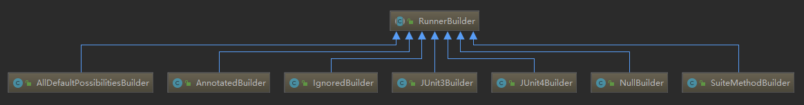
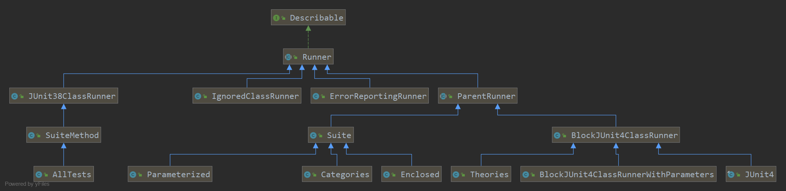

# RunnerBuilder


RunnerBuilder顾名思义就是用来创建Runner的建造者.
每个测试Class会返回一个Runner.
一共有7种RunnerBuilder类,

* IgnoredBuilder (处理类上的Ignore注解,如果有这个注解就为这个测试类返回IgnoreClassRunner)
* AnnotationBuilder (处理@RunWith注解, 如果有这注解就为这个测试类尝试创捷指定的Runner)
* SuiteMethodBuilder (如果测试类中有 suite() 方法,就为这个测试类生成 SuiteMethod)
* NullBuilder (永远返回 null)
* JUnit3Builder (如果测试类是 TestCase 的子类就为这个测试类生成 JUnit38ClassRunner)
* JUnit4Builder (返回 BlockJUnit4ClassRunner)
* AllDefaultPossibilitiesBuilder (组合了上面的Builder,下面详解)

AllDefaultpossibilitesBuilder 就是组合所有的 RunnerBuilder,为传入的 测试类查找最好的RunnerBuilder(就是对应的Runner).

```java
public class AllDefaultPossibilitiesBuilder extends RunnerBuilder {
    private final boolean canUseSuiteMethod;

    public AllDefaultPossibilitiesBuilder(boolean canUseSuiteMethod) {
        this.canUseSuiteMethod = canUseSuiteMethod;
    }

    @Override
    public Runner runnerForClass(Class<?> testClass) throws Throwable {
        List<RunnerBuilder> builders = Arrays.asList(
                ignoredBuilder(),
                annotatedBuilder(),
                suiteMethodBuilder(),
                junit3Builder(),
                junit4Builder());

        for (RunnerBuilder each : builders) {
            Runner runner = each.safeRunnerForClass(testClass);
            if (runner != null) {
                return runner;
            }
        }
        return null;
    }

    // 其他方法基本和这个一样只是简单的new对应的Builder
    protected JUnit4Builder junit4Builder() {
        return new JUnit4Builder();
    }
    // 根据canUseSuiteMethod来判断是否支持suite()方法
    protected RunnerBuilder suiteMethodBuilder() {
        if (canUseSuiteMethod) {
            return new SuiteMethodBuilder();
        }
        return new NullBuilder();
    }
}
```

# Runner


主要讲解BlockJUnit4ClassRunner.
父类ParentRunner在初始化的过程中会初始化对应TestClass对象,

同时还会检验测试类是否符合要求.

Runner 的核心就是 run(RunNotifier notifier)方法.

```java
public abstract class Runner implements Describable {
    public abstract Description getDescription();

    public abstract void run(RunNotifier notifier);

    public int testCount() {
        return getDescription().testCount();
    }
}
```

* ParentRunner
* BlockJUnit4ClassRunner
* Suite
* JUnit38ClassRunner
* ErrorReportingRunner
* IgnoredClassRunner

## ParentRunner 分支

```java
public abstract class ParentRunner<T> extends Runner implements Filterable, Sortable {
    // 静态的验证器集合, 用于验证 TestClass 是否合格.
    private static final List<TestClassValidator> VALIDATORS = Arrays.asList(
            new AnnotationsValidator(), new PublicClassValidator());

    // 用于多线程的对象锁
    private final Object childrenLock = new Object();
    // 要测试的类的 TestClass 包装对象实例
    private final TestClass testClass;

    // Guarded by childrenLock
    private volatile Collection<T> filteredChildren = null;
    //RunnerScheduler 接口的匿名实现类,很简单
    private volatile RunnerScheduler scheduler = new RunnerScheduler() {
        public void schedule(Runnable childStatement) {
            childStatement.run();
        }

        public void finished() {
            // do nothing
        }
    };

    // 构造器
    protected ParaentRunner(Class<?> testClass) throws InitializationError {
        // 给指定测试类创建TestClass, 简单的new TestClass(testclass)而已.
        this.testClass = createTestClass(testClass);
        // 验证测试类是否符合要求,
        validate();
    }

    private void validate() throws InitializationError {
        List<Throwable> errors = new ArrayList<>();
        collectionInitializationErrors(errors);
        if (!errors.isEmpty()) {
            throw new InitializationError(errors);
        }
    }
    protected void collectionInitializationErrors(List<Throwable> errors) {
        // 检验@BeforeClass,@AfterClass方法是否为static, void, 无参
        validatePublicVoidNoArgMethods(BeforeClass.class, true, errors);
        validatePublicVoidNoArgMethods(AfterClass.class, true, errors);

        // 验证@ClassRule,@Rule
        validateClassRules(errors);
        // 应用常量VALIDATORS验证器集合, 验证TestClass.它里面有两个验证器
        // PublicClassValidator和AnnotationsValidator.
        // PublicClassValidator简单的验证 测试类是否为 public. 必须要是public否则报错.
        // AnnotationsValidator中有多个子验证器, 用于验证不同的方面
        applyValidators(errors);
    }

    // 实现Runner的核心抽象接口, 主要是try中的调用.
    // Statement 是一个 run() 方法的抽象, 可以理解为一个方法
    public void run(final RunNotifier notifier) {
        EachTestNotifier testNotifier = new EachTestNotifier(notifier, getDescription());
        try {
            Statement statement = classBlock(notifier);
            statement.evaluate();
        } catch (AssumptionViolatedException e) {
            testNotifier.addFailedAssumption(e); //发布断言失败事件
        } catch (StoppedByUserException e) {
            throw e;
        } catch (Throwable e) {
            testNotifier.addFailure(e);  // 发布测试失败事件
        }
    }
    // 忽略BeforeClass方法的处理逻辑之后, 主要逻辑是调用 runChildren(notifier)方法.
    protected Statement classBlock(final RunNotifier notifier) {
        Statement statement = childernInvoker(notifier);
        //
        if (!areAllChildernIgnored()) {
            // 给statement添加执行 BeforeClass, AfterClass, ClassRunles 的逻辑.
            // 使用了静态代理模式
            statement = withBeforeClasses(statement);
            statement = withAfterClasses(statement);
            statement = withClassRules(statement);
        }
        return statement;
    }
    // 返回一个Statement, 它会调用 runChildren() 方法.
    protected Statement childrenInvoker(final RunNotifier notifier) {
        return new Statement() {
            @Override
            public void evaluate() {
                runChildren(notifier);
            }
        };
    }

    // 真正的调用, getFilteredChildren() 方法返回@Test测试方法集合,
    // 用RunnerScheduler来执行它.所以runChild(each, notifier)是真正的逻辑.
    // runChild 又是一个抽象方法由子类实现, 而子类 BlockJUnit4ClassRunner 中的逻辑是判断@Ignore方法,
    // 然后调用 runLeaf() 方法, 这是一个从父类 ParentRunner 继承的方法.
    private void runChildren(final RunNotifier notifier) {
        // 还记得这个 scheduler 的逻辑是调用 Runnable.run()方法
        final RunnerScheduler currentScheduler = scheduler;
        try {
            // 这个T 对于BlockJUnit4ClassRunner来说就是 FrameworkMethod, 是一个@Test方法对象.
            for (final T each : getFilteredChildren()) {
                currentScheduler.schedule(new Runnable() {
                    public void run() {
                        // 这里使用 类名.this. 指定this是外部类对象,
                        // 而不是这个Runnable对象.
                        ParentRunner.this.runChild(each, notifier);
                    }
                });
            }
        } finally {
            currentScheduler.finished();
        }
    }
    调用getChildren()方法, 获取对象.
    private Collection<T> getFilteredChildren() {
        if (filteredChildren == null) {
            synchronized (childrenLock) {
                if (filteredChildren == null) {
                    filteredChildren = Collections.unmodifiableCollection(getChildren());
                }
            }
        }
        return filteredChildren;
    }

    // 被子类BlockJUnit4ClassRunner调用的方法, 唯一的调用发生在BlockJUnit4ClassRunner子类中.
    protected final void runLeaf(Statement statement, Description description,
            RunNotifier notifier) {
        EachTestNotifier eachNotifier = new EachTestNotifier(notifier, description);
        // 测试开始
        eachNotifier.fireTestStarted();
        try {
            statement.evaluate();
        } catch (AssumptionViolatedException e) {
            // 断言失败事件
            eachNotifier.addFailedAssumption(e);
        } catch (Throwable e) {
            eachNotifier.addFailure(e);
        } finally {
            // 测试结束
            eachNotifier.fireTestFinished();
        }
    }

    protected abstract List<T> getChildren();
    protected abstract void runChild(T child, RunNotifier notifier);
}

```

## BlockJUnit4ClassRunner

```java
protected List<FrameworkMethod> getChildren() {
    return computeTestMethods();
}
protected List<FrameworkMethod> computeTestMethods() {
    return getTestClass().getAnnotatedMethods(Test.class);
}

// 如果不是@Ignore的方法就执行runLeaf()方法, 但是runLeaf()方法又是ParentRunner的
protected void runChild(final FrameworkMethod method, RunNotifier notifier) {
    Description description = describeChild(method);
    if (isIgnored(method)) {
        // 发布@Ignore方法事件
        notifier.fireTestIgnored(description);
    } else {
        runLeaf(methodBlock(method), description, notifier);
    }
}
```
