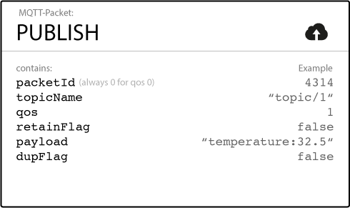
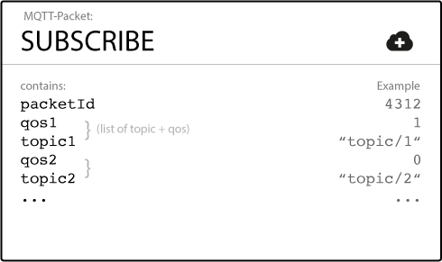
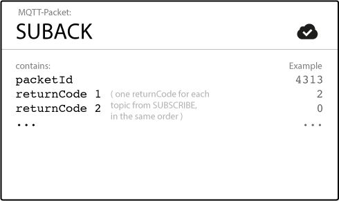
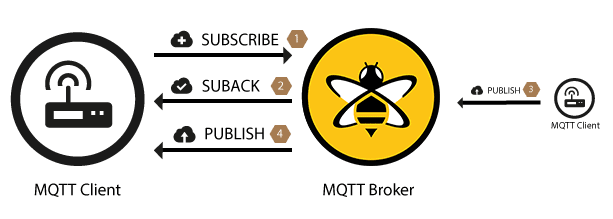
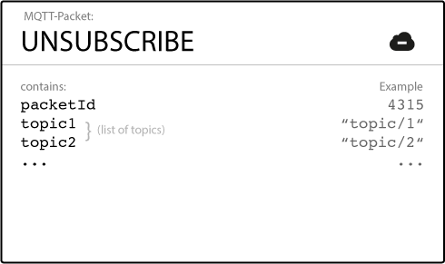
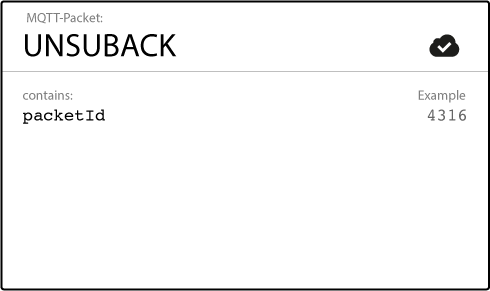
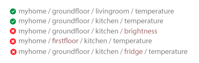
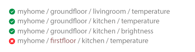

# MQTT 简介
“ MQTT是客户端服务器发布/订阅消息传递协议。
它轻量级，开放，简单并且设计得易于实施。
这些特性使其非常适合在许多情况下使用， 包括受约束的环境，
例如用于机器对机器（M2M）和物联网（IoT）上下文中的通信，
这些环境中需要很小的代码占用空间和/或网络带宽非常宝贵。 “

# 发布/订阅模式

发布/订阅模式（也称为pub / sub） 提供了传统客户端-服务器体系结构的替代方法。
在客户端服务器模型中，客户端直接与端点进行通信。
发布/订阅模型将发送消息的客户端（发布者）与接收消息的客户端（订阅者）分离。
发布者和订阅者从不直接相互联系。
实际上，他们甚至不知道另一个存在。
它们之间的连接由第三个组件（代理）处理。
代理的工作是过滤所有传入消息，并将其正确分发给订阅者。

# 与传统消息队列的区别
* 消息队列存储信息, 直到被消耗为止.
* 一条消息仅由一个客户端使用.
* 队列需要显式创建. 

# MQTT连接
客户端将 CONNECT 消息发送给代理, 代理以 CONNACK 消息和状态码响应.

## CONNECT 消息

* ClientId: 客户端标识符**标识**连接到MQTT代理的每个MQTT客户端.
每个ID对于每个客户端和代理是唯一的. 在MQTT3.1.1中如果不需要保存状态,
可以发送一个空的ClientId并且clean session必须设置为true, 否则代理将拒绝连接.

* cleanSession:  是否要建立持久会话. 
在持久性会话中代理将为客户端存储所有订阅等级为1或2的消息.
反之不存储任何信息, 并且会清楚之前任何持久会话中的消息.

* username, password:
MQTT可以通过用户名密码进行客户端身份验证和授权.
这里的用户名密码是通过纯文本格式发送的
(通过实现TLS或者自己对密码做哈希来保证安全性).

* Last will message(遗言消息):
MQTT遗嘱功能的一部分. 当客户端不正常地断开连接时,
此时消息会通知其他客户端(就是向指定的 topic 中发送一个消息)

* keep-alive: 建立连接后客户端指定并于代理进行通信的时间间隔(以秒为单位).
客户端向代理发送常规的PING请求消息. 代理以PING.

## CONNACK 消息
当mqtt代理收到CONNECT消息时, 会以CONNACK消息进行响应.

CONNACK 消息包含两个数据
* session present flag (会话存在标识)
> 这个标志告诉客户端代理是否已经从客户端之前交互持续性会话.
* status code (状态码)
> 连接确认标志, 告诉客户端连接是否成功.

|返回码|	返回码响应|
|------|-----|
|0|	接受连接
|1| 连接被拒绝，协议版本不可接受
|2|	连接被拒绝，标识符被拒绝
|3|	连接被拒绝，服务器不可用
|4|	连接被拒绝，用户名或密码错误
|5|	连接被拒绝，未经授权

# 发布与订阅

## 发布消息
MQTT Client一旦连接到代理, 便可发布消息.
MQTT利用基于主题的代理过滤消息.

*每消息必须包含一个主题,代理通过主题将消息转发给感兴趣的客户端.
通常每个消息都有一个 payload, 其中包含以字节格式传输的数据.*
MQTT与数据无关,每个消息的消息体不受限制,二进制,文本,XML/JSON都可以.

* TopicName
> topic name 是一个有层次结构的, 通过 "/" 分隔的简单字符串
> 比如 "myhome/livingroom/temperature" or "Germany/Munich/Octoberfest/people"

* QoS
> 表示这个 message 的 Quality of Service Level(QoS, 服务质量等级).
> 有三个等级: 0, 1, 2
> QoS 确定message 对到达预期收件人( client or broker）的保证类型. 
> ps: 有两个方向的, 一个是publisher发布消息时的qos, 这个代表消息到 broker的保证等级.
> subscriber 订阅topic指定的QoS代表, borker 将message 投递给sub时的保证等级.
> 如果同一消息在两个流程中指定的QoS等级不一致, 那么实际表现出来的整体行为, 按小的哪个来.

* RetainFlag
> 此标志定义消息是否由 broker 保存为指定 topic 的最后一个已知值.
> 当新client订阅主题时, 它们会收到该主题上保留的最后一条消息.

* Payload
> 这是消息的实际内容.
> MQTT与数据无关, 可以发送图像, 任何编码的文本, 加密数据以及几乎所有二进制数据.

* PacketId
> 当消息在客户端和代理之间流动时, 包标识符唯一地标识消息.
> 数据包标识符仅与大于零的QoS级别相关.

* DUP flag
> DUP标志该标志指示邮件是重复邮件. 
> 并且已被重新发送, 因为目标收件人（客户或代理）未确认原始邮件, 这仅与大于0的QoS相关. 
> 通常，resend/duplicate 机制由MQTT客户端库或代理作为实现细节来处理.

## 订阅

客户端将 SUBSCRIBE 消息发送给MQTT代理, 以订阅感兴趣的主题.

* packetId(包标识符): 
* topic list(订阅列表): 

代理将 SUBACK (订阅确认消息)发送给客户端.

|返回码|	返回码响应
|-----|-----|
|0|	成功-最大QoS 0|
|1|	成功-最大QoS 1|
|2|	成功-最大QoS 2|
|128|	失败|

## 取消订阅

# MQTT 主题
MQTT中 topic 指的是UTF-8字符串, 代理使用该字符串来过滤每个连接的各户端的消息.
主题包含一个或多个主题层级, 层级直接以 '/' 分隔.

与传统消息队列相比, MQTT的主题非常轻巧.
无效在订阅或者发布之前创建所需的主题.

每个主题**至少包含1个字符**,并且允许使用空格.**主题区分大小写**

## 通配符
### 单层通配符:  '+'

### 多层通配符: '#'
多层次通配符包含许多主题级别。哈希符号表示主题中的多级通配符。为了让代理确定哪个主题匹配，多级通配符必须放在主题的最后一个字符，并在前面加一个正斜杠。

### 以$开头的主题:
 $符号开头的主题保留用于MQTT代理的内部统计(目前没有官方标准化).
 具体参考不同的MQTT broker 文档

### 关于主题的最佳实践
* 不要使用正斜杠开头.
> MQTT中允许前导的正斜杠。例如,/myhome/groundfloor/厅。然而，前导斜杠引入了一个不必要的主题级别, 而且经常导致混乱。
* 不要在topic中使用空格.
> 空格容易引起混乱
* 主题名简短
> 对于小型设备来说, 较短的topicName长度有助于节省资源
* 仅使用ASCII字符,避免使用不可打印的字符
* 将唯一标识或者clientId嵌入主题中
> 在主题中包含发布ClientId可能非常有帮助。主题中的唯一标识符可以帮助您确定是谁发送了消息。嵌入的ID可用于强制授权。只有具有与主题中的ID相同的客户端ID的客户端才允许发布到该主题。例如，允许ID为client1的客户机发布到client1/status，但不允许发布到client2/status。
* 不要订阅 #
> 有时，有必要订阅通过代理传输的所有消息。例如，将所有消息持久化到数据库中。不要通过使用MQTT客户机和订阅多层次通配符来订阅代理上的所有消息。通常，订阅客户端无法处理由此方法产生的消息负载(特别是在吞吐量很大的情况下)。我们的建议是在MQTT代理中实现扩展。例如，使用HiveMQ的插件系统，你可以挂钩HiveMQ的行为，并添加一个异步例程来处理每个传入的消息，并将其持久化到数据库中。
* 注意主题层次结构的可扩展性
* Use specific topics, not general ones
> 在命名主题时，不要像在队列中那样使用它们。尽量区分你的主题。例如，如果你的客厅里有三个传感器，
为 myhome/livingroom/temperature, myhome/livingroom/brightness, myhome/livingroom/humidity 分别创建主题
不要把所有的消息发送到myhome/livingroom。对所有消息使用单个主题是一种反模式。特定的命名还使您可以使用其他MQTT特性，如保留消息。

# 参考文档
[mqtt](https://www.hivemq.com/mqtt-essentials/)