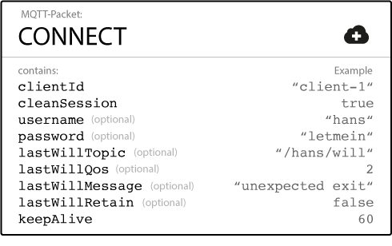

# Qos (服务质量)

Quality of Service (QoS) level 是消息发送者与接受者之间的协议, 定义了指定 message 的传递保证.
在MQTT中有3个QoS leve:

* At most one (0, 最多一次)
* At least one (1, 至少一次)
* Exactly one (2, 只有一次)

发布者在发送 message 时指定消息的 QoS level.
代理使用 subscriber 在订阅主题是指定的QoS level 传递消息.

如果订阅者指定较低的 QoS level, 那么broker会以较低的QoS提供服务.

## QOS 的重要性
QoS是MQTT协议的一个关键特性。QoS使客户机能够选择与其网络可靠性和应用程序逻辑相匹配的服务级别。
由于MQTT管理消息的重新传输并保证传递(即使底层传输不可靠)，QoS使不可靠网络中的通信变得容易得多。

## Qos 0
QoS级别0通常被称为“启动并忘记”，它提供了与底层TCP协议相同的保证。
即不做任何处理, 发送即抛弃.

## Qos 1
QoS级别1保证消息至少一次被发送到接收方。
发送方存储消息，直到从接收方获得确认接收到消息的PUBACK包为止。
可以多次发送或传递消息。

## Qos 2
QoS 2是MQTT中最高级别的服务。这个级别保证每个消息只被预期的收件人接收一次。
QoS 2是最安全、最慢的服务级别质量。
保证是由发送方和接收方之间的至少两个请求/响应流(四部分握手)提供的。
发送方和接收方使用原始发布消息的包标识符来协调消息的传递。

# Persistent Session (持久性会话)
普通情况下, 一个客户端想要接收消息需要连接到代理,然后创建其订阅.
如果断开了连接, 那么客户端需要在下次连接时重新进行订阅.

对于资源受限的设备来说, 每次重新订阅可能是个负担, 为了避免这个问题.
客户端在创建连接时, 可以使用持久性会话.
代理保存关于客户端的所有信息.

## session 保存的信息
1. session 的存在
2. 客户端的订阅
3. 所有 Qos 为1或2的未被确认的消息
4. 在离线状态错过的所有 Qos1或2的消息
5. 从客户端接收到的所有尚未完全确认的QoS 2消息。

## 最佳实践
**Persistent Session**

1. 客户端必须从某个主题获取所有消息，即使该主题处于脱机状态。您希望代理为客户机对消息进行排队，并在客户机恢复在线时立即交付这些消息。

2. 客户资源有限。您希望代理存储客户机的订阅信息并快速恢复中断的通信。

3. 客户端需要在重新连接后恢复所有QoS 1和QoS 2发布消息。

**Clean Session**

1. 客户端只需要将消息发布到主题，客户端不需要订阅主题。 您不希望代理存储会话信息或重试QoS 1和2消息的传输。

2. 客户端不需要获取它离线错过的消息。

# 保留消息

保留消息时将 retain flag 设置为true的常规消息.  代理存储topic的最后保留的消息和对应的Qos.
每个topic只存储一条保留消息.

客户端订阅topic时会立即收到, 被订阅的topic的保留消息.
通配符订阅也会收到对应的保留消息.

**保留的消息可帮助新订阅的客户端订阅主题后立即获得状态更新。保留的消息消除了等待发布客户端发送下一个更新的等待。**

## 删除保留消息
还有一种删除主题的保留消息的非常简单的方法：在要删除先前保留的消息的主题上发送带有零字节有效负载的保留消息。
代理删除保留的消息，新订阅者不再获得该主题的保留的消息。
通常，甚至没有必要删除，因为每个新保留的消息都会覆盖前一个。

## 何时使用保留消息
当您希望新连接的订阅者立即接收消息时(无需等到发布客户端发送下一条消息),保留消息才有意义.
这对于单个主题上组件或设备的状态更新非常有帮助.
例如，door1的状态位于主题myhome/devices/door1/status 上。
使用保留的消息时，主题的新订阅者订阅后会立即获得设备的状态(开/关).

# Last Will and Testament(遗嘱消息)
在MQTT中，您可以使用最后遗嘱(LWT)特性通知其他客户端有关一个不正常断开连接的客户端。

标准的断开连接流程, 客户端需要发送一个DISCONNECT包.
如果正确的关闭连接, 代理会丢弃在连接时保存的遗嘱消息.

通过LWT可以实现各种, 客户端异常离线处理策略(至少通知其他客户端离线状态)

## 如何指定遗嘱消息

在客户端建立与代理的连接时, 可以指定遗嘱消息.

## 什么情况下代理会发送LWT
1. 代理检测到I/O错误或网络故障.
2. 客户端在定义的保持连接时间内通信失败.
3. 客户端在关闭网络连接之前不发送断开连接包.
4. 由于协议错误,代理关闭了网络连接.

## 何时使用遗嘱消息
通过遗嘱消息可以及时的知道客户端的在离线状态.

遗嘱消息配合保留消息可以用来更新客户端在离线状态.