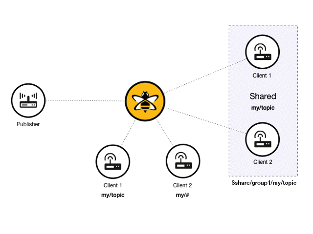
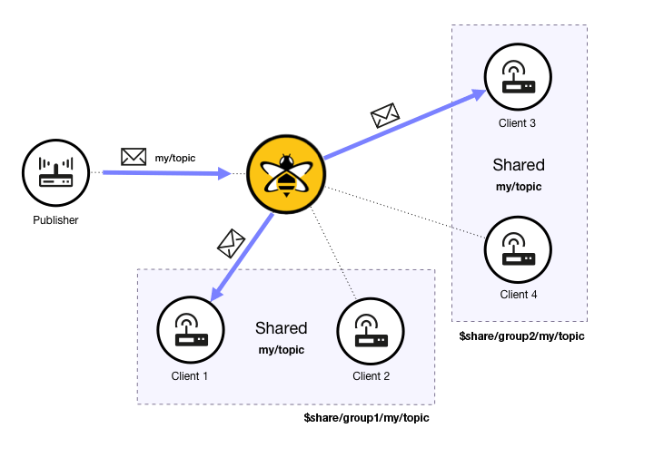

# MQTT 5 的优点

MQTT3 提出时还没有IoT的概念, 所以对于 cloud 等新事物的支持有限.因此对协议进行了升级.
MQTT5 在2019年3月份通过成为标志规范

## Better Error Handling for More Robust Systems (更好的错误处理)

1. session and message expiry feature (会话以及消息的过期机制)

> 允许为message或者session设置一个时间限制
> 如果在时间限制内, 消息没有被发送, 那么消息会被删除
> example, 发送了MQTT message 控制打开车间的机器,
> 如果message在限制时间段内没有发送, 则会被删除.
> 确保只有在安全的时间段内启动机器, 并且不会因为网络延迟或中断而延迟发送.
>
> ps: 感觉用于下发那些有时效性的指令时很有用.

2. negative acknowledgements (否定确认 NACk)
   MQTT broker 可以在特定情况下发送否定确认.
   比如: 不支持的特性, 或者broker处于不可靠状态.
   有助于MQTT broker防御 DOS 攻击

## More Scalability for Cloud Native Computing (伸缩性 云原生)

1. Shared subscription

> MQTT 5 标准化了 shared subscriptions (共享订阅)
> 共享订阅允许多个MQTT client实例, 在broker上共享相同的订阅.
> 该特性使部署在云集群上的MQTT客户机能够实现负载平衡.
> 当您使用MQTT Client 将 MQTT message存储并转发到后端企业系统
> (如数据库或企业服务总线(ESB))时, 这是非常有用的.

2. Topic aliases

> 主题别名允许允许用 integer 替换 topic string.
> 对于大型系统, topic name 结构复杂的情况下
> (也就是 topic name 太长了, 而每次push message时都需要指定topic name.)
> 可以优化网络使用情况.
> Topic aliase 存在于每一个客户端与代理之间(每个客户端互相独立不受影响).

## Greater Flexibility and Easier Integration(更好的扩展性, 更易于集成)

1. User Properties(用户属性)

> 允许添加 key-value 形式的属性到 MQTT message 的 message header 中.
> These properties allow you to add application-specific information to each message that can be used in processing the
> message.
> 这些属性允许你添加 处理message应用程序的特定信息到每个消息中.
> 比如添加设备的固件版本

2. Payload format indicator(负载格式标识)

> 为了使接收方更容易处理消息, 有效负载格式指示器
> 包括MIME样式的内容类型, 已经在 MQTT 5 中被添加

# User Properties(自定义属性)

User Properties 是最基本的UTF-8字符串键值对, 可以将其附加到几乎每种MQTT数据包中(除了PINGREQ, PINGRESP).
重要不超过最大消息的大小, 就可以不限数量的添加自定义属性将元数据添加到MQTT消息中.

这个功能与HTTP协议里的 header 非常相似.

MQTT3的缺点:

1. 协议缺乏可扩展性
2. 难以创建多厂商部署.

# Shared Subscription(共享订阅)

在标准MQTT订阅中, 每个订阅客户端都会收到发送到该主题的每条消息副本.
在共享订阅中, 同一订阅组的客户端将交替接收消息. 这种机制也可被称为客户端负载均衡.

共享订阅使用特殊的主题语法订阅, 所以客户端无需进行任何修改.

$share/groupID/Topic

* 静态共享订阅标识符
* 组标识符
* 实际订阅的topic

在共享订阅中，每个订阅组在概念上都可以想象成一个虚拟客户端，同时充当多个单独订阅者的代理。

在此示例中，有两个不同的组，每个共享订阅组中都有2个订阅客户端。
这两个组订阅了相同的topic，但具有不同的组标识符。
当发布者发送带有匹配主题的消息时，每个组的一个（只有一个）客户端会收到该邮件。

# 参考文档

[mqtt5](https://www.hivemq.com/mqtt-5/)
