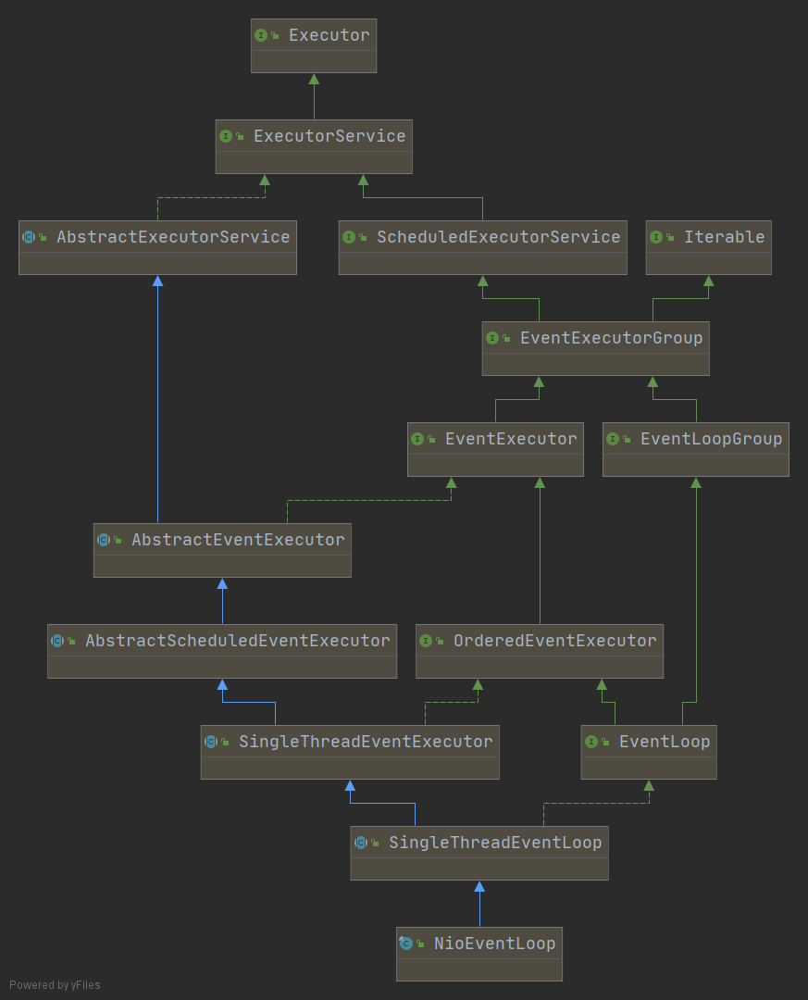

# EventLoop

处理`Channle`的所有IO操作, 一个 EventLoop 实例通常会处理多个`Channel`, 但这可能取决于实现细节和内部结构(netty兼容一个连接一个线程的形式).
从类图上可以看到, EventLoop 接口是继承自 `EventExecutorGroup`.
就像 `EventLoopGroup` 接口继承自 `EventExecutorGroup` 一样 在向上可以看到 JDK 定义的 `ScheduledExecutorService`, `ExecutorService`, `Executor` 等接口

实现也是从JDK提供的`AbstractExecutorService` 继承而来的

## AbstractEventExecutor

``` java
public abstract class AbstractEventExecutor extends AbstractExecutorService implements EventExecutor {

}
```

## AbstractScheduledEventExecutor

schedule 方法的相关实现

## SingleThreadEventExecutor

``` java
private void execute(Runnable task, boolean immediate) {
  boolean inEventLoop = inEventLoop();
  // 将提交的task添加到任务队列中
   addTask(task);
   // 如果调用 execute() 的线程不是, EventLoop 线程.
   // 说明可能是首次调用, 调用startThread()方法, 启动 EventLoop
  if (!inEventLoop) {
      startThread();
     // 发现当前Executor已经关闭时的处理, 不是核心逻辑
      if (isShutdown()) {
          boolean reject = false;
          try {
              if (removeTask(task)) {
                  reject = true;
              }
          } catch (UnsupportedOperationException e) {
              // The task queue does not support removal so the best thing we can do is to just move on and
              // hope we will be able to pick-up the task before its completely terminated.
              // In worst case we will log on termination.
          }
          if (reject) {
              reject();
          }
      }
  }

  if (!addTaskWakesUp && immediate) {
     wakeup(inEventLoop);
  }
}

// 如果EventLoop状态是 ST_NOT_STARTED (未启动) 的情况下尝试启动
// 这里只是简单的修改 EventLoop 状态为 ST_STARTED 已启动
// 并且这里使用JDK提供的原子修改操作, 这样多个线程同时调用 execute() 方法时, 保证了 doStartThread() 方法只被调用一次
private void startThread() {
 if (state == ST_NOT_STARTED) {
     if (STATE_UPDATER.compareAndSet(this, ST_NOT_STARTED, ST_STARTED)) {
         boolean success = false;
         try {
             doStartThread();
             success = true;
         } finally {
             if (!success) {
                 STATE_UPDATER.compareAndSet(this, ST_STARTED, ST_NOT_STARTED);
             }
         }
     }
 }
}

// 这个方法调用了内部的 executor 的 execute() 方法
// 回顾 EventLoopGroup 实现, 会发现通常情况这里的 executor 是一个调用一次新建一个thread的逻辑

// 1. 给EventLoop 绑定线程
// 2. 调用抽象的 run() 方法(子类实现通常是个死循环, 处理任务队列)
// 3. 编写一个 finally 块, 当run() 方法结束意味着 EventLoop 也结束了. 进行状态的改变以及清理工作
    private void doStartThread() {
     assert thread == null;
     executor.execute(new Runnable() {
         @Override
         public void run() {
      // EventLoop 绑定这个 thread 线程
             thread = Thread.currentThread();
             if (interrupted) {
                 thread.interrupt();
             }

             boolean success = false;
             updateLastExecutionTime();
             try {
                 SingleThreadEventExecutor.this.run();
                 success = true;
             } catch (Throwable t) {
                 logger.warn("Unexpected exception from an event executor: ", t);
             } finally {
                 for (;;) {
                     int oldState = state;
                     if (oldState >= ST_SHUTTING_DOWN || STATE_UPDATER.compareAndSet(
                             SingleThreadEventExecutor.this, oldState, ST_SHUTTING_DOWN)) {
                         break;
                     }
                 }

                 // Check if confirmShutdown() was called at the end of the loop.
                 if (success && gracefulShutdownStartTime == 0) {
                     if (logger.isErrorEnabled()) {
                         logger.error("Buggy " + EventExecutor.class.getSimpleName() + " implementation; " +
                                 SingleThreadEventExecutor.class.getSimpleName() + ".confirmShutdown() must " +
                                 "be called before run() implementation terminates.");
                     }
                 }

                 try {
                     // Run all remaining tasks and shutdown hooks. At this point the event loop
                     // is in ST_SHUTTING_DOWN state still accepting tasks which is needed for
                     // graceful shutdown with quietPeriod.
                     for (;;) {
                         if (confirmShutdown()) {
                             break;
                         }
                     }

                     // Now we want to make sure no more tasks can be added from this point. This is
                     // achieved by switching the state. Any new tasks beyond this point will be rejected.
                     for (;;) {
                         int oldState = state;
                         if (oldState >= ST_SHUTDOWN || STATE_UPDATER.compareAndSet(
                                 SingleThreadEventExecutor.this, oldState, ST_SHUTDOWN)) {
                             break;
                         }
                     }

                     // We have the final set of tasks in the queue now, no more can be added, run all remaining.
                     // No need to loop here, this is the final pass.
                     confirmShutdown();
                 } finally {
                     try {
                         cleanup();
                     } finally {
                         // Lets remove all FastThreadLocals for the Thread as we are about to terminate and notify
                         // the future. The user may block on the future and once it unblocks the JVM may terminate
                         // and start unloading classes.
                         // See https://github.com/netty/netty/issues/6596.
                         FastThreadLocal.removeAll();

                         STATE_UPDATER.set(SingleThreadEventExecutor.this, ST_TERMINATED);
                         threadLock.countDown();
                         int numUserTasks = drainTasks();
                         if (numUserTasks > 0 && logger.isWarnEnabled()) {
                             logger.warn("An event executor terminated with " +
                                     "non-empty task queue (" + numUserTasks + ')');
                         }
                         terminationFuture.setSuccess(null);
                     }
                 }
             }
         }
     });
   }

  /**
  * Run the tasks in the {@link #taskQueue}
  */
 protected abstract void run();
}
```

## DefaultEventLoop.run()

可以看到 run 方法的实现非常简单. 
- 调用 takeTask() 获得一个任务
- 执行 runnable 
- 更新最后执行时间 
- 判断当前是否收到了shutdown请求, 如果有break出循环

``` java
@Override
protected void run() {
 for (;;) {
     Runnable task = takeTask();
     if (task != null) {
         runTask(task);
         updateLastExecutionTime();
     }

     if (confirmShutdown()) {
         break;
     }
 }
}
```

## NioEventLoop.run()

```java
public final class NioEventLoop extends SingleThreadEventLoop {


    // 下次唤醒的时常
    private final AtomicLong nextWakeupNanos = new AtomicLong(AWAKE);

    private static final long NONE = Long.MAX_VALUE;

    private final IntSupplier selectNowSupplier = new IntSupplier() {
        @Override
        public int get() throws Exception {
            return selectNow();
        }
    };

    @Override
    protected void run() {
        int selectCnt = 0;
        for (;;) {
            try {
                int strategy;
                try {
                    // 如果有任务的话, 就调用 selectNowSupplier 也就是调用 selector.selectNow() 不阻塞
                    // 直接返回当前准备好io的channel数量, 如果没有任务的话就返回 SelectStrategy.SELECT
                    // PS: SelectStrategy.CONTINUE, SelectStrategy.BUSY_WAIT. 在默认实现中根本不会返回
                    strategy = selectStrategy.calculateStrategy(selectNowSupplier, hasTasks());
                    switch (strategy) {
                    case SelectStrategy.CONTINUE:
                        continue;

                    case SelectStrategy.BUSY_WAIT:
                        // fall-through to SELECT since the busy-wait is not supported with NIO

                    // 如果当前没有延时任务, 也没有任何普通任务, 就调用 selector.select() 阻塞当前线程到返回为止.
                    // 如果期间有别的线程调用了 protected void wakeup(boolean inEventLoop) 方法则会停止select动作重新唤醒线程
                    // PS: 比如说execute()方法
                    case SelectStrategy.SELECT:
                        // 获取下一个延时任务的时间, 如果没有的化就返回 -1;
                        long curDeadlineNanos = nextScheduledTaskDeadlineNanos();
                        if (curDeadlineNanos == -1L) {
                            // 又把 curDeadlineNanos 变成了 Long.MAX
                            curDeadlineNanos = NONE; // nothing on the calendar
                        }
                        nextWakeupNanos.set(curDeadlineNanos);
                        try {
                            // 再次判断当前是否存在task, 如果没有任务的话, 执行 select(timeout)
                            // 此时EventLoop会阻塞在 selector.select(timeout) 方法上.
                            // PS: 此时JVM中 Thread.getState() 还是Running. 但是Thread dump查看线程发现, cpu占用时间不会增长
                            // 用linux ps -p xxx -M 查看线程发现Sate 都是 Sleep
                            if (!hasTasks()) {
                                strategy = select(curDeadlineNanos);
                            }
                        } finally {
                            // This update is just to help block unnecessary selector wakeups
                            // so use of lazySet is ok (no race condition)
                            nextWakeupNanos.lazySet(AWAKE);
                        }
                        // fall through
                    default:
                    }
                } catch (IOException e) {
                    // If we receive an IOException here its because the Selector is messed up. Let's rebuild
                    // the selector and retry. https://github.com/netty/netty/issues/8566
                    rebuildSelector0();
                    selectCnt = 0;
                    handleLoopException(e);
                    continue;
                }

                selectCnt++;
                cancelledKeys = 0;
                needsToSelectAgain = false;
                // 这个设置表示, io处理和任务处理的比例. 默认50, 也就是各占一半
                final int ioRatio = this.ioRatio;
                boolean ranTasks;
                // strategy > 0 说明, 存在准备好的channel. 所以执行processSelectedKeys()方法处理IO事件
                if (ioRatio == 100) {
                    try {
                        if (strategy > 0) {
                            processSelectedKeys();
                        }
                    } finally {
                        // Ensure we always run tasks.
                        ranTasks = runAllTasks();
                    }
                } else if (strategy > 0) {
                    final long ioStartTime = System.nanoTime();
                    try {
                        processSelectedKeys();
                    } finally {
                        // Ensure we always run tasks.
                        final long ioTime = System.nanoTime() - ioStartTime;
                        ranTasks = runAllTasks(ioTime * (100 - ioRatio) / ioRatio);
                    }
                } else {
                    ranTasks = runAllTasks(0); // This will run the minimum number of tasks
                }

                // 如果执行过任务或者确实有准备好的channel
                // 说明是一次正常的唤醒
                if (ranTasks || strategy > 0) {
                    if (selectCnt > MIN_PREMATURE_SELECTOR_RETURNS && logger.isDebugEnabled()) {
                        logger.debug("Selector.select() returned prematurely {} times in a row for Selector {}.",
                                selectCnt - 1, selector);
                    }
                    selectCnt = 0;
                } else if (unexpectedSelectorWakeup(selectCnt)) { // Unexpected wakeup (unusual case)
                    selectCnt = 0;
                }
            } catch (CancelledKeyException e) {
                // Harmless exception - log anyway
                if (logger.isDebugEnabled()) {
                    logger.debug(CancelledKeyException.class.getSimpleName() + " raised by a Selector {} - JDK bug?",
                            selector, e);
                }
            } catch (Error e) {
                throw e;
            } catch (Throwable t) {
                handleLoopException(t);
            } finally {
                // 每次for循环结束都判断 EventLoop 是否关闭了, 如果关闭了就close所有的channel
                // Always handle shutdown even if the loop processing threw an exception.
                try {
                    if (isShuttingDown()) {
                        closeAll();
                        if (confirmShutdown()) {
                            return;
                        }
                    }
                } catch (Error e) {
                    throw e;
                } catch (Throwable t) {
                    handleLoopException(t);
                }
            }
        }
    }
```

### netty对于key处理过程的优化
```java
    private void processSelectedKeys() {
        if (selectedKeys != null) {
            // 优化的逻辑
            processSelectedKeysOptimized();
        } else {
            // 没有优化的逻辑
            processSelectedKeysPlain(selector.selectedKeys());
        }
    }
```

实现优化的地方,会发现netty使用反射机制, 将sun.nio.ch.SelectorImpl#selectedKeys 字段替换为了自己的
SelectedSelectionKeySet(数组结构, 实现set接口). 原始实现采用了 HashSet 存储.
对比数据结构的区别, 应该是有利于插入和遍历的性能.
```java
    private SelectorTuple openSelector() {
        final Selector unwrappedSelector;
        try {
            unwrappedSelector = provider.openSelector();
        } catch (IOException e) {
            throw new ChannelException("failed to open a new selector", e);
        }

        if (DISABLE_KEY_SET_OPTIMIZATION) {
            return new SelectorTuple(unwrappedSelector);
        }

        Object maybeSelectorImplClass = AccessController.doPrivileged(new PrivilegedAction<Object>() {
            @Override
            public Object run() {
                try {
                    return Class.forName(
                            "sun.nio.ch.SelectorImpl",
                            false,
                            PlatformDependent.getSystemClassLoader());
                } catch (Throwable cause) {
                    return cause;
                }
            }
        });

        if (!(maybeSelectorImplClass instanceof Class) ||
            // ensure the current selector implementation is what we can instrument.
            !((Class<?>) maybeSelectorImplClass).isAssignableFrom(unwrappedSelector.getClass())) {
            if (maybeSelectorImplClass instanceof Throwable) {
                Throwable t = (Throwable) maybeSelectorImplClass;
                logger.trace("failed to instrument a special java.util.Set into: {}", unwrappedSelector, t);
            }
            return new SelectorTuple(unwrappedSelector);
        }

        final Class<?> selectorImplClass = (Class<?>) maybeSelectorImplClass;
        final SelectedSelectionKeySet selectedKeySet = new SelectedSelectionKeySet();

        Object maybeException = AccessController.doPrivileged(new PrivilegedAction<Object>() {
            @Override
            public Object run() {
                try {
                    Field selectedKeysField = selectorImplClass.getDeclaredField("selectedKeys");
                    Field publicSelectedKeysField = selectorImplClass.getDeclaredField("publicSelectedKeys");

                    if (PlatformDependent.javaVersion() >= 9 && PlatformDependent.hasUnsafe()) {
                        // Let us try to use sun.misc.Unsafe to replace the SelectionKeySet.
                        // This allows us to also do this in Java9+ without any extra flags.
                        long selectedKeysFieldOffset = PlatformDependent.objectFieldOffset(selectedKeysField);
                        long publicSelectedKeysFieldOffset =
                                PlatformDependent.objectFieldOffset(publicSelectedKeysField);

                        if (selectedKeysFieldOffset != -1 && publicSelectedKeysFieldOffset != -1) {
                            PlatformDependent.putObject(
                                    unwrappedSelector, selectedKeysFieldOffset, selectedKeySet);
                            PlatformDependent.putObject(
                                    unwrappedSelector, publicSelectedKeysFieldOffset, selectedKeySet);
                            return null;
                        }
                        // We could not retrieve the offset, lets try reflection as last-resort.
                    }

                    Throwable cause = ReflectionUtil.trySetAccessible(selectedKeysField, true);
                    if (cause != null) {
                        return cause;
                    }
                    cause = ReflectionUtil.trySetAccessible(publicSelectedKeysField, true);
                    if (cause != null) {
                        return cause;
                    }

                    selectedKeysField.set(unwrappedSelector, selectedKeySet);
                    publicSelectedKeysField.set(unwrappedSelector, selectedKeySet);
                    return null;
                } catch (NoSuchFieldException e) {
                    return e;
                } catch (IllegalAccessException e) {
                    return e;
                }
            }
        });

        if (maybeException instanceof Exception) {
            selectedKeys = null;
            Exception e = (Exception) maybeException;
            logger.trace("failed to instrument a special java.util.Set into: {}", unwrappedSelector, e);
            return new SelectorTuple(unwrappedSelector);
        }
        selectedKeys = selectedKeySet;
        logger.trace("instrumented a special java.util.Set into: {}", unwrappedSelector);
        return new SelectorTuple(unwrappedSelector,
                                 new SelectedSelectionKeySetSelector(unwrappedSelector, selectedKeySet));
    }
}
```
