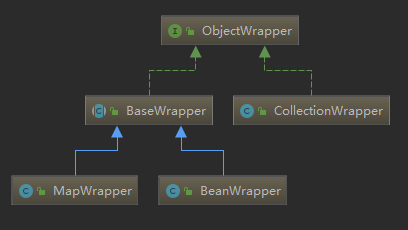

# TypeParametterResolver

## Type 接口

这是Java反射的知识, 这里简单介绍一下.

* Class 比较常见, 它表示的是原始类型. Class 类的对象表示 JVM 中的一个类或接口,
  每个Java类在JVM里都表现为一个Class对象. 数组也被映射为 Class 对象,
  所有元素类型相同且维数相同的数组共享一个 Class 对象.
* ParameterizedType 表示的参数化类型, 例如 List<String>, Map<Integer, String>这种带泛型的类型

* TypeVariable 表示的是类型变量, 它用来反映在 JVM 编译该泛型前的信息

* GenericArrayType 表示的是数组类型且组成元素是 ParameterizedType 或 TypeVariable.

* WildcardType 表示的是通配符泛型

---
TypeParameterResolver 是一个工具类, 提供了一系列静态方法来解析指定类中的字段, 方法返回值或方法参数的类型

# ObjectFactory

MyBatis 中会有很多模块会使用 ObjectFacotry 接口, 该接口提供了多个 create() 方法的重载,
通过这些 create() 方法可以创建指定类型的对象.

```java
public interface ObjectFactory {
    /**
    * Sets configuration properties.
    */
    void setProperties(Properties properties);

    /**
    * Creates a new object with default constructor.
    * 使用默认构造器创建对象
    * class.newInstance();
    */
    <T> T create(Class<T> type);

    /**
    * Creates a new object with the specified constructor and params.
    * 使用指定构造器和参数构造对象
    */
    <T> T create(Class<T> type, List<Class<?>> constructorArgTypes, List<Object> constructorArgs);

    /**
    * Returns true if this object can have a set of other objects.
    * It's main purpose is to support non-java.util.Collection objects like Scala collections.
    */
    <T> boolean isCollection(Class<T> type);
}
```

# Property 工具集

PropertyTokenizer, PropertyNamer, PropertyCopier

"orders[0].items[0].name" 这种由"."和"[]"组成的表达式是由 PropertyTokenizer 进行解析的.
orders 为name
items[0].name 为 children
orders[0] 为 indexedName
index 为 0

PropertyTokenizer 中各个字段含义如下:

```java
private String name; // 当前表达式的名称
private final String indexedName; // 当前表达式的索引名
private String index; // 索引下标
private final String children; // 子表达式
```

PropertyTokenizer 的构造器会根据传入的表达式对上面的各个字段进行初始化.

```java
    //构造器
    public PropertyTokenizer(String fullname){
        // 获得第一个 "." 的位置
        int delim = fullname.indexOf('.');
        // 如果有 .
        if (delim > -1) {
            // 将name 初始化为表达式开头到 . 之间的值
            name = fullname.substring(0, delim);
            // 将 . 之后的字符串视为当前串的 children
            children = fullname.substring(delim + 1);
        } else {
            // 如果没有.这个符号就将name 初始化为传入的表达式, children为null
            name = fullname;
            chilren = null;
        }
        // indexedName 初始化,
        indexedName = name;
        delim = name.indexOf('[');
        // 如果有表达式中有 "[]"
        if (delim > -1) {
            //初始化 index
            index = name.substring(delim + 1, name.length() -1);
            // 将原来带有[]符号的name切分为不带[]的name
            name = name.substring(0, delim);
        }
    }
```

----
PropertyNamer 是另一个工具类, 提供了完成方法名到属性名的转换的静态方法, 以及多种检测操作.

```java
public final class PropertyNamer {
    private PropertyNamer(){
        // Prevent Instantiation of Static Class
    }
    /*
    * 判定是传入的方法名是否是 setter/getter 方法
    * 如果是就将对应的前缀(get, set, is)截掉
    * 如果不是setter/getter方法就会报错
    */
    public static String methodToProperty(String name) {
        if (name.startsWith("is")) {
            name = name.substring(2);
        } else if (name.startsWith("get") || name.startsWith("set") {
            name = name.substring(3);
        } else {
            thorw new ReflectionException("Error parsing property name '" + name + "'. Didn't start with 'is', 'get' or 'set'.");
        }
        return name;
    }

    public static boolean isProperty(String name) {
        return name.startsWith("get") || name.startsWith("set") || name.startsWith("is");
    }
    public static boolean isGetter(String name) {
        return name.startsWith("get") || name.startsWith("is");
    }
    public static boolean isSetter(String name) {
        return name.startsWith("set");
    }
}
```

----
PropertyCopier 是一个属性拷贝的工具类, 其核心方法是 copyBeanProperties() 方法,
主要实现相同类型的两个对象之间的属性值拷贝

```java
public final class PropertyCopier {
    //
    private PropertyCopier(){ }

    public static void copyBeanProperties(Class<?> type, Object sourceBean, Object destinationBean) {
        Class<?> parent = type;
        while (parent != null) {
            final Field[] fields = parent.getDeclaredFields();
            for(Field field : fields) {
                try {
                    field.setAccessible(true);
                    field.set(destinationBean, field.get(sourceBean));
                } catch (Exception e) {

                }
            }
            parent = parent.getSuperclass();
        }
    }
}
```

# MetaClass

MetaClass 通过 Reflector 和 PropertyTokenizer 组合使用, 实现了对复杂的属性表达式的解析,
并实现了获取指定属性描述信息的功能

```java
    // 构造器是 private 的
    private MetaClass(Class<?> type, ReflectorFactory reflectorFactory) {
        this.reflectorFactory = reflectorFactory;
        this.reflector = reflectorFactory.findForClass(type);
    }
    // 提供了一个静态方法
    public static MetaClass(Class<?> type, ReflectorFactory reflectorFactory) {
        return new MetaClass(type, reflectorFactory);
    }
```

MetaClass 中比较重要的方法是 findProperty() 方法.
它通过调用 MetaClass.buildProperty() 方法实现.
而buildProperty() 方法中会使用 PropertyTokenizer 解析复杂的属性表达式.

```java
public String findProperty(String name){
    StringBuilder prop = buildProperty(name , new StringBuilder());
    return prop.length() > 0 ? prop.toString() : null;
}
public String findProperty(String name, boolean useCamelCaseMapping) {
    if (useCamelCaseMapping) {
        name = name.replace("_", "");
    }
    return findProperty(name);
}

private StruingBuilder buildProperty(String name, Stringbuilder builder) {
    // 解析属性表达式
    PropertyTokenizer prop = new PropertyTokenizer(name);
    // 是否还有子表达式
    if (prop.hasNext()) {
        // 查询 PropertyTokenizer.name 对应的属性
        String propertyName = reflector.findPropertyName(prop.getName());
        if (propertyName != null) {
            builder.append(propertyName);
            builder.append(".");
            MeatClass metaProp = metaClassForProperty(propertyName);
            metaProp.builldeProperty(prop.getChildren(), builder);
        }
    } else {
        String propertyName = reflector.findPropertyName(name);
        if (propertyName != null) {
            builder.append(propertyName);
        }
    }
    return builder;
}

public MetaClass metaClassForProperty(String name) {
    Class<?> propType = reflector.getGetterType(name);
    return MetaClass.forClass(propType, reflectorFactory);
}
```

# ObjectWrapper

ObjectWrapper 接口是对 对象 的包装, 抽象了对象的属性信息,
它定义了一系列查询对象属性信息的方法, 以及更新属性的方法.


```java
    public interface ObjectWrapper {
        // 如果ObjectWrapper 中封装的普通的 Bean 对象, 则调用相应属性的 getter 方法,
        // 如果封装的是集合类, 则获取指定 key 或下标对应的 value 值
        Object get(PropertyTokenizer prop);

        // 如果 ObjectWrapper 中封装的是普通的 Bean 对象, 则调用相应属性的对应setter方法
        // 如果封装的是集合类, 则设置指定key 或下标对应的value值.
        void set(PropertyTokenizer prop, Object value);

        // 查找属性表达式指定的属性, 第二个参数表示是否忽略属性表达式中的下划线
        String findProperty(String name, boolean useCamelCaseMapping);

        // 可读属性的名称集合
        String[] getGetterNames();

        // 可写属性的名称集合
        String[] getSetterNames();

        // 解析属性表达式指定的属性的 setter 方法的参数类型
        Class<?> getSetterType(String name);

        // 解析属性表达式指定的属性的 getter 方法的返回值类型
        Class<?> getGetterType(String name);

        // 判断属性表达式指定属性是否有 getter/setter 方法
        boolean hasSetter(String name);
        boolean hasGetter(String name);

        // 为属性表达式指定的属性创建相应的 MetaObject 对象.
        MetaObject instantiatePropertyValue(String name, PropertyTokenizer prop, ObjectFactory objectFactory);

        // 封装的对象是否为 Collection 类型
        boolean isCollection();

        // 调用 Collection 对象的 add()方法
        void add(Object element);

        // 调用 Collection 对象的 addAll() 方法
        <E> void addAll(List<E> element);
    }
```

## BaseWrapper

```java
public abstract class BaseWrapper implements ObjectWrapper {
    protected static final Object[] NO_ARGUMENTS = new Object[0];
    protected final MetaObject metaObject;

    protected BaseWrapper(MetaObject metaObject) {
        this.metaObject = metaObject;
    }

    protected Object resolveCollection(PropertyTokenizer prop, Object object){
        if ("".equals(prop.getName())) {
            return object;
        } else {
            return metaObject.getValue(prop.getName());
        }
    }

    protected Object getColletionValue(PropertyTokenizer prop, Object collection) {
        if (collection instanceof Map) {
            return ((Map)collection).get(prop.getIndex());
        } else {
            int i = Integer.parseInt(prop.getIndex());
        }
    }
}
```

# MetaObject

字段含义如下:

```java
private Object originalObject; // 原始 JavaBean 对象
// 封装了 originalObject 对象的 Wrapper 对象
private ObjectWrapper objectWrapper;
// 负责实例化 ObjectWrapper 的工厂对象
private ObjectFactory objectFactory;
// 负责创建 ObjectWrapper 的工厂对象
private ObjectWrapperFactory objectWrapperFactory;
// 用于创建并缓存 Reflector 对象的工厂对象
private ReflectorFactory reflectorFactory;
```

MetaObject 的构造方法会根据传入的原始对象类型以及 ObjectFactory 工厂的实现,
创建相应的 ObjectWrapper 对象.

```java
private MetaObject(Object object, ObjectFactory objectFactory,
        ObjectWrapperFactory objectWrapperFactory, ReflectorFactory reflectorFactory) {
    this.originalObject = object;
    this.objectFactory = objectFactory;
    this.objectWrapperFactory = objectWrapperFactory;
    this.reflectorFactory = reflectorFactory;

    if (object instanceof ObjectWrapper) {
        this.objectWrapper = (ObjectWrapper) object;
    } else if (objectWrapperFactory.hasWrapperFor(object)) {
        this.objectWrapper = objectWrapperFactory.getWrapperFor(this, object);
    } else if (object instanceof Map) {
        this.objectWrapper = new MapWrapper(this, (Map) object);
    } else if (object instanceof Collection) {
        this.objectWrapper = new CollectionWrapper(this, (Collection) object);
    } else {
        this.objectWrapper = new BeanWrapper(this, object);
    }
}
```
