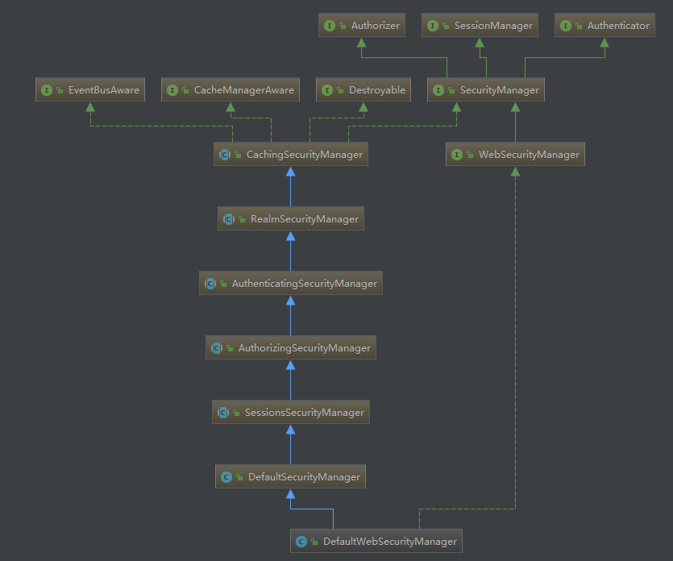

# SecurityManager 结构


重点是上面的接口继承关系, SecurityManager 继承了 Authorizer(授权), Authenticator(认证), SessionManager(会话管理)

Authorizer接口中的方法和 Subject 接口中定义的 检查系列方法是相同的, 所以在 Subject 实现类中,将方法托付给SecurityManager 的同名方法实现

Authenticator 接口只提供了一个关键方法
一个检查 Token 返回认证信息的方法
```java
public interface Authenticator {
    public AuthenticationInfo authenticate(AuthenticationToken authenticationToken)throws AuthenticationException;
}
```

# login 的实现
在 DefaultSecurityManager 中调用了 从AuthenticatingSecurityManager 继承来的  authenticate()方法这是对 Authenticator 接口的实现
```java
    public Subject login(Subject subject, AuthenticationToken token) throws AuthenticationException {
        AuthenticationInfo info;
        //一些异常处理被我去掉了, authenticate() 是继承来的方法
        info = authenticate(token);
        Subject loggedIn = createSubject(token, info, subject);
        return loggedIn;
    }
```

继续看下去就发现,在 SecurityManager 中 authenticate() 又把验证过程委派给另一个 Authenticateor 的实现 ModularRealmeAuthenticator 类, 而这个类持有一个 Realm 集合,通过判断又委派给 对应的 Realm 类

