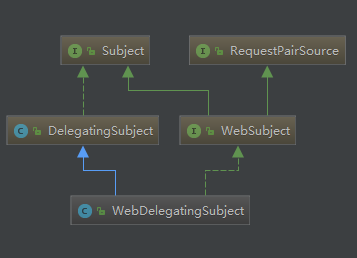

# 继承结构



# Subject
主要定义的方法(重载方法不计录)
```java
Object getPrincipal()       //获取身份信息
PrincipalConllection getPrincipals()

boolean isPermitted         //权限检查
void checkPermisssion

boolean hasRole             //角色检查
void checkRole

boolean isAuthernticated()   //是否已登入
boolean isRemembered()      

Session getSession()

void login(Authentication Token)
void logout()
```

Subject 当中还有一个 Static 的 Builder 类

看样子是用来 创建 Subject的
```java
    public Subject buildSubject() {
        return this.securityManager.createSubject(this.subjectContext);
    }
```
# DelegatingSubject
Delegating (委派)

这个类实现了 Subject 接口中的方法, 但是查看源码可知真正的判断逻辑在 SecurityManager 的对应方法中
```java
    public boolean isPermitted(String permission) {
        return hasPrincipals() && securityManager.isPermitted(getPrincipals(), permission);
    }
    public void checkPermission(String permission) throws AuthorizationException {
        //先断言验证的可能性, 简单的判断, 当前用户有无 Principasl , 没有的话就没必要在检查权限,抛出异常
        assertAuthzCheckPossible();
        securityManager.checkPermission(getPrincipals(), permission);
    }
```
其他的检查方法也是一样交给了 SecurityManager 实现,在此就不做记录了

## 重点 login 和 logout
login 也交给 SecurityManager 来做, 它会返回一个 Subject 对象, 通检查 返回的 Subject 对象来给 现在的Subject 对象的 Principals 赋值, 并把 authenticated(登入状态) 设置为 true

简单的记录一下
```java
public void login(AuthenticationToken token) throws AuthenticationException {
        clearRunAsIdentitiesInternal();
        Subject subject = securityManager.login(this, token);
        //更加 Subject 的情况判断然后赋值
        this.principals = principals;
        this.authenticated = true;
}
```