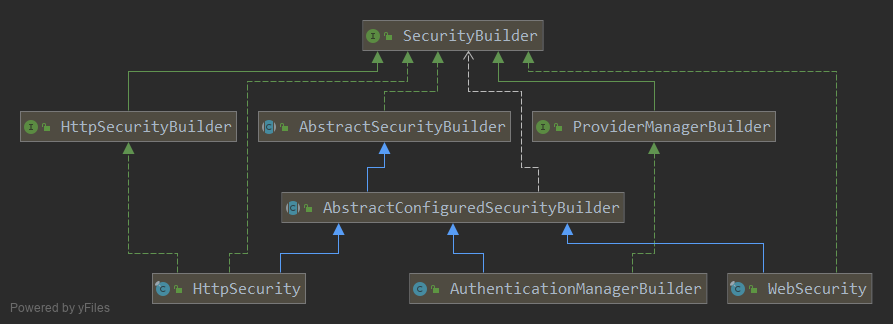

# SecurityBuilder


一个Builder接口负责创建对象.
```java
public interface SecurityBuilder<O> {
    0 build() throws Exception;
}
```
# AbstractSecurityBuilder
```java
// 保证了对象只会被创建一次, 因为 build 方法只能被调用一次.
// 但是没有明确的指明创建什么类型的对象, 泛型没有填. 把创建对象的逻辑委托给子类
public abstract class AbstractSecurityBuilder<O> implements SecurityBuilder<O> {
	private AtomicBoolean building = new AtomicBoolean();

	private O object;

	public final O build() throws Exception {
		if (this.building.compareAndSet(false, true)) {
			this.object = doBuild();
			return this.object;
		}
		throw new AlreadyBuiltException("This object has already been built");
	}

	public final O getObject() {
		if (!this.building.get()) {
			throw new IllegalStateException("This object has not been built");
		}
		return this.object;
	}

	protected abstract O doBuild() throws Exception;
}
```

---
一个允许 SecurityConfigurer 接口的实现进行配置的builder.
这个类的泛型需要两个, 一个是创建的目标对象 O, 一个是实现创建目标对象的Builder.
这个泛型真的很难懂. 
由于这个泛型的原因, 这个类的3个主要子类都又去implement SecurityBuilder 接口了.

```java
public abstract class AbstractConfiguredSecurityBuilder<O, B extends SecurityBuilder<O>>
		extends AbstractSecurityBuilder<O> {
	private final Log logger = LogFactory.getLog(getClass());

	private final LinkedHashMap<Class<? extends SecurityConfigurer<O, B>>, List<SecurityConfigurer<O, B>>> configurers = new LinkedHashMap<Class<? extends SecurityConfigurer<O, B>>, List<SecurityConfigurer<O, B>>>();
	private final List<SecurityConfigurer<O, B>> configurersAddedInInitializing = new ArrayList<SecurityConfigurer<O, B>>();

	private final Map<Class<? extends Object>, Object> sharedObjects = new HashMap<Class<? extends Object>, Object>();

	private final boolean allowConfigurersOfSameType;

	private BuildState buildState = BuildState.UNBUILT;

	private ObjectPostProcessor<Object> objectPostProcessor;
    // 构造器
	protected AbstractConfiguredSecurityBuilder(
			ObjectPostProcessor<Object> objectPostProcessor) {
		this(objectPostProcessor, false);
	}
	protected AbstractConfiguredSecurityBuilder(
			ObjectPostProcessor<Object> objectPostProcessor,
			boolean allowConfigurersOfSameType) {
		Assert.notNull(objectPostProcessor, "objectPostProcessor cannot be null");
		this.objectPostProcessor = objectPostProcessor;
		this.allowConfigurersOfSameType = allowConfigurersOfSameType;
	}

}
```

实现父类方法 doBuild().
当然这是一个模板方法, 只是定义如何执行build过程, 真正的build交给 performBuild();
1. 先初始化
2. 进行配置
3. 进行build
```java
protected final O doBuild() throws Exception {
    synchronized (configurers) {
        buildState = BuildState.INITIALIZING;

        beforeInit();
        init();

        buildState = BuildState.CONFIGURING;

        beforeConfigure();
        configure();

        buildState = BuildState.BUILDING;

        O result = performBuild();

        buildState = BuildState.BUILT;

        return result;
    }
}
```

## WebSecurity
这个最简单的子类, 没有涉及到额外的接口.
它继承了 AbstractConfiguredSecurityBuilder 类并填上了泛型是 Filter, 代表它是一个创建 Filter 的Builder.
然后它还实现了 SecurityBuilder\<Filter\>, 这样它就符合 AbstractConfiguredSecurityBuilder 的第二个泛型要求.
```java
public final class WebSecurity 
        extends AbstractConfiguredSecurityBuilder<Filter, WebSecurity>
        implements SecurityBuilder<Filter>, ApplicationContextAware {
            
}
```
