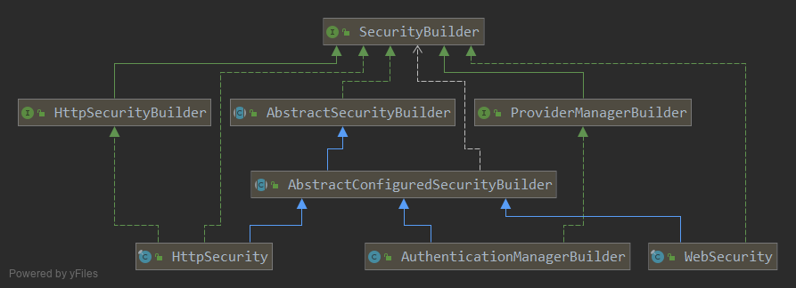

# SecurityBuilder



一个负责创建泛型指定类型对象的Builder接口. (建造者模式)

```java
public interface SecurityBuilder<O> {
    0 build() throws Exception;
}
```

# AbstractSecurityBuilder

保证了对象只会被创建一次, 因为 build 方法只能被调用一次. 提供了一个 getObject() 方法可以在Builder构建后反复获取同一个构建的对象.
但是没有明确的指明创建什么类型的对象, 泛型没有填. 把创建对象的逻辑委托给子类.

```java
public abstract class AbstractSecurityBuilder<O> implements SecurityBuilder<O> {
	private AtomicBoolean building = new AtomicBoolean();

	private O object;

	public final O build() throws Exception {
		if (this.building.compareAndSet(false, true)) {
			this.object = doBuild();
			return this.object;
		}
		throw new AlreadyBuiltException("This object has already been built");
	}

	public final O getObject() {
		if (!this.building.get()) {
			throw new IllegalStateException("This object has not been built");
		}
		return this.object;
	}

	protected abstract O doBuild() throws Exception;
}
```

# AbstractConfiguredSecurityBuilder

一个允许多个 SecurityConfigurer 接口的实现进行配置的builder. (还有 ObjectProcessor 接口)
这个类的泛型需要两个, 一个是创建的目标对象 O, 一个是实现创建目标对象的Builder.
这个泛型真的很难懂.
由于这个泛型的原因, 这个类的3个主要子类都又去implement SecurityBuilder 接口了.

除了提供 SecurityConfigurer 接口的集成外,
还提供了一个迷你的IOC的功能, 由 Map\<Classs, Object> sharedObjects 实现.
将一些需要共用的对象放置这个Map中.

这个功能在 AuthenticationManagerBuilder 中好像没有用到,
因为构建一个 AuthenticManager 时没有需要共享的组件.
相反在 HttpSecurity 中这个功能被经常使用, 因为许多类型的 Filter 都需要用到共有的对象.
而且 HttpSecurity 的构造器就要求, 必须传入 sharedObjects,
而且必须包含 AuthenticationManagerBuilder 对象(负责认证逻辑的Filter需要这个AuthenticationManagerBuilder)

```java
public abstract class AbstractConfiguredSecurityBuilder<O, B extends SecurityBuilder<O>>
		extends AbstractSecurityBuilder<O> {
	private final Log logger = LogFactory.getLog(getClass());

    // 保存SecurityConfigurer实现
	private final LinkedHashMap<Class<? extends SecurityConfigurer<O, B>>, List<SecurityConfigurer<O, B>>> configurers = new LinkedHashMap<Class<? extends SecurityConfigurer<O, B>>, List<SecurityConfigurer<O, B>>>();
    // 也是保存实现, 只不过这里的实例对象都是在 build() 方法中注册进来的.
	private final List<SecurityConfigurer<O, B>> configurersAddedInInitializing = new ArrayList<SecurityConfigurer<O, B>>();

	private final Map<Class<? extends Object>, Object> sharedObjects = new HashMap<Class<? extends Object>, Object>();

    // 一个系统内部的布尔标准, 我们无法修改, 也不应该修改.
    // 是否允许同一 SecurityConfigurer 配置多次, 会影响 apply() 时向 Map<Class, List<>>添加的行为.
    // 如果为 false, 那么 Map<Class, List> 中的List永远只能有一个,
    // 后注册的SecurityConfigurer会覆盖之前注册的相同类型的SecurityConfigurer
    // 如果为 true, 那么就允许同一种SecurityConfigurer配置多次.
    // 注意这个是被 final 修饰的, 意味着它在构造器中初始化后, 就不会改变.
    // WebSecurity 和 HttpSecurity 都是false, 而 AuthenticationManagerBuilder 是true
	private final boolean allowConfigurersOfSameType;

	private BuildState buildState = BuildState.UNBUILT;

	private ObjectPostProcessor<Object> objectPostProcessor;

    // protected 的构造器, 只能被子类使用, 子类的构造器会确定是否允许配置覆盖的策略(布尔值)
	protected AbstractConfiguredSecurityBuilder(
			ObjectPostProcessor<Object> objectPostProcessor) {
		this(objectPostProcessor, false);
	}
	protected AbstractConfiguredSecurityBuilder(
			ObjectPostProcessor<Object> objectPostProcessor,
			boolean allowConfigurersOfSameType) {
		Assert.notNull(objectPostProcessor, "objectPostProcessor cannot be null");
		this.objectPostProcessor = objectPostProcessor;
		this.allowConfigurersOfSameType = allowConfigurersOfSameType;
	}
}
```

实现父类方法 doBuild().
当然这是一个模板方法, 只是定义如何执行build过程,
真正的build交给 performBuild()方法, 所有的子类都会去实现这个方法.

1. 先初始化
2. 进行配置
3. 进行build

```java
protected final O doBuild() throws Exception {
    synchronized (configurers) {
        buildState = BuildState.INITIALIZING;

        // 给子类扩展用
        beforeInit();
        // 调用注册的 SecurityConfigurer.init() 方法
        init();

        buildState = BuildState.CONFIGURING;

        // 给子类扩展用
        beforeConfigure();
        // 调用注册的 SecurityConfigurer.configure() 方法
        configure();

        buildState = BuildState.BUILDING;

        O result = performBuild();

        buildState = BuildState.BUILT;

        return result;
    }
}
```

除了提供一个模板方法实现 doBuild() 外还提供了一个 getOrBuild() 方法

```java
public O getOrBuild() {
    if (isUnbuilt()) {
        try {
            return build();
        }
        catch (Exception e) {
            logger.debug("Failed to perform build. Returning null", e);
            return null;
        }
    }
    else {
        return getObject();
    }
}
```

## 和SecurityConfigurer的集成

下面是提供的和 SecurityConfigurer 接口实现集成的部分.
主要是

```java

public <C extends SecurityConfigurerAdapter<O, B>> C apply(C configurer)
        throws Exception {
    configurer.addObjectPostProcessor(objectPostProcessor);
    configurer.setBuilder((B) this);
    add(configurer);
    return configurer;
}

public <C extends SecurityConfigurer<O, B>> C apply(C configurer) throws Exception {
    add(configurer);
    return configurer;
}


private <C extends SecurityConfigurer<O, B>> void add(C configurer) throws Exception {
    Assert.notNull(configurer, "configurer cannot be null");

    Class<? extends SecurityConfigurer<O, B>> clazz = (Class<? extends SecurityConfigurer<O, B>>) configurer
            .getClass();
    synchronized (configurers) {
        if (buildState.isConfigured()) {
            throw new IllegalStateException("Cannot apply " + configurer
                    + " to already built object");
        }
        List<SecurityConfigurer<O, B>> configs = allowConfigurersOfSameType ? this.configurers
                .get(clazz) : null;
        if (configs == null) {
            configs = new ArrayList<SecurityConfigurer<O, B>>(1);
        }
        configs.add(configurer);
        this.configurers.put(clazz, configs);
        if (buildState.isInitializing()) {
            this.configurersAddedInInitializing.add(configurer);
        }
    }
}

@SuppressWarnings("unchecked")
public <C extends SecurityConfigurer<O, B>> List<C> getConfigurers(Class<C> clazz) {
    List<C> configs = (List<C>) this.configurers.get(clazz);
    if (configs == null) {
        return new ArrayList<>();
    }
    return new ArrayList<>(configs);
}

@SuppressWarnings("unchecked")
public <C extends SecurityConfigurer<O, B>> List<C> removeConfigurers(Class<C> clazz) {
    List<C> configs = (List<C>) this.configurers.remove(clazz);
    if (configs == null) {
        return new ArrayList<>();
    }
    return new ArrayList<>(configs);
}

@SuppressWarnings("unchecked")
public <C extends SecurityConfigurer<O, B>> C getConfigurer(Class<C> clazz) {
    List<SecurityConfigurer<O, B>> configs = this.configurers.get(clazz);
    if (configs == null) {
        return null;
    }
    if (configs.size() != 1) {
        throw new IllegalStateException("Only one configurer expected for type "
                + clazz + ", but got " + configs);
    }
    return (C) configs.get(0);
}

@SuppressWarnings("unchecked")
public <C extends SecurityConfigurer<O, B>> C removeConfigurer(Class<C> clazz) {
    List<SecurityConfigurer<O, B>> configs = this.configurers.remove(clazz);
    if (configs == null) {
        return null;
    }
    if (configs.size() != 1) {
        throw new IllegalStateException("Only one configurer expected for type "
                + clazz + ", but got " + configs);
    }
    return (C) configs.get(0);
}
```
