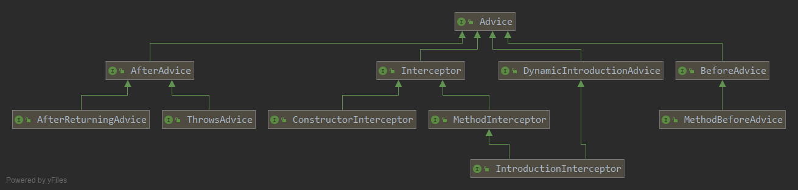

# Advice

顶级接口是AOP联盟定义的 Advice 是一个标记接口.

spring 扩展这个接口进行了分类, BeforeAdvice, AfterAdvice.
前置增强和后置增强的标记接口.

最后是AfterAdvice下又两个具体的子接口, 分别为正常返回时的增强, 和抛出异常时的增强.
但它们都是在方法调用之后执行, 所以都是后置增强.

BeforeAdvice 下只有一个具体接口, 就是MethodBeforeAdvice.

而环绕增强用的就是AOP联盟定义的 MethodInterceptor.

