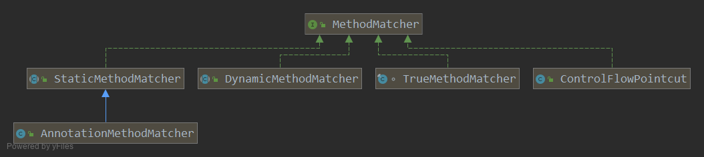

# PointCut

一个完整的切点由 ClassFilter 和 MethodMatcher.
一个确定哪些类需要被增强, 一个确定哪些方法需要被增强.

## ClassFilter

相当简单的接口. 用来确定目标类

```java
public interface ClassFilter {
    boolean matches(Class<?> clazz);
}
```


主要子类为 (ps: 我按复杂程度排的)

* TypePatternClassFilter(利用 AspectJ type match 实现的)
* AnnotationClassFilter(基于判断类上是否有指定类型的注解, 而决定是否匹配的)
* RootClassFilter(一个基于是否是指定子类进行匹配)
* TrueClassFilter(永远匹配的实现)

## MethodMatcher

和ClassFilter相比更为复杂.


Spring 支持两种方法匹配器: 静态方法匹配器和动态方法匹配器.
所谓静态方法匹配器, 仅对方法签名(方法名, 参数类型和类型)进行匹配.
而动态方法匹配器会在运行期检测方法入参的值
(可以实现如果参数是什么值之后才增强, 不是什么参数就不会增强).

静态匹配仅会判断一次, 而动态匹配因为每次调用方法的入参可能不同,
所以每次调用方法都必须进行判断, 因此动态匹配对性能影响很大.
一般情况下, 动态匹配不常使用. 方法匹配器类型由isRuntime()返回值确定.
返回false表示是静态方法匹配器, 返回ture表示是动态方法匹配器.

```java
public interface MethodMatcher {

    // 静态方法匹配器使用的方法
	boolean matches(Method method, Class<?> targetClass);

	boolean isRuntime();

    // 动态方法匹配器使用的方法
	boolean matches(Method method, Class<?> targetClass, Object... args);
}
```

## PointCut实现

我们知道所谓的 PointCut 就是一个ClassFilter 和 MethodMatcher的组合.
所以Spring提供了一些定义好的组合.

* ControlFlowPointcut (特殊的切点, 没有组合任何的ClassFilter, 和MethodMatcher 自己实现了这两个接口, getClassFilter()
  返回的是this)
* ComposablePointcut
* TruePoincut: TrueClassFilter 和 TrueMethodFilter 的组合, 匹配所有的类和所有的方法.
* AnnotationMatchingPointcut (根据调用的构造器的不同, 可以构造出不同的连接点,
  本质是组合基于注解的ClassFilter和MethodMatcher)
* StaticMethodMatcherPointcut ()
* DynmicMethodMatcherPointcut
