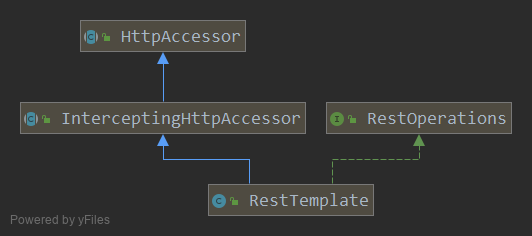
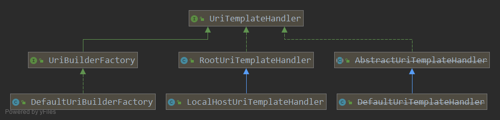
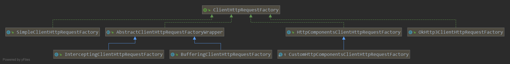
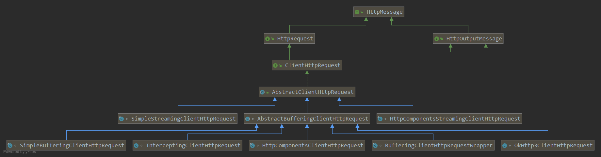

= RestTemplate

RestTemplate通过HTTP客户端库提供了更高级别的API.
它使在一行中轻松调用REST端点变得容易. 它公开了以下几组重载方法:

|===
|Method group |Description

|getForObject
|Column 2, row 1

|getForEntity
|

|headForHeaders
|Column 2, row 3

|postForLocation
|Column 2, row 4

|postForObject
|Column 2, row 5

|postForEntity
|Column 2, row 6

|put
|Column 2, row 7

|patchForObject
|Column 2, row 8

|delete
|Column 2, row 9

|optionsForAllow
|Column 2, row 10

|exchange
|Column 2, row 9

|execute
|Column 2, row 10
|===

== 源码实现

``ClientHttpRequestFactory``是一个``ClientHttpRequest``的工厂,
可以根据不同的Http类库开发出不同的实现.

=== HttpAccessor
``HttpAccessor``定义了如何``ClientHttpRequestFactory``进行交互.

.HttpAccessor.java
[source,java]
----
public class HttpAccessor {

	protected final Log logger = HttpLogging.forLogName(getClass());

	private ClientHttpRequestFactory requestFactory = new SimpleClientHttpRequestFactory();

	// 5.2 新添加的, 提供一个新的机制可以在 requestFactory 创建出使用的ClientHttpRequest 之后
	// 进行自定义的初始化.
	private final List<ClientHttpRequestInitializer> clientHttpRequestInitializers = new ArrayList<>();

	// 重点方法, 使用内部的 requestFactory 创建出ClientHttpRequest.
	protected ClientHttpRequest createRequest(URI url, HttpMethod method) throws IOException {
	    // 比较有趣的调用方式, 没有直接与字段进行交互, 而是通过getRequestFactory().
	    // 给子类替换requestFactory的机会.
		ClientHttpRequest request = getRequestFactory().createRequest(url, method);
		// 5.2 新增的自定义初始化逻辑.
		initialize(request);
		if (logger.isDebugEnabled()) {
			logger.debug("HTTP " + method.name() + " " + url);
		}
		return request;
	}

	private void initialize(ClientHttpRequest request) {
		this.clientHttpRequestInitializers.forEach(initializer -> initializer.initialize(request));
	}

	// 非常简单的getter, setter 方法.
	public void setRequestFactory(ClientHttpRequestFactory requestFactory) {
		Assert.notNull(requestFactory, "ClientHttpRequestFactory must not be null");
		this.requestFactory = requestFactory;
	}
	public ClientHttpRequestFactory getRequestFactory() {
		return this.requestFactory;
	}
	public void setClientHttpRequestInitializers(
			List<ClientHttpRequestInitializer> clientHttpRequestInitializers) {

		if (this.clientHttpRequestInitializers != clientHttpRequestInitializers) {
			this.clientHttpRequestInitializers.clear();
			this.clientHttpRequestInitializers.addAll(clientHttpRequestInitializers);
			AnnotationAwareOrderComparator.sort(this.clientHttpRequestInitializers);
		}
	}
	public List<ClientHttpRequestInitializer> getClientHttpRequestInitializers() {
		return this.clientHttpRequestInitializers;
	}
}
----

=== InterceptingHttpAccessor

添加拦截器机制的HttpAccessor

.InterceptingHttpAccessor.java
[source,java]
----
public abstract class InterceptingHttpAccessor extends HttpAccessor {

	private final List<ClientHttpRequestInterceptor> interceptors = new ArrayList<>();

	@Nullable
	private volatile ClientHttpRequestFactory interceptingRequestFactory;

	public void setInterceptors(List<ClientHttpRequestInterceptor> interceptors) {
		// Take getInterceptors() List as-is when passed in here
		if (this.interceptors != interceptors) {
			this.interceptors.clear();
			this.interceptors.addAll(interceptors);
			AnnotationAwareOrderComparator.sort(this.interceptors);
		}
	}

	public List<ClientHttpRequestInterceptor> getInterceptors() {
		return this.interceptors;
	}

	/**
	 * {@inheritDoc}
	 */
	@Override
	public void setRequestFactory(ClientHttpRequestFactory requestFactory) {
		super.setRequestFactory(requestFactory);
		this.interceptingRequestFactory = null;
	}

	// 重写父类HttpAccessor的 getRequestFactory()方法.
	// 因为createRequest()方法的实现是getRequestFactory().createRequest()实现的.
	// 所以重写getRequestFactory()方法在合适的时候(ps: 当有拦截器注册时)
	// 替换实现为InterceptingClientHttpRequestFactory
	@Override
	public ClientHttpRequestFactory getRequestFactory() {
		List<ClientHttpRequestInterceptor> interceptors = getInterceptors();
		if (!CollectionUtils.isEmpty(interceptors)) {
			ClientHttpRequestFactory factory = this.interceptingRequestFactory;
			if (factory == null) {
				factory = new InterceptingClientHttpRequestFactory(super.getRequestFactory(), interceptors);
				this.interceptingRequestFactory = factory;
			}
			return factory;
		}
		else {
			return super.getRequestFactory();
		}
	}

}
----

=== RestTemplate
主要定义一些细节, 如 URL 的构造, 异常处理, 和实现``RestOperations``接口.

.RestTemplate.java
[source,java]
----
class RestTemplate {

    // 最主要的方法.
	protected <T> T doExecute(URI url, @Nullable HttpMethod method, @Nullable RequestCallback requestCallback,
			@Nullable ResponseExtractor<T> responseExtractor) throws RestClientException {

		Assert.notNull(url, "URI is required");
		Assert.notNull(method, "HttpMethod is required");
		ClientHttpResponse response = null;
		try {

			ClientHttpRequest request = createRequest(url, method);// <1>
			if (requestCallback != null) {
				requestCallback.doWithRequest(request); // <2>
			}

			response = request.execute(); // <3>

			handleResponse(url, method, response); // <4>

			return (responseExtractor != null ? responseExtractor.extractData(response) : null); // <5>
		}
		catch (IOException ex) {
			String resource = url.toString();
			String query = url.getRawQuery();
			resource = (query != null ? resource.substring(0, resource.indexOf('?')) : resource);
			throw new ResourceAccessException("I/O error on " + method.name() +
					" request for \"" + resource + "\": " + ex.getMessage(), ex);
		}
		finally {
			if (response != null) {
				response.close();
			}
		}
	}
}
----
<1> 调用HttpAccessor中定义的 createRequest()方法
<2> 使用传入 requestCallback 对 request 进行填充数据, 比如header, body. 构造完整的请求.
<3> 调用 ClientHttpRequest 的 execute() 方法, 执行发送Http请求的步骤. 是一个阻塞线程的行为.
<4> 内部处理 response, 主要是会把 5xx 4xx 状态码映射为异常.
<5> 调用传入 responseExtractor 将 response 转换成指定的格式.

TIP: 这里涉及到 RequestCallback 和 ResponseExtractor 两个函数式接口.
非常简单并且功能明确, 所以就不多做介绍.

=== URI 的构造.
RestTemplate提供的许多方法都可以接受一个String url作为URL模板, 多个Object...作为路径变量.
而最后执行方法只接受一个URI作为最终的资源表示.
所以有一步就是通过URL模板字符串来生成一个正确的URI.

通过分析我们可以发现, 是通过UriTemplateHandler执行的.

this.uriTemplateHandler是在构造器中进行的初始化, 具体就不展开了.
[source,java]
----
public <T> T execute(String url, HttpMethod method, @Nullable RequestCallback requestCallback,
        @Nullable ResponseExtractor<T> responseExtractor, Object... uriVariables) throws RestClientException {

    URI expanded = getUriTemplateHandler().expand(url, uriVariables);
    return doExecute(expanded, method, requestCallback, responseExtractor);
}
----

==== UriTemplateHandler

[source,java]
----
public interface UriTemplateHandler {
    URI expand(String uriTemplate, Map<String, ?> uriVariables);

    URI expand(String uriTemplate, Object... uriVariables);
}
----

一个非常简单的接口, 在5.x版本中有多个实现.
DefaultUriTemplateHandler 是4.2 到5.x之间的默认实现.
5.0 之后提供了新的实现, 所以之前的也就被废弃了.
而中间的``RootUriTemplateHandler``是一个包装器, 用来添加/根节点.

===== UriBuilderFactory

继承UriTemplateHandler接口. 是一个工厂模式, 用来创建``UriBuilder``接口实例.

``UriBuilderFactory``接口``UriBuilder``都是5.0后添加的接口,
目的是面向接口编程, 使得系统解耦易于修改扩展.
3.1提供的用来构造URI的``UriComponentsBuilder``在5.0后实现了``UriBuilder``接口.

[source,java]
----
public interface UriBuilderFactory extends UriTemplateHandler {
    UriBuilder uriString(String uriTemplate);
    UriBuilder builder();
}
----

== 内部机制

通过基于不同的Http类库实现具体的 ClientHttpRequestFactory 和 HttpClientRequest.
让RestTemplate的发送http请求的能力不依赖与某个特定的类库, 可以与各种第三方类库进行集成.

=== ClientHttpRequestFactory

Spring 提供了3个不同基本实现, 内部使用分别是 java.net 包, Apache HttpComponent, OKHttp3.
一个装饰器模式分支.

.ClientHttpRequestFactory.java
[source,java]
----
public interface ClientHttpRequestFactory {

	ClientHttpRequest createRequest(URI uri, HttpMethod httpMethod) throws IOException;

}
----

==== SimpleClientHttpRequestFactory

最简单的实现, 使用java.net 实现.

.SimpleClientHttpRequestFactory.java
[source,java]
----
public class SimpleClientHttpRequestFactory implements ClientHttpRequestFactory, AsyncClientHttpRequestFactory {

	private static final int DEFAULT_CHUNK_SIZE = 4096;

	@Nullable
	private Proxy proxy;

	private boolean bufferRequestBody = true;

	private int chunkSize = DEFAULT_CHUNK_SIZE;

	private int connectTimeout = -1;

	private int readTimeout = -1;

	private boolean outputStreaming = true;

	@Nullable
	private AsyncListenableTaskExecutor taskExecutor;

	// 字段对应的setter, 没有getter.

	// 主要方法.
	@Override
	public ClientHttpRequest createRequest(URI uri, HttpMethod httpMethod) throws IOException {
		HttpURLConnection connection = openConnection(uri.toURL(), this.proxy);
		prepareConnection(connection, httpMethod.name());

		if (this.bufferRequestBody) {
			return new SimpleBufferingClientHttpRequest(connection, this.outputStreaming);
		}
		else {
			return new SimpleStreamingClientHttpRequest(connection, this.chunkSize, this.outputStreaming);
		}
	}

	@Override
	public AsyncClientHttpRequest createAsyncRequest(URI uri, HttpMethod httpMethod) throws IOException {
		Assert.state(this.taskExecutor != null, "Asynchronous execution requires TaskExecutor to be set");

		HttpURLConnection connection = openConnection(uri.toURL(), this.proxy);
		prepareConnection(connection, httpMethod.name());

		if (this.bufferRequestBody) {
			return new SimpleBufferingAsyncClientHttpRequest(
					connection, this.outputStreaming, this.taskExecutor);
		}
		else {
			return new SimpleStreamingAsyncClientHttpRequest(
					connection, this.chunkSize, this.outputStreaming, this.taskExecutor);
		}
	}

	protected HttpURLConnection openConnection(URL url, @Nullable Proxy proxy) throws IOException {
		URLConnection urlConnection = (proxy != null ? url.openConnection(proxy) : url.openConnection());
		if (!HttpURLConnection.class.isInstance(urlConnection)) {
			throw new IllegalStateException("HttpURLConnection required for [" + url + "] but got: " + urlConnection);
		}
		return (HttpURLConnection) urlConnection;
	}

	// 根据使用的http方法不同, 需要不同的设置.
	protected void prepareConnection(HttpURLConnection connection, String httpMethod) throws IOException {
		if (this.connectTimeout >= 0) {
			connection.setConnectTimeout(this.connectTimeout);
		}
		if (this.readTimeout >= 0) {
			connection.setReadTimeout(this.readTimeout);
		}

		connection.setDoInput(true);

		if ("GET".equals(httpMethod)) {
			connection.setInstanceFollowRedirects(true);
		}
		else {
			connection.setInstanceFollowRedirects(false);
		}

		if ("POST".equals(httpMethod) || "PUT".equals(httpMethod) ||
				"PATCH".equals(httpMethod) || "DELETE".equals(httpMethod)) {
			connection.setDoOutput(true);
		}
		else {
			connection.setDoOutput(false);
		}

		connection.setRequestMethod(httpMethod);
	}

}
----

=== ClientHttpRequest

.ClientHttpRequest.java
[source,java]
----
public interface ClientHttpRequest extends HttpRequest, HttpOutputMessage {

	ClientHttpResponse execute() throws IOException;

}
----

``ClientHttpRequest``的抽象基类, 实现这个request的不会被执行两次, 避免header和body多次传输.

.AbstractClientHttpRequest.java
[source,java]
----
public abstract class AbstractClientHttpRequest implements ClientHttpRequest {

    // 用一个HttpHeaders实现 OutputHttpMessage 的部分接口.
	private final HttpHeaders headers = new HttpHeaders();

	private boolean executed = false;

	@Override
	public final HttpHeaders getHeaders() {
		return (this.executed ? HttpHeaders.readOnlyHttpHeaders(this.headers) : this.headers);
	}

	@Override
	public final OutputStream getBody() throws IOException {
		assertNotExecuted();
		return getBodyInternal(this.headers);
	}

	// 实现 execute() 方法, 静止多次调用.
	public final ClientHttpResponse execute() throws IOException {
		assertNotExecuted();
		ClientHttpResponse result = executeInternal(this.headers);
		this.executed = true;
		return result;
	}

	protected void assertNotExecuted() {
		Assert.state(!this.executed, "ClientHttpRequest already executed");
	}

	protected abstract OutputStream getBodyInternal(HttpHeaders headers) throws IOException;

	protected abstract ClientHttpResponse executeInternal(HttpHeaders headers) throws IOException;

}
----

==== SimpleStreamingClientHttpRequest

使用标准JDK工具执行流请求的ClientHttpRequest实现.
通过SimpleClientHttpRequestFactory创建.

.SimpleStreamingClientHttpRequest
[source,java]
----
final class SimpleStreamingClientHttpRequest extends AbstractClientHttpRequest {

	private final HttpURLConnection connection;

	private final int chunkSize;

	@Nullable
	private OutputStream body;

	private final boolean outputStreaming;

	// 故意是包访问权限, 只能同包下的 SimpleClientHttpRequestFactory 使用.
	SimpleStreamingClientHttpRequest(HttpURLConnection connection, int chunkSize, boolean outputStreaming) {
		this.connection = connection;
		this.chunkSize = chunkSize;
		this.outputStreaming = outputStreaming;
	}

	@Override
	public String getMethodValue() {
		return this.connection.getRequestMethod();
	}

	@Override
	public URI getURI() {
		try {
			return this.connection.getURL().toURI();
		}
		catch (URISyntaxException ex) {
			throw new IllegalStateException("Could not get HttpURLConnection URI: " + ex.getMessage(), ex);
		}
	}

	@Override
	protected OutputStream getBodyInternal(HttpHeaders headers) throws IOException {
		if (this.body == null) {
			if (this.outputStreaming) {
				long contentLength = headers.getContentLength();
				if (contentLength >= 0) {
					this.connection.setFixedLengthStreamingMode(contentLength);
				}
				else {
					this.connection.setChunkedStreamingMode(this.chunkSize);
				}
			}
			SimpleBufferingClientHttpRequest.addHeaders(this.connection, headers);
			this.connection.connect();
			this.body = this.connection.getOutputStream();
		}
		return StreamUtils.nonClosing(this.body);
	}

	// 主要的执行方法,
	@Override
	protected ClientHttpResponse executeInternal(HttpHeaders headers) throws IOException {
		try {
			if (this.body != null) {
				this.body.close();
			}
			else {
			    //
				SimpleBufferingClientHttpRequest.addHeaders(this.connection, headers);
				this.connection.connect();
				// Immediately trigger the request in a no-output scenario as well
				this.connection.getResponseCode();
			}
		}
		catch (IOException ex) {
			// ignore
		}
		return new SimpleClientHttpResponse(this.connection);
	}

}
----
