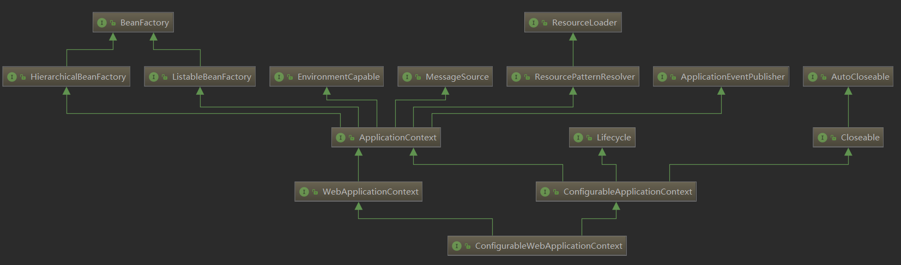

# Application



# AbstractApplicationContext

有三个 abstract (抽象)方法

```java
//这两个是自己提供的
protected abstract void refreshBeanFactory();
protected abstract void closeBeanFactory();
// 这个是从 ConfigurableApplication 中遗留的
public abstract ConfigurableListableBeanFactory getBeanFactory();
```

这里使用了模板方法, 将方法调用过程放在父类中, 子类实现这些方法的细节
这个方法是核心方法, 第一次加载配置和以后的刷新配置都是经过这个方法

```java
    @Override
	public void refresh() throws BeansException, IllegalStateException {
		synchronized (this.startupShutdownMonitor) {
            // 预备刷新这个context
			prepareRefresh();

            // 告诉子类刷新内部的 BeanFactory
            // obtaninFreshBeanFactory() 方法在下面
			ConfigurableListableBeanFactory beanFactory = obtainFreshBeanFactory();

			// Prepare the bean factory for use in this context.
			prepareBeanFactory(beanFactory);

			try {
                // 给子类扩展的空方法
				postProcessBeanFactory(beanFactory);

				// Invoke factory processors registered as beans in the context.
                // 调用 BeanFactoryPostProcessor
				invokeBeanFactoryPostProcessors(beanFactory);

				// Register bean processors that intercept bean creation.
				registerBeanPostProcessors(beanFactory);

				// Initialize message source for this context.
				initMessageSource();

				// Initialize event multicaster for this context.
				initApplicationEventMulticaster();

				// Initialize other special beans in specific context subclasses.
				onRefresh();

				// Check for listener beans and register them.
				registerListeners();

				// Instantiate all remaining (non-lazy-init) singletons.
				finishBeanFactoryInitialization(beanFactory);

				// Last step: publish corresponding event.
				finishRefresh();
			}

			catch (BeansException ex) {
				if (logger.isWarnEnabled()) {
					logger.warn("Exception encountered during context initialization - " +
							"cancelling refresh attempt: " + ex);
				}

				// Destroy already created singletons to avoid dangling resources.
				destroyBeans();

				// Reset 'active' flag.
				cancelRefresh(ex);

				// Propagate exception to caller.
				throw ex;
			}

			finally {
				// Reset common introspection caches in Spring's core, since we
				// might not ever need metadata for singleton beans anymore...
				resetCommonCaches();
			}
		}
	}
```

```java
    protected ConfigurableListableBeanFactory obtainFreshBeanFactory() {
        // 启动子类的 refreshBeanFactory() 方法
        // refreshBeanFactory() 在自己这里定义为abstract, 实现交给子类
        // 采用模板方法设计模式
        refreshBeanFactory();
        ConfigurableListableBeanFactory beanFactory = getBeanFactory();
        //一个debug等级的日志
        if (logger.isDebugEnabled()){
            logger.debug("Bean factory for " + getDisplayName() + ": " + beanFactory);
        }
        return beanFactory;
    }
```

```java
    protected final void refreshBeanFactory() throws BeanException {
        if (hasBeanFactory()) {
            destroyBeans();
            closeBeanFactory();
        }
        try {
            //创建一个和之前一样的 beanFactory
            //主要逻辑就是获得自己的**父容器**,如果父容器是个 ApplicationContext的话获得内部的 BeanFactory
            DefaultListableBeanFactory beanFactory = createBeanFactory();
            beanFactory.setSerializationId(getId());
            // 定制BeanFactory, 主要是设置是否允许别名覆盖和BeanDefinition覆盖
            customizeBeanFactory(beanFactory);
            // 加载BeanDefinition, 这个方法是个 abstract 方法, 具体由子类实现
            // 又是模板方法模式的使用
            loadBeanDefinitions(beanFactory);
            synchronized (this.BeanFactoryMonitor) {
                this.beanFactory = beanFactory;
            }
        }//异常处理
        catch (IOException ex){
            thorw new ApplicationContextException("");
        }
    }
```

这里我们选择学习 AbstractXmlApplicationContext 中的 loadBeanDefinitions() 实现

```java
    protected void loadBeanDefinitions(DefaultListableBeanFactory beanFactory) throws BeanException, IOException {
        // 创建一个 XmlBeanDefinitionReader
        XmlBeanDefinitionReader beanDefintionReader = new  XmlBeanDefinitionReader(beanFactory);
        //
        beanDefintionReader.setEnironment(this.getEnvironment());
        beanDefintionReader.setResourceLoader(this);
        beanDefintionReader.setEntityResolber(new ResourceEntityResovler(this));

        initBeanDefinitionReader(beanDefintionReader);
        loadBeanDefinitions(beanDefintionReader);
    }
```

# 子类

GenericApplicationContext(通用的applicationcontext) 和
AbstractRefreshableApplicationContext 继承并实现了 AbstractApplication

Spring 在这里搞了两套实现

AbstractRefreshableApplicationContext 实现了中的三个抽象方法,
并且提供了一个加载配置的抽象方法

```java
protected abstract void loadBeanDefinitions(DefaultListableBeanFactory beanFactory);
```
