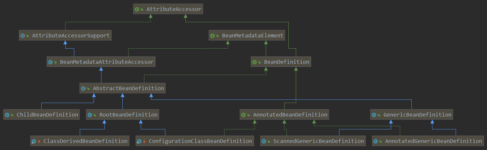

# BeanDefinition


一个 BeanDefinition 描述了一个 bean 实例, 它具有属性值, 构造参数值,

BeanDefinition 接口继承了 AttributeAccessor(属性访问器) 和 BeanMetadatElement 接口.
意味着要实现 BeanDefinition 的同时也要实现这两个接口.
Spring提供了上面两个的实现类, 方便实现BeanDefinition接口.

这个接口提供了方法抽象和一些公共变量.
```java
public interface BeanDefinition extends AttributeAccessor, BeanMetadataElement {

    // Spring定义了两个Scope, 单例和原型不需多讲
	String SCOPE_SINGLETON = ConfigurableBeanFactory.SCOPE_SINGLETON;
	String SCOPE_PROTOTYPE = ConfigurableBeanFactory.SCOPE_PROTOTYPE;

    // 这些常量代表一个BeanDefinition的角色, 是用户自己的Appliction, 还是Spring的内部对象
	int ROLE_APPLICATION = 0;
	int ROLE_SUPPORT = 1;
	int ROLE_INFRASTRUCTURE = 2;

	// Modifiable attributes
    // 设置Parent Definition(父定义)名字, 如果有的话, 对应XML文件中的 parent属性.
	void setParentName(@Nullable String parentName);
	@Nullable
	String getParentName();

    // 指定这个BeanDefinition对象代表的Class的类名, 
    // 这个属性可以在 beanfactory-post-processing 时被改变.
	void setBeanClassName(@Nullable String beanClassName);
	@Nullable
	String getBeanClassName();

    // 设置目标对象的 Scope 属性
	void setScope(@Nullable String scope);
	@Nullable
	String getScope();

    // 设置是否懒加载(lazyInit), 如果为false的话, 将会在BeanFactory实例化的时候被创建.
    // 这个属性只应用于单例范围的Bean
	void setLazyInit(boolean lazyInit);
	boolean isLazyInit();

    // 设置这个Bean初始化依赖的Bean的name, 对应XML中的 dependsOn 属性.
    // 和注解配置中的 @DependsOn 注解. 这些依赖对象会在这个Bean初始化前初始化.
    // 这里会有循环依赖, 
	void setDependsOn(@Nullable String... dependsOn);
	@Nullable
	String[] getDependsOn();

    // 指定这个Bean是否是自动配装的"候选者",如果为true,这个Bean就会被自动装配到需要它的Bean中.
    // 这个标志仅仅影响基于类型的自动装配.
    // 对应XML的autowire-candidate属性, @Bean(autowireCandidate=true)
	void setAutowireCandidate(boolean autowireCandidate);
	boolean isAutowireCandidate();

    // 设置是否是自动装配中的"首选项", 对应XML中primary属性, @Primary注解
	void setPrimary(boolean primary);
	boolean isPrimary();

    
    // 指定对应FactoryBean的名字. 对应XML中的factory-bean属性.
    // 和下面的factory-method配合使用, factory-bean指定对应的工厂, method指定工厂的创造方法
    // 合在一起就会变成一个bean的指定, 如果只有method, 没有factoryname, 
    // method指定的方法被视为本地静态方法
	void setFactoryBeanName(@Nullable String factoryBeanName);
	@Nullable
	String getFactoryBeanName();

    // 指定工厂方法的名字. 对应XML中的factory-method属性
	void setFactoryMethodName(@Nullable String factoryMethodName);
	@Nullable
	String getFactoryMethodName();

    // 返回这个Bean的构造参数, 对应<constructor-arg>标签的集合
	ConstructorArgumentValues getConstructorArgumentValues();
	default boolean hasConstructorArgumentValues() {
		return !getConstructorArgumentValues().isEmpty();
	}

    // 返回这个Bean的属性值, 对应<property> 标签集合.
	MutablePropertyValues getPropertyValues();
	default boolean hasPropertyValues() {
		return !getPropertyValues().isEmpty();
	}

    // 设置init-method方法, 对应XML中的init-method属性, @Bean(initMethod=""), @PostConstruct
	void setInitMethodName(@Nullable String initMethodName);
	@Nullable
	String getInitMethodName();

    // 设置destroy-method方法, 对应XML中的destory-method属性, @Bean(destroyMethod=""), @PreDestroy.
	void setDestroyMethodName(@Nullable String destroyMethodName);
	@Nullable
	String getDestroyMethodName();

    // 设置Bean对应的角色属性, 对框架来说挺重要的.
	void setRole(int role);
	int getRole();

    // 设置一个人类可读的描述
	void setDescription(@Nullable String description);
	@Nullable
	String getDescription();


	// Read-only attributes

    // 是否对应的Scope
	boolean isSingleton();
	boolean isPrototype();

    // 返回一个Bean是否为"abstract", 如果为true就意味着不要创建这个Bean.
	boolean isAbstract();

    // 返回此BeanDefinition的来源的描述
	@Nullable
	String getResourceDescription();

	@Nullable
	BeanDefinition getOriginatingBeanDefinition();

}
```
总结一下, BeanDefiniton接口一共定义了14个属性
* 父定义name
* BeanClass的全类名
* Scope
* LazyInit
* 
```java
String parentName;
String beanClassName;
String scope
boolean isLazyInit
String[] dependsOn
boolean isAutowireCandidate
boolean isPrimary
String factoryBeanName
String factroyMethodName
String initMethod
String destroyMethod
int ROLE
boolean isAbstract

String description

//
MutablePropertyValues
ConstrcutorArgumentValues
```

