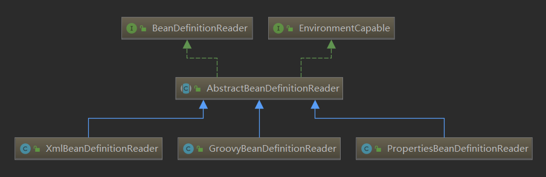

# BeanDefinitionReader



Simple interface for bean definition readers.
这个接口负责向 BeanDefinitionRegistry 中注册 BeanDefinition

```java
public interface BeanDefinitionReader {
    //这几个方法其实反应了实现类中会有什么
    //BeanDefinitionReader 其实就是组合运用这几个类
    BeanDefinitionRegistry getRegistry();
    ResourceLoader getResourceLoader();
    ClassLoader getBeanClassLoader();
    BeanNameGenerator getBeanNameGenerator();
    // 核心方法
    int loadBeanDefinitions(Resource resource);
    int loadBeanDefinitions(Resource... resources);
    int loadBeanDefinitions(String location);
    int loadBeanDefinitions(String... locations);
}
```

## AbstractBeanDefinitionReader

字段和构造器.
实现了 BeanDefinitionReader 接口. 有一个方法没有实现

```java
public abstract class AbstractBeanDefinitionReader implements EnvironmentCapable, BeanDefinitionReader{
    private final BeanDefinitionRegistry registry;
    private ResourceLoader resourceLoader;
    private ClassLoader beanClassLoader;
    private Environment environment;
    private BeanNameGenerator beanNameGenerator = new DefaultBeanNameGenerator();

    /*
    * 利用BeanDefinitionRegistry进行初始化.
    * 因为在Spring中Application实现了各种接口,
    * 在Spring内部中每次调用这个方法传入的其实都是 BeanFactory 或 ApplicationContext
    * */
    protected AbstractBeanDefinitionReader(BeanDefinitionRegistry registry) {
        Assert.notNull(registry, "BeanDefinitionRegistry must not be null");
        this.registry = registry;

        // Determine ResourceLoader to use.
        if (this.registry instanceof ResourceLoader) {
            this.resourceLoader = (ResourceLoader) this.registry;
        }
        else {
            this.resourceLoader = new PathMatchingResourcePatternResolver();
        }
        // Inherit Environment if possible
        if (this.registry instanceof EnvironmentCapable) {
            this.environment = ((EnvironmentCapable) this.registry).getEnvironment();
        }
        else {
            this.environment = new StandardEnvironment();
        }
    }
}
```

## 核心代码

```java
    // 循环遍历, 对每一个Resource方法调用loadBeanDefintion(Resource)方法
    public int loadBeanDefinitions(Resource... resources) throws BeanDefinitionException {
        Assert.notNull(resource, "Resource array must not be null");
        int counter = 0;
        for (Resource resource : resources) {
            counter += loadBeanDefinitions(resource);
        }
        return counter;
    }


    // 这两个方法调用 loadBeanDefinition(String, Set<Resource>) 方法
    // 而那个方法会调用, loadBeanDefinition(Resource) 方法.
    public int loadBeanDefinitions(String location) throws BeanDefinitionException {
        return loadBeanDefinitions(location, null);
    }
    public int loadBeanDefinitions(String... locations) throws BeanDefinitionException {
        Assert.notNull(locations, "Resource array must not be null");
        int counter = 0;
        for (String location : locations) {
            counter += loadBeanDefinitions(location);
        }
        return counter;
    }

    public int loadBeanDefinitions(String location, Set<Resource> actualResources) throws BeanDefinitionException {
        ResourceLoader resourceLoader = getResourceLoader();
        if (resourceLoader = null) {
            throw new BeanDefinitionStoreException(
                    "Cannot import bean definitions from location [" + location + "]: no ResourceLoader available");
        }

        if (resourceLoader instanceof ResourcePatternResolver) {
            try {
                Resource[] resources = ((ResourcePatternResolver)resourceLoader).getResources(location);
                int loadCount = loadBeanDefinitions(resources);
                if (actualResources != null) {
                    for (Resource resource : resources) {
                        actualResources.add(resource);
                    }
                }
                if (logger.isDebugEnable()) {
                    logger.debug();
                }
                return loadCount;
            }
            catch (IOException ex) {
                throw new BeanDefinitionStoreException(
                        "Could not resolve bean definition resource pattern [" + location + "]");
            }
        }
        else {
            Resource resource = resourceLoader.getResource(location);
            int loadCount = loadBeanDefinitions(resource);
            if (actualResources != null) {
                actualResources.add(resource);
            }
            if (logger.isDebugEnable()) {
                logger.debug();
            }
            return loadCount;
        }
    }
}

public abstract int loadBeanDefinitions(Resource resource);
```

其他load方法底层都依赖于它, 然后把它交给子类实现 (ps:模板方法设计模式)
其他方法的实现都很简单, 只是简单的持有一个相应的类对象
然后一些 setter/getter 方法

# XmlBeanDefinitionReader

字段含义

```java
public static final int VALIDATION_NOTE = XmlValidationModeDetector.VALIDATION_NOTE;
public static final int VALIDATION_AUTO = XmlValidationModeDetector.VALIDATION_AUTO;
public static final int VALIDATION_DTD = XmlValidationModeDetector.VALIDATION_DTD;
public static final int VALIDATION_XSD = XmlValidationModeDetector.VALIDATION_XSD;
private static final Constants constants = new Constants(XmlBeanDefinitionReader.class);
private int validationMode = VALIDATION_AUTO;
private boolean namespaceAware = false;
private Class<?> documentReaderClass = DefaultBeanDefinitionDocumentReader.class;
private ProblemReporter problemReporter = new FailFastProblemReporter();
private ReaderEventListener eventListener = new EmptyReaderEventListener();
private SourceExtractor sourceExtractor = new NullSourceExtractor();
private NamespaceHandlerResolver namespaceHandlerResolver;
private DocumentLoader documentLoader = new DefaultDocumentLoader();
private EntityResolver entityResolver;
private ErrorHandler errorHandler = new SimpleSaxErrorHandler();
private final XmlValidationModeDetector validationModeDetector = new XmlValidationModeDetector();
private final ThreadLocal<Set<EncodedResource>> resourcesCurrentlyBeingLoaded =
        new NamedThreadLocal<>("XML bean definition resources currently being loaded");
```

XmlBeanDefinitionReader 实现了这个抽象方法
这个方法是启动解析的方法

```java
public int loadBeanDefinitions(EncodedResource encodedResource) throws BeanDefinitionStoreException {
    Assert.notNull(encodedResource, "EncodedResource must not be null");
    if (logger.isInfoEnabled()) {
        logger.info("Loading XML bean definitions from " + encodedResource.getResource());
    }

    // resourceCurrentlyBeingLoaded 是一个 ThreadLocal 对象
    Set<EncodedResource> currentResources = this.resourcesCurrentlyBeingLoaded.get();
    if (currentResources == null) {
        currentResources = new HashSet<EncodedResource>(4);
        this.resourcesCurrentlyBeingLoaded.set(currentResources);
    }
    if (!currentResources.add(encodedResource)) {
        throw new BeanDefinitionStoreException(
                "Detected cyclic loading of " + encodedResource + " - check your import definitions!");
    }
    try {
        InputStream inputStream = encodedResource.getResource().getInputStream();
        try {
            InputSource inputSource = new InputSource(inputStream);
            if (encodedResource.getEncoding() != null) {
                inputSource.setEncoding(encodedResource.getEncoding());
            }
            // 加载 BeanDefinitions. 首先获得 Document 对象
            // 然后解析 Document 对象
            return doLoadBeanDefinitions(inputSource, encodedResource.getResource());
        }
        finally {
            inputStream.close();
        }
    }
    catch (IOException ex) {
        throw new BeanDefinitionStoreException(
                "IOException parsing XML document from " + encodedResource.getResource(), ex);
    }
    finally {
        currentResources.remove(encodedResource);
        if (currentResources.isEmpty()) {
            this.resourcesCurrentlyBeingLoaded.remove();
        }
    }
}

// 负责加载出 Document 对象, 然后通过这个文档对象进行注册行为,
// 以及在解析 Document 对象时抛出异常进行捕捉和处理.
protected int doLoadBeanDefinitions(InputSource inputSource, Resource resource)
        throws BeanDefinitionStoreException {
    try {
        // 重点, 其他都是异常的捕捉和处理
        Document doc = doLoadDocument(inputSource, resource);
        int count = registerBeanDefinitions(doc, resource);
        if (logger.isDebugEnabled()) {
            logger.debug("Loaded " + count + " bean definitions from " + resource);
        }
        return count;
    }
    catch (BeanDefinitionStoreException ex) {
        throw ex;
    }
    catch (SAXParseException ex) {
        throw new XmlBeanDefinitionStoreException(resource.getDescription(),
                "Line " + ex.getLineNumber() + " in XML document from " + resource + " is invalid", ex);
    }
    catch (SAXException ex) {
        throw new XmlBeanDefinitionStoreException(resource.getDescription(),
                "XML document from " + resource + " is invalid", ex);
    }
    catch (ParserConfigurationException ex) {
        throw new BeanDefinitionStoreException(resource.getDescription(),
                "Parser configuration exception parsing XML from " + resource, ex);
    }
    catch (IOException ex) {
        throw new BeanDefinitionStoreException(resource.getDescription(),
                "IOException parsing XML document from " + resource, ex);
    }
    catch (Throwable ex) {
        throw new BeanDefinitionStoreException(resource.getDescription(),
                "Unexpected exception parsing XML document from " + resource, ex);
    }
}
```

```java
// 通过Document对象获得BeanDefintion 然后进行注册.
// 实际上是委托给 BeanDefinitionDocumentReader 进行的. 它被定义为接口是为了方便扩展.
// Spring 已经提供了一个默认实现, 我们也就不必纠结
public int registerBeanDefinitions(Document doc, Resource resource) throws BeanDefinitionStoreException {
    // 这个createBeanDefintionDocumentReader() 方法就是用来接口的实现的.
    // 通过自定义值我们也可以让 XmlBeanDefintionReader 使用我们提供的接口实现.
    // 不过默认是Spring提供的那个实现.
    BeanDefinitionDocumentReader documentReader = createBeanDefinitionDocumentReader();
    int countBefore = getRegistry().getBeanDefinitionCount();
    documentReader.registerBeanDefinitions(doc, createReaderContext(resource));
    return getRegistry().getBeanDefinitionCount() - countBefore;
}
```

# DefaultBeanDefinitionDocumentReader

```java
public void registerBeanDefinitions(Document doc, XmlReaderContext readerContext) {
    this.readerContext = readerContext;
    doRegisterBeanDefinitions(doc.getDocumentElement());
}

@SuppressWarnings("deprecation")  // for Environment.acceptsProfiles(String...)
protected void doRegisterBeanDefinitions(Element root) {
    // Any nested <beans> elements will cause recursion in this method. In
    // order to propagate and preserve <beans> default-* attributes correctly,
    // keep track of the current (parent) delegate, which may be null. Create
    // the new (child) delegate with a reference to the parent for fallback purposes,
    // then ultimately reset this.delegate back to its original (parent) reference.
    // this behavior emulates a stack of delegates without actually necessitating one.
    BeanDefinitionParserDelegate parent = this.delegate;
    this.delegate = createDelegate(getReaderContext(), root, parent);

    if (this.delegate.isDefaultNamespace(root)) {
        String profileSpec = root.getAttribute(PROFILE_ATTRIBUTE);
        if (StringUtils.hasText(profileSpec)) {
            String[] specifiedProfiles = StringUtils.tokenizeToStringArray(
                    profileSpec, BeanDefinitionParserDelegate.MULTI_VALUE_ATTRIBUTE_DELIMITERS);
            // We cannot use Profiles.of(...) since profile expressions are not supported
            // in XML config. See SPR-12458 for details.
            if (!getReaderContext().getEnvironment().acceptsProfiles(specifiedProfiles)) {
                if (logger.isDebugEnabled()) {
                    logger.debug("Skipped XML bean definition file due to specified profiles [" + profileSpec +
                            "] not matching: " + getReaderContext().getResource());
                }
                return;
            }
        }
    }

    preProcessXml(root);
    parseBeanDefinitions(root, this.delegate);
    postProcessXml(root);

    this.delegate = parent;
}

```

