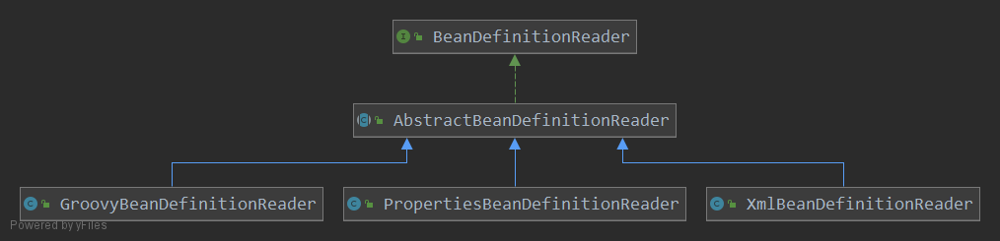

# AbstractBeanDefinitionReader
下面是AbstractBeanDefinitionReader的字段和初始化分析:
```java
public abstract class AbstractBeanDefinitionReader implements BeanDefinitionReader, EnvironmentCapable {
	
    /** Logger available to subclasses. */
	protected final Log logger = LogFactory.getLog(getClass());
    // 需要一个可以注册解析出来的Definition的地方 
	private final BeanDefinitionRegistry registry;
    // 一个资源定位器用来定位 Resource 位置
	private ResourceLoader resourceLoader;
    // 用来加载 BeanClass
	private ClassLoader beanClassLoader;
    // 提供环境抽象
	private Environment environment;
    // 为Bean生成名字
	private BeanNameGenerator beanNameGenerator = new DefaultBeanNameGenerator();
	protected AbstractBeanDefinitionReader(BeanDefinitionRegistry registry) {
		Assert.notNull(registry, "BeanDefinitionRegistry must not be null");
		this.registry = registry;
		// Determine ResourceLoader to use.
		if (this.registry instanceof ResourceLoader) {
			this.resourceLoader = (ResourceLoader) this.registry;
		}
		else {
			this.resourceLoader = new PathMatchingResourcePatternResolver();
		}
		// Inherit Environment if possible
		if (this.registry instanceof EnvironmentCapable) {
			this.environment = ((EnvironmentCapable) this.registry).getEnvironment();
		}
		else {
			this.environment = new StandardEnvironment();
		}
	}
}
```

# XmlBeanDefinitionReader
```java
    // 首先是静态常量用来判断XML文件的验证方式分别为, 不验证, 自动选择, DTD, XSD
	public static final int VALIDATION_NONE = XmlValidationModeDetector.VALIDATION_NONE;
	public static final int VALIDATION_AUTO = XmlValidationModeDetector.VALIDATION_AUTO;
	public static final int VALIDATION_DTD = XmlValidationModeDetector.VALIDATION_DTD;
	public static final int VALIDATION_XSD = XmlValidationModeDetector.VALIDATION_XSD;

	private static final Constants constants = new Constants(XmlBeanDefinitionReader.class);

    // 默认的验证等级是AUTO
	private int validationMode = VALIDATION_AUTO;
	private boolean namespaceAware = false;
	private Class<? extends BeanDefinitionDocumentReader> documentReaderClass =
			DefaultBeanDefinitionDocumentReader.class;
            
	private ProblemReporter problemReporter = new FailFastProblemReporter();
	private ReaderEventListener eventListener = new EmptyReaderEventListener();
	private SourceExtractor sourceExtractor = new NullSourceExtractor();

	@Nullable
	private NamespaceHandlerResolver namespaceHandlerResolver;
	private DocumentLoader documentLoader = new DefaultDocumentLoader();

	@Nullable
	private EntityResolver entityResolver;
	private ErrorHandler errorHandler = new SimpleSaxErrorHandler(logger);
	private final XmlValidationModeDetector validationModeDetector = new XmlValidationModeDetector();
	private final ThreadLocal<Set<EncodedResource>> resourcesCurrentlyBeingLoaded =
			new NamedThreadLocal<>("XML bean definition resources currently being loaded");
```

# Core
```java
	public int loadBeanDefinitions(Resource resource) throws BeanDefinitionStoreException {
		return loadBeanDefinitions(new EncodedResource(resource));
	}
	public int loadBeanDefinitions(EncodedResource encodedResource) throws BeanDefinitionStoreException {
		Set<EncodedResource> currentResources = this.resourcesCurrentlyBeingLoaded.get();
		if (currentResources == null) {
			currentResources = new HashSet<>(4);
			this.resourcesCurrentlyBeingLoaded.set(currentResources);
		}
		if (!currentResources.add(encodedResource)) {
			throw new BeanDefinitionStoreException(
					"Detected cyclic loading of " + encodedResource + " - check your import definitions!");
		}
		try {
			InputStream inputStream = encodedResource.getResource().getInputStream();
			try {
				InputSource inputSource = new InputSource(inputStream);
				if (encodedResource.getEncoding() != null) {
					inputSource.setEncoding(encodedResource.getEncoding());
				}
				// 重点调用
				return doLoadBeanDefinitions(inputSource, encodedResource.getResource());
			}
			finally {
				inputStream.close();
			}
		}
		catch (IOException ex) {
			throw new BeanDefinitionStoreException(
					"IOException parsing XML document from " + encodedResource.getResource(), ex);
		}
		finally {
			currentResources.remove(encodedResource);
			if (currentResources.isEmpty()) {
				this.resourcesCurrentlyBeingLoaded.remove();
			}
		}
	}
```

```java
// 
protected int doLoadBeanDefinitions(InputSource inputSource, Resource resource)
        throws BeanDefinitionStoreException {
    try {
        Document doc = doLoadDocument(inputSource, resource);
        // 重点调用
        int count = registerBeanDefinitions(doc, resource);
        if (logger.isDebugEnabled()) {
            logger.debug("Loaded " + count + " bean definitions from " + resource);
        }
        return count;
    }//省略了catch 异常的部分
}
// 将Document的解析过程交给 BeanDefinitionDocumentReader 来完成
public int registerBeanDefinitions(Document doc, Resource resource) throws BeanDefinitionStoreException {
    BeanDefinitionDocumentReader documentReader = createBeanDefinitionDocumentReader();
    int countBefore = getRegistry().getBeanDefinitionCount();
    documentReader.registerBeanDefinitions(doc, createReaderContext(resource));
    return getRegistry().getBeanDefinitionCount() - countBefore;
}
```

# BeanDefinitionDocumentReader
```java
	protected void doRegisterBeanDefinitions(Element root) {
		BeanDefinitionParserDelegate parent = this.delegate;
		this.delegate = createDelegate(getReaderContext(), root, parent);
		// 这个if语句块主要是获取这个 xml 文件指定激活的 profile, 并且设置environment
		if (this.delegate.isDefaultNamespace(root)) {
			String profileSpec = root.getAttribute(PROFILE_ATTRIBUTE);
			if (StringUtils.hasText(profileSpec)) {
				String[] specifiedProfiles = StringUtils.tokenizeToStringArray(
						profileSpec, BeanDefinitionParserDelegate.MULTI_VALUE_ATTRIBUTE_DELIMITERS);
				// We cannot use Profiles.of(...) since profile expressions are not supported
				// in XML config. See SPR-12458 for details.
				if (!getReaderContext().getEnvironment().acceptsProfiles(specifiedProfiles)) {
					if (logger.isDebugEnabled()) {
						logger.debug("Skipped XML bean definition file due to specified profiles [" + profileSpec +
								"] not matching: " + getReaderContext().getResource());
					}
					return;
				}
			}
		}

		// 空方法
		preProcessXml(root);
		// 具体方法
		parseBeanDefinitions(root, this.delegate);
		// 空方法
		postProcessXml(root);

		this.delegate = parent;
	}
	protected void parseBeanDefinitions(Element root, BeanDefinitionParserDelegate delegate) {
		if (delegate.isDefaultNamespace(root)) {
			NodeList nl = root.getChildNodes();
			for (int i = 0; i < nl.getLength(); i++) {
				Node node = nl.item(i);
				if (node instanceof Element) {
					Element ele = (Element) node;
					if (delegate.isDefaultNamespace(ele)) {
						parseDefaultElement(ele, delegate);
					}
					else {
						delegate.parseCustomElement(ele);
					}
				}
			}
		}
		else {
			delegate.parseCustomElement(root);
		}
	}
	// 解决默认标签 Improt, Alias, bean, beans
	private void parseDefaultElement(Element ele, BeanDefinitionParserDelegate delegate) {
		if (delegate.nodeNameEquals(ele, IMPORT_ELEMENT)) {
			importBeanDefinitionResource(ele);
		}
		else if (delegate.nodeNameEquals(ele, ALIAS_ELEMENT)) {
			processAliasRegistration(ele);
		}
		else if (delegate.nodeNameEquals(ele, BEAN_ELEMENT)) {
			// 主要关注这个方法, 这个方法解析<bean/>标签
			processBeanDefinition(ele, delegate);
		}
		else if (delegate.nodeNameEquals(ele, NESTED_BEANS_ELEMENT)) {
			// recurse
			doRegisterBeanDefinitions(ele);
		}
	}
	protected void processBeanDefinition(Element ele, BeanDefinitionParserDelegate delegate) {
		// BeanDefinitionHolder 是BeanDefinition 的包装类
		BeanDefinitionHolder bdHolder = delegate.parseBeanDefinitionElement(ele);
		if (bdHolder != null) {
			bdHolder = delegate.decorateBeanDefinitionIfRequired(ele, bdHolder);
			try {
				// 这里就是向IoC容器注册解析得到BeanDefinition的地方
				BeanDefinitionReaderUtils.registerBeanDefinition(bdHolder, getReaderContext().getRegistry());
			}
			catch (BeanDefinitionStoreException ex) {
				getReaderContext().error("Failed to register bean definition with name '" +
						bdHolder.getBeanName() + "'", ele, ex);
			}
			// Send registration event.
			getReaderContext().fireComponentRegistered(new BeanComponentDefinition(bdHolder));
		}
	}
	protected void preProcessXml(Element root) {
	}
	protected void preProcessXml(Element root) {
	}
```

 最后还是调用了 DeanDefinitionParserDelegate 上的方法来完成解析
 ```java
 	public BeanDefinitionHolder parseBeanDefinitionElement(Element ele) {
		return parseBeanDefinitionElement(ele, null);
	}
	public BeanDefinitionHolder parseBeanDefinitionElement(Element ele, @Nullable BeanDefinition containingBean) {
		// <bean/> 标签的 id, name 属性处理
		String id = ele.getAttribute(ID_ATTRIBUTE);
		String nameAttr = ele.getAttribute(NAME_ATTRIBUTE);

		List<String> aliases = new ArrayList<>();
		if (StringUtils.hasLength(nameAttr)) {
			String[] nameArr = StringUtils.tokenizeToStringArray(nameAttr, MULTI_VALUE_ATTRIBUTE_DELIMITERS);
			aliases.addAll(Arrays.asList(nameArr));
		}

		String beanName = id;
		// 如果没有指定id, 但是别名不为空, 用别名的第一个作为beanName
		if (!StringUtils.hasText(beanName) && !aliases.isEmpty()) {
			beanName = aliases.remove(0);
			if (logger.isTraceEnabled()) {
				logger.trace("No XML 'id' specified - using '" + beanName +
						"' as bean name and " + aliases + " as aliases");
			}
		}

		if (containingBean == null) {
			checkNameUniqueness(beanName, aliases, ele);
		}

		// 这里会触发<bean/> 的详细解析, 并且生成 BeanDefinition
		AbstractBeanDefinition beanDefinition = parseBeanDefinitionElement(ele, beanName, containingBean);
		if (beanDefinition != null) {
			if (!StringUtils.hasText(beanName)) {
				try {
					if (containingBean != null) {
						beanName = BeanDefinitionReaderUtils.generateBeanName(
								beanDefinition, this.readerContext.getRegistry(), true);
					}
					else {
						beanName = this.readerContext.generateBeanName(beanDefinition);
						// Register an alias for the plain bean class name, if still possible,
						// if the generator returned the class name plus a suffix.
						// This is expected for Spring 1.2/2.0 backwards compatibility.
						String beanClassName = beanDefinition.getBeanClassName();
						if (beanClassName != null &&
								beanName.startsWith(beanClassName) && beanName.length() > beanClassName.length() &&
								!this.readerContext.getRegistry().isBeanNameInUse(beanClassName)) {
							aliases.add(beanClassName);
						}
					}
					if (logger.isTraceEnabled()) {
						logger.trace("Neither XML 'id' nor 'name' specified - " +
								"using generated bean name [" + beanName + "]");
					}
				}
				catch (Exception ex) {
					error(ex.getMessage(), ele);
					return null;
				}
			}
			String[] aliasesArray = StringUtils.toStringArray(aliases);
			return new BeanDefinitionHolder(beanDefinition, beanName, aliasesArray);
		}

		return null;
	}
 ```
