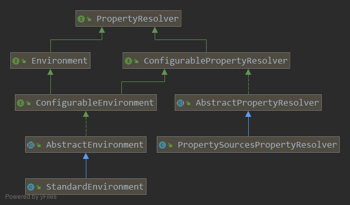

# Environment
environment interface 是集成在容器中的抽象, 
它模拟了应用程序环境的两个关键方面: profiles and properties;

*profiles*是在给定配置文件活动状态时才向容器注册的bean的逻辑组.
与profiles有关的environment对象的作用确定哪些处于活动状态.
以及默认情况下哪些配置文件应处于活动状态.

```java
// 接口中定义了与 profiles 有关的方法. 和 properties 有关的方法从父接口继承来.
public interface Environment extends PropertyResolver {

    // 获得激活的 profiles
	String[] getActiveProfiles();
    // 获得默认激活的 profiles
	String[] getDefaultProfiles();

    // 返回给定名字的 profiles 的状态, 如果由!开头逻辑会反转.
    // 如: p1 是active 而 p2 not active则 acceptsProfiles("p1", "!p2") 会返回 true.
	@Deprecated
	boolean acceptsProfiles(String... profiles);
    // 功能和上面一样, Spring提供了静态方法用于String中创建Profiles对象.
	boolean acceptsProfiles(Profiles profiles);
}

// 用于解析任何来源的properties, 属性值解决器. 实现Environment接口就必须实现它, 当然其实spring提供了一个具体实现类.
public interface PropertyResolver {

    // 返回key是否由对应值
	boolean containsProperty(String key);

    // 返回给定key对应的值或null
	@Nullable
	String getProperty(String key);

    // 返回给定key对应的值或 默认值.
	String getProperty(String key, String defaultValue);

	@Nullable
	<T> T getProperty(String key, Class<T> targetType);

	<T> T getProperty(String key, Class<T> targetType, T defaultValue);

    // 返回对应key的值, 永远不会为null, 如果那不到就会 抛出异常, 这意味着传入的key是必须的.
	String getRequiredProperty(String key) throws IllegalStateException;

	<T> T getRequiredProperty(String key, Class<T> targetType) throws IllegalStateException;

    // 用于解决${...}占位符, 可以使用 key:value之间的默认分隔符":"来提供默认值.
    // text = "${uesr.dir:/wkunc}"
	String resolvePlaceholders(String text);

    // 把必须的属性.
	String resolveRequiredPlaceholders(String text) throws IllegalArgumentException;
}
```

# ConfigurableEnvironment
提供用于设置活动和配置文件以及操作基础源的方法.(上面的接口只有获取方法没有设置方法)
```java
public interface ConfigurableEnvironment extends Environment, ConfigurablePropertyResolver {

	void setActiveProfiles(String... profiles);

	void addActiveProfile(String profile);

	void setDefaultProfiles(String... profiles);

    // 
	MutablePropertySources getPropertySources();

	Map<String, Object> getSystemProperties();

	Map<String, Object> getSystemEnvironment();

	void merge(ConfigurableEnvironment parent);
}

// 
public interface ConfigurablePropertyResolver extends PropertyResolver {

    // 用来转换类型的服务, 应该会用在传入Class对象要求取到对应类型的值的地方.
	ConfigurableConversionService getConversionService();
	void setConversionService(ConfigurableConversionService conversionService);

    // 占位符前缀
	void setPlaceholderPrefix(String placeholderPrefix);

    // 占位符后缀
	void setPlaceholderSuffix(String placeholderSuffix);

    // 值的分隔符
	void setValueSeparator(@Nullable String valueSeparator);

    // 是否忽视不能解决的嵌套占位符, 应该是一个布尔值
	void setIgnoreUnresolvableNestedPlaceholders(boolean ignoreUnresolvableNestedPlaceholders);

    // 这两个方法是配合使用的, 一个设置哪些属性必须要存在, 一个验证这些必要属性是否存在
	void setRequiredProperties(String... requiredProperties);
	void validateRequiredProperties() throws MissingRequiredPropertiesException;
}
```



我们首先学习 PropertyResolver 的实现. 它承当了占位符的解析是重要的功能.
# PropertyResolver

## AbstractPropertyResolver
解决properties代理任何的底层source.
也就是说这个类没有定义如何存储属性值, 可以是Map, 可以是java.util.Properties.
具体子类确定信息存储的方式, 这个父类负责实现通用的接口方法如: 

setPlaceholderPrefix()
setConversionService()
setRequiredProperties()
validateRequiredProperties() 等等.

以及大部分的核心方法的逻辑:
getProperty(String key);
getProperty(String key, String defaultValue);
containsProperty(String key);

当然有很多方法的逻辑是绕路的, 不是很好.
因为这个类不知道底层的信息, 所以只能绕路实现. 不过这些方法的逻辑都是正确的.
当然子类一般会重新这些绕路实现的方法如: containsProperty() 方法.


类声明和构造器如下: 
没有显式构造器, 只有一个默认的无参构造器
```java
public abstract class AbstractPropertyResolver implements ConfigurablePropertyResolver {

	protected final Log logger = LogFactory.getLog(getClass());

    // 用来实现的类型转换的服务
	@Nullable
	private volatile ConfigurableConversionService conversionService;

    // 重点
	@Nullable
	private PropertyPlaceholderHelper nonStrictHelper;
	@Nullable
	private PropertyPlaceholderHelper strictHelper;

    // 接口中定义方法对应的字段
	private boolean ignoreUnresolvableNestedPlaceholders = false;

    // 占位符前缀, 默认值 "${"
	private String placeholderPrefix = SystemPropertyUtils.PLACEHOLDER_PREFIX;

    // 占位符后缀, 默认值 "}"
	private String placeholderSuffix = SystemPropertyUtils.PLACEHOLDER_SUFFIX;

    // 值分隔符, 默认值 ":"
	@Nullable
	private String valueSeparator = SystemPropertyUtils.VALUE_SEPARATOR;

    // 用来实现接口的字段.
	private final Set<String> requiredProperties = new LinkedHashSet<>();
}
```

### 核心方法的实现
```java
// 调用 getProperty(String key, Class clazz)
public String getProperty(String key) {
    return getProperty(key, String.class);
}

// 调用 getProperty(String key)
public String getProperty(String key, String defaultValue) {
    String value = getProperty(key);
    return (value != null ? value : defaultValue);
}

// 调用 getProperty(String key, Class clazz)
public <T> T getProperty(String key, Class<T> targetType, T defaultValue) {
    T value = getProperty(key, targetType);
    return (value != null ? value : defaultValue);
}

// 调用 getProperty(String key)
public String getRequiredProperty(String key) throws IllegalStateException {
    String value = getProperty(key);
    if (value == null) {
        throw new IllegalStateException("Required key '" + key + "' not found");
    }
    return value;
}

// 调用 getProperty(String key, Class clazz)
public <T> T getRequiredProperty(String key, Class<T> valueType) throws IllegalStateException {
    T value = getProperty(key, valueType);
    if (value == null) {
        throw new IllegalStateException("Required key '" + key + "' not found");
    }
    return value;
}
```
以上核心方法的实现都是调用了 PropertyResolver 接口定义的
getProperty(String key, Class clazz) 方法实现的.
当然AbstractPropertyResolver没有实现这个方法, 交给子类实现.


```java
@Override
public String resolvePlaceholders(String text) {
    if (this.nonStrictHelper == null) {
        this.nonStrictHelper = createPlaceholderHelper(true);
    }
    return doResolvePlaceholders(text, this.nonStrictHelper);
}

// 和上面的不同点是 createPlaceholderHelper() 的参数值.
@Override
public String resolveRequiredPlaceholders(String text) throws IllegalArgumentException {
    if (this.strictHelper == null) {
        this.strictHelper = createPlaceholderHelper(false);
    }
    return doResolvePlaceholders(text, this.strictHelper);
}

private String doResolvePlaceholders(String text, PropertyPlaceholderHelper helper) {
    return helper.replacePlaceholders(text, this::getPropertyAsRawString);
}

//
private PropertyPlaceholderHelper createPlaceholderHelper(boolean ignoreUnresolvablePlaceholders) {
    return new PropertyPlaceholderHelper(this.placeholderPrefix, this.placeholderSuffix,
            this.valueSeparator, ignoreUnresolvablePlaceholders);
}

```

## PropertySourcesPropertyResolver
用PropertySouces来做底层存储数据的对象, 而实现的属性值解析器.

```java
public class PropertySourcesPropertyResolver extends AbstractPropertyResolver {

	@Nullable
	private final PropertySources propertySources;

	public PropertySourcesPropertyResolver(@Nullable PropertySources propertySources) {
		this.propertySources = propertySources;
	}
}
```


```java
public <T> T getProperty(String key, Class<T> targetValueType) {
    return getProperty(key, targetValueType, true);
}

protected <T> T getProperty(String key, Class<T> targetValueType, boolean resolveNestedPlaceholders) {
    if (this.propertySources != null) {
        for (PropertySource<?> propertySource : this.propertySources) {
            if (logger.isTraceEnabled()) {
                logger.trace("Searching for key '" + key + "' in PropertySource '" +
                        propertySource.getName() + "'");
            }
            Object value = propertySource.getProperty(key);
            if (value != null) {
                if (resolveNestedPlaceholders && value instanceof String) {
                    value = resolveNestedPlaceholders((String) value);
                }
                logKeyFound(key, propertySource, value);
                // 进行类型转换, 父类提供的方法, 毕竟ConverterService在父类中就配置了
                return convertValueIfNecessary(value, targetValueType);
            }
        }
    }
    if (logger.isTraceEnabled()) {
        logger.trace("Could not find key '" + key + "' in any property source");
    }
    return null;
}
```

很显然如何获得值是通过内部的 PropertySources (这个接口只有一个实现类) 
而这个接口想表达的就是一堆 PropertySource(注意没有s) 的集合.
可以简单的理解为一个 List\<PropertySource>.

然后让我们把目光放在 PropertySource 类上.

# PropertySource
刨去一个logger对象, 就只剩一个 name 和一个 source.

这个类想表达的就是一个有name做标识的属性源, 
所以上面解析器里面打印信息时, 打印了在那个属性源中获取的值.

而一个泛型为 T source 是因为如何实现根据key获取value有许多的方式.
如我们上面提到的 Map, Properties 等等.

而JNDI也可以看作一个属性源, 通过JNDI也可以实现通过key获取值的行为.

所以这个类就是为了让哪些能作为属性源的对象有一个同一的表示.
而不用一个一个实现具体的, 通过PropertySources对象还可以把不同的类型的属性源组合到一起.
如将 MapPropertySource, JndiPropertySource 等组合在一起. 这样查询值的时候就会全部查到.
有了更好的扩展性.
```java
public abstract class PropertySource<T> {

	protected final String name;
	protected final T source;

	public PropertySource(String name, T source) {
		Assert.hasText(name, "Property source name must contain at least one character");
		Assert.notNull(source, "Property source must not be null");
		this.name = name;
		this.source = source;
	}

	public PropertySource(String name) {
		this(name, (T) new Object());
	}

	public abstract Object getProperty(String name);

    //以下省略若干方法,如 equal, hashCode(为了能放到HashMap等容器中), containsProperty...
}
```


首先根据能否遍历这个特点将PropertySource分成两大类, 
一种是 EnumerablePropertySource(可枚举的), JndiPropertySource.

Enumerable 的意味着可以方便的遍历属性源的所有属性(getPropertyNames())
方便调用者内省可用属性, 而无需访问底层源对象.
也有助于更有效的实现containsProperty()方法, 
因为它可以调用 getPropertyNames() 并遍历返回的数组来确定是否包含,
而不用使用更昂贵的getProperty().

大多数Spring提供的PropertySource实例都是可枚举的.
反例是 JndiPropertySource, 
由于 JNDI 的性质,任何给定时间都无法确定所有可能的属性名, 
它只能尝试访问属性(通过getProperty(String))来判断属性是否存在.

```java
public abstract class EnumerablePropertySource<T> extends PropertySource<T> {
    // 省略构造器..

	public boolean containsProperty(String name) {
		return ObjectUtils.containsElement(getPropertyNames(), name);
	}

	public abstract String[] getPropertyNames();
}
```


# Environment
接下来就非常简单了, AbstractEnvironment 实现了所有的功能.
PropertyResolver接口的方法委托给对应的字段, 
Environment接口的方法自己实现, 也比较简单.

就是PropertyResovler接口只负责解析当前的属性源中的值, 接口中也没有定义如何设置内部的 PropertySources.
只有在初始化的时候才能传入设置, 所以添加属性源的方法在Environment中.
```java
public abstract class AbstractEnvironment implements ConfigurableEnvironment {
	protected final Log logger = LogFactory.getLog(getClass());

	private final Set<String> activeProfiles = new LinkedHashSet<>();

	private final Set<String> defaultProfiles = new LinkedHashSet<>(getReservedDefaultProfiles());

	private final MutablePropertySources propertySources = new MutablePropertySources();

	private final ConfigurablePropertyResolver propertyResolver =
			new PropertySourcesPropertyResolver(this.propertySources);

	public AbstractEnvironment() {
		customizePropertySources(this.propertySources);
	}
}
```
