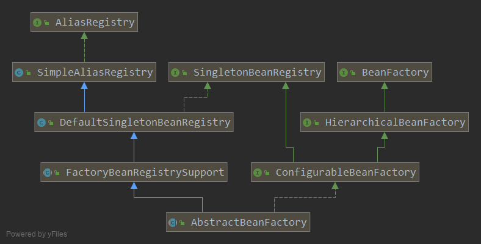

# AbstractBeanFactory



它是Spring最基础的BeanFactory, 实现了 ConfigurableBeanFactory 的全部功能.


不假定 Listable beanFactory, 因此可以作为所有的BeanFactory的基类.
但也因此 对 BeanDefinition 的访问变的"昂贵"

通过基类 DefaultSingletonBeanRegistry 提供了, 
singleton/prototype 确定,
FactoryBean 处理,
别名管理,
用于 childBeanDefinition 和 BeanDefinition meger.

子类要实现的主要模板方法是: 
1. getBeanDefinition(): 给指定beanName查找一个 BeanDefinition
2. createBean(): 给定一个 BeanDefinition 创建一个 bean 实例

以及访问BeanDefinition的方法


```java
public abstract class AbstractBeanFactory extends FactoryBeanRegistrySupport implements ConfigurableBeanFactory {

	@Nullable
	private BeanFactory parentBeanFactory;

	@Nullable
	private ClassLoader beanClassLoader = ClassUtils.getDefaultClassLoader();

	@Nullable
	private ClassLoader tempClassLoader;

	private boolean cacheBeanMetadata = true;

	@Nullable
	private BeanExpressionResolver beanExpressionResolver;

	@Nullable
	private ConversionService conversionService;

	private final Set<PropertyEditorRegistrar> propertyEditorRegistrars = new LinkedHashSet<>(4);

	private final Map<Class<?>, Class<? extends PropertyEditor>> customEditors = new HashMap<>(4);

	@Nullable
	private TypeConverter typeConverter;

	private final List<StringValueResolver> embeddedValueResolvers = new CopyOnWriteArrayList<>();

	private final List<BeanPostProcessor> beanPostProcessors = new CopyOnWriteArrayList<>();


	/** Indicates whether any InstantiationAwareBeanPostProcessors have been registered. */
	private volatile boolean hasInstantiationAwareBeanPostProcessors;

	/** Indicates whether any DestructionAwareBeanPostProcessors have been registered. */
	private volatile boolean hasDestructionAwareBeanPostProcessors;

    // 注册的Scope 名字
	private final Map<String, Scope> scopes = new LinkedHashMap<>(8);

	/** Security context used when running with a SecurityManager. */
	@Nullable
	private SecurityContextProvider securityContextProvider;

	/** Map from bean name to merged RootBeanDefinition. */
	private final Map<String, RootBeanDefinition> mergedBeanDefinitions = new ConcurrentHashMap<>(256);

	/** Names of beans that have already been created at least once. */
	private final Set<String> alreadyCreated = Collections.newSetFromMap(new ConcurrentHashMap<>(256));

	/** Names of beans that are currently in creation. */
	private final ThreadLocal<Object> prototypesCurrentlyInCreation =
			new NamedThreadLocal<>("Prototype beans currently in creation");


	/**
	 * Create a new AbstractBeanFactory.
	 */
	public AbstractBeanFactory() {
	}

	/**
	 * Create a new AbstractBeanFactory with the given parent.
	 * @param parentBeanFactory parent bean factory, or {@code null} if none
	 * @see #getBean
	 */
	public AbstractBeanFactory(@Nullable BeanFactory parentBeanFactory) {
		this.parentBeanFactory = parentBeanFactory;
	}

}
```

# Implementation of BeanFactory interface

```java
@Override
public Object getBean(String name) throws BeansException {
    return doGetBean(name, null, null, false);
}

@Override
public <T> T getBean(String name, Class<T> requiredType) throws BeansException {
    return doGetBean(name, requiredType, null, false);
}

@Override
public Object getBean(String name, Object... args) throws BeansException {
    return doGetBean(name, null, args, false);
}
public <T> T getBean(String name, @Nullable Class<T> requiredType, @Nullable Object... args)
        throws BeansException {

    return doGetBean(name, requiredType, args, false);
}

protected <T> T doGetBean(final String name, @Nullable final Class<T> requiredType,
        @Nullable final Object[] args, boolean typeCheckOnly) throws BeansException {

    final String beanName = transformedBeanName(name);
    Object bean;

    // Eagerly check singleton cache for manually registered singletons.
    Object sharedInstance = getSingleton(beanName);
    if (sharedInstance != null && args == null) {
        if (logger.isTraceEnabled()) {
            if (isSingletonCurrentlyInCreation(beanName)) {
                logger.trace("Returning eagerly cached instance of singleton bean '" + beanName +
                        "' that is not fully initialized yet - a consequence of a circular reference");
            }
            else {
                logger.trace("Returning cached instance of singleton bean '" + beanName + "'");
            }
        }
        bean = getObjectForBeanInstance(sharedInstance, name, beanName, null);
    }

    else {
        // Fail if we're already creating this bean instance:
        // We're assumably within a circular reference.
        if (isPrototypeCurrentlyInCreation(beanName)) {
            throw new BeanCurrentlyInCreationException(beanName);
        }

        // Check if bean definition exists in this factory.
        BeanFactory parentBeanFactory = getParentBeanFactory();
        if (parentBeanFactory != null && !containsBeanDefinition(beanName)) {
            // Not found -> check parent.
            String nameToLookup = originalBeanName(name);
            if (parentBeanFactory instanceof AbstractBeanFactory) {
                return ((AbstractBeanFactory) parentBeanFactory).doGetBean(
                        nameToLookup, requiredType, args, typeCheckOnly);
            }
            else if (args != null) {
                // Delegation to parent with explicit args.
                return (T) parentBeanFactory.getBean(nameToLookup, args);
            }
            else if (requiredType != null) {
                // No args -> delegate to standard getBean method.
                return parentBeanFactory.getBean(nameToLookup, requiredType);
            }
            else {
                return (T) parentBeanFactory.getBean(nameToLookup);
            }
        }

        if (!typeCheckOnly) {
            markBeanAsCreated(beanName);
        }

        try {
            final RootBeanDefinition mbd = getMergedLocalBeanDefinition(beanName);
            checkMergedBeanDefinition(mbd, beanName, args);

            // Guarantee initialization of beans that the current bean depends on.
            String[] dependsOn = mbd.getDependsOn();
            if (dependsOn != null) {
                for (String dep : dependsOn) {
                    if (isDependent(beanName, dep)) {
                        throw new BeanCreationException(mbd.getResourceDescription(), beanName,
                                "Circular depends-on relationship between '" + beanName + "' and '" + dep + "'");
                    }
                    registerDependentBean(dep, beanName);
                    try {
                        getBean(dep);
                    }
                    catch (NoSuchBeanDefinitionException ex) {
                        throw new BeanCreationException(mbd.getResourceDescription(), beanName,
                                "'" + beanName + "' depends on missing bean '" + dep + "'", ex);
                    }
                }
            }

            // Create bean instance.
            if (mbd.isSingleton()) {
                sharedInstance = getSingleton(beanName, () -> {
                    try {
                        return createBean(beanName, mbd, args);
                    }
                    catch (BeansException ex) {
                        // Explicitly remove instance from singleton cache: It might have been put there
                        // eagerly by the creation process, to allow for circular reference resolution.
                        // Also remove any beans that received a temporary reference to the bean.
                        destroySingleton(beanName);
                        throw ex;
                    }
                });
                bean = getObjectForBeanInstance(sharedInstance, name, beanName, mbd);
            }

            else if (mbd.isPrototype()) {
                // It's a prototype -> create a new instance.
                Object prototypeInstance = null;
                try {
                    beforePrototypeCreation(beanName);
                    prototypeInstance = createBean(beanName, mbd, args);
                }
                finally {
                    afterPrototypeCreation(beanName);
                }
                bean = getObjectForBeanInstance(prototypeInstance, name, beanName, mbd);
            }

            else {
                String scopeName = mbd.getScope();
                final Scope scope = this.scopes.get(scopeName);
                if (scope == null) {
                    throw new IllegalStateException("No Scope registered for scope name '" + scopeName + "'");
                }
                try {
                    Object scopedInstance = scope.get(beanName, () -> {
                        beforePrototypeCreation(beanName);
                        try {
                            return createBean(beanName, mbd, args);
                        }
                        finally {
                            afterPrototypeCreation(beanName);
                        }
                    });
                    bean = getObjectForBeanInstance(scopedInstance, name, beanName, mbd);
                }
                catch (IllegalStateException ex) {
                    throw new BeanCreationException(beanName,
                            "Scope '" + scopeName + "' is not active for the current thread; consider " +
                            "defining a scoped proxy for this bean if you intend to refer to it from a singleton",
                            ex);
                }
            }
        }
        catch (BeansException ex) {
            cleanupAfterBeanCreationFailure(beanName);
            throw ex;
        }
    }

    // Check if required type matches the type of the actual bean instance.
    if (requiredType != null && !requiredType.isInstance(bean)) {
        try {
            T convertedBean = getTypeConverter().convertIfNecessary(bean, requiredType);
            if (convertedBean == null) {
                throw new BeanNotOfRequiredTypeException(name, requiredType, bean.getClass());
            }
            return convertedBean;
        }
        catch (TypeMismatchException ex) {
            if (logger.isTraceEnabled()) {
                logger.trace("Failed to convert bean '" + name + "' to required type '" +
                        ClassUtils.getQualifiedName(requiredType) + "'", ex);
            }
            throw new BeanNotOfRequiredTypeException(name, requiredType, bean.getClass());
        }
    }
    return (T) bean;
}
```
