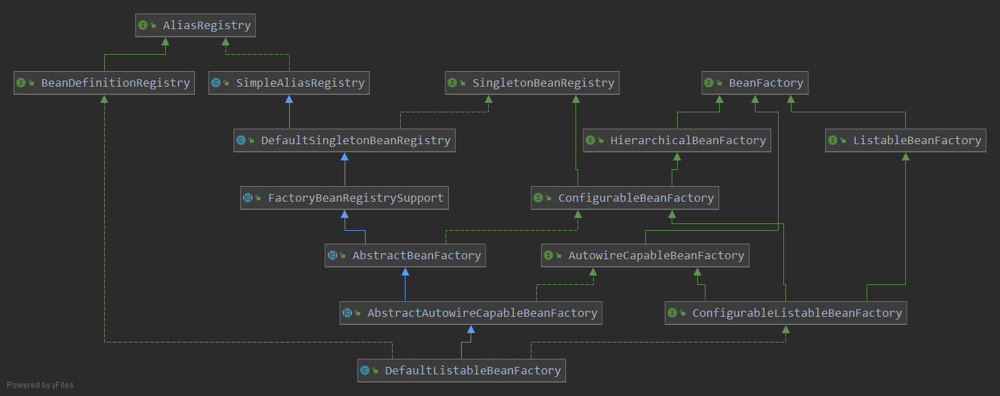

= BeanFactory

它是 Spring bean container 的 root interface 

它主要定义了一系列的 getBean() 方法

[source,java]
----
public interface BeanFactory {
    //通过指定的beanName获取指定的 Bean
    //在 AbstractBeanFactory 中实现
    Object getBean(String name) throws BeansException;

    //指定名字和类型来获取 Bean, requireType 可以是其父类或接口, 甚至可以是 null
    //在 AbstractBeanFactory 中实现
    <T> T getBean(String name, Class<T> requireType) throws BeansException;

    //用指定的参数来构建指定的 Bean, 这些参数可以是构造器参数/工厂方法参数,用来覆盖默认的参数
    //在 AbstractBeanFactory 中实现
    // 2.5版本加入
    Object getBean(String name, Object... args) throws BeansException;

    //返回唯一匹配的对象类型, 不可以为 null.
    //在 DefaultListableBeanFactory 中实现
    // 3.0版本加入
    <T> T getBean(Class<T> requiredType) throws BeansException;

    //和上面的一样,用新的参数去构造一个新的指定对象
    //在 DefaultListableBeanFactory 中实现
    // 4.1版本加入
    <T> T getBean(Class<T> requiredType, Object... args) throws BeansException;

    // 5.1 新加的两个方法
	<T> ObjectProvider<T> getBeanProvider(Class<T> requiredType);
	<T> ObjectProvider<T> getBeanProvider(ResolvableType requiredType);

    // 在 AbstractBeanFactory 中实现
    boolean containsBean(String name);
    boolean isSingleton(String name);
    boolean isProtorype(String name);

    //返回给定的beanName 和 类型是否匹配. ResolvableType 封装了 java.lang.reflect.Type 类
    //在 AbstractBeanFactory 中实现
    boolean isTypeMatch(String name, ResolvableType typeToMatch);
    boolean isTypeMatch(String name, Class<?> typeToMatch);

    // 在 AbstractBeanFactory 中实现.
    Class<?> getType(String );
    String[] getAliases(String name);
}
----

== ListableBeanFactory

定义了访问容器中 Bean 基本信息的若干方法
比如获取容器中 BeanDefinition 的个数

[source,java]
----
public interface ListableBeanFactory extends BeanFactory {

	boolean containsBeanDefinition(String beanName);

	int getBeanDefinitionCount();

	String[] getBeanDefinitionNames();

	String[] getBeanNamesForType(ResolvableType type);

	String[] getBeanNamesForType(ResolvableType type, boolean includeNonSingletons, boolean allowEagerInit);

	String[] getBeanNamesForType(@Nullable Class<?> type);

	String[] getBeanNamesForType(@Nullable Class<?> type, boolean includeNonSingletons, boolean allowEagerInit);

	<T> Map<String, T> getBeansOfType(@Nullable Class<T> type) throws BeansException;

	<T> Map<String, T> getBeansOfType(@Nullable Class<T> type, boolean includeNonSingletons, boolean allowEagerInit)
			throws BeansException;

	String[] getBeanNamesForAnnotation(Class<? extends Annotation> annotationType);

	Map<String, Object> getBeansWithAnnotation(Class<? extends Annotation> annotationType) throws BeansException;

	@Nullable
	<A extends Annotation> A findAnnotationOnBean(String beanName, Class<A> annotationType)
			throws NoSuchBeanDefinitionException;

}
----

== HierarchicalBeanFactory

定义了父子级联的 Ioc 容器接口
仅仅包含了两个方法

[source,java]
----
public interface HierarchicalBeanFactory extends BeanFactory{
    //返回父容器, 如果没有返回 null
    BeanFactory getParentBeanFactory();
    // 判断当前 BeanFactory 中是否有指定名字的 Bean ,忽略父容器中的
    boolean containsLocalBean(String name);
}
----

== ConfigurableBeanFactory

这是一个重量级的接口, 它增强了 IoC 容器的可定制性(ps:可配置的BeanFactroy嘛)
这个 BeanFactory 接口并不适合用于普通的应用程序,
这个扩展接口只是为了允许框架内部的即插即用和对 BeanFactory 配置方法的特殊访问.

它定义了设置类装载器, 属性编辑器, 容器初始化后置处理器 等方法

. ParentBeanFactory BeanFactory // 父接口中来的
. BeanClassLoader 加载Bean的ClassLoader
. TempClassLoader ClassLoader
. CacheBeanMetadata boolean (ps:是否缓存元数据)
. BeanExpressionResolver(ps:好像和 EL表达式有关)
. ConversionService(类型转换服务)
. PropertyEditorRegistrar(属性编辑器)
. TyepConverter(类型转换)
. EmbeddedValueResolver
. BeanPostProcessor

[source,java]
----
public interface ConfigurableBeanFactory extends HierarchiaclBeanFactory, SingletonBeanRegistry {

    String SCOPE_SINGLETON = "singleton";

}
----

== AutowireCapableBeanFactory

自动装配的 BeanFactory. 这个接口是暴露了内部自动装配的方法, 不是给常规的应用使用的.
通常给那些其他框架使用, 不能由 Spring 控制生命周期的Bean提供依赖注入的地方.
即那些Bean不是由 Spring 创建的, 但Spring可以给它们提供所需的组件bean.
也就是可以通过这个接口中定义的方法来 "手动" 装配一个组件

[source,java]
----
public interface AutowireCapableBeanFactory extends BeanFactory {

	int AUTOWIRE_NO = 0;

	int AUTOWIRE_BY_NAME = 1;

	int AUTOWIRE_BY_TYPE = 2;

	int AUTOWIRE_CONSTRUCTOR = 3;

	@Deprecated
	int AUTOWIRE_AUTODETECT = 4;

	String ORIGINAL_INSTANCE_SUFFIX = ".ORIGINAL";

	//-------------------------------------------------------------------------
	// Typical methods for creating and populating external bean instances
	//-------------------------------------------------------------------------

	<T> T createBean(Class<T> beanClass) throws BeansException;

	void autowireBean(Object existingBean) throws BeansException;

	Object configureBean(Object existingBean, String beanName) throws BeansException;

	//-------------------------------------------------------------------------
	// Specialized methods for fine-grained control over the bean lifecycle
	//-------------------------------------------------------------------------

	Object createBean(Class<?> beanClass, int autowireMode, boolean dependencyCheck) throws BeansException;

	Object autowire(Class<?> beanClass, int autowireMode, boolean dependencyCheck) throws BeansException;

	void autowireBeanProperties(Object existingBean, int autowireMode, boolean dependencyCheck)
			throws BeansException;

	void applyBeanPropertyValues(Object existingBean, String beanName) throws BeansException;

	Object initializeBean(Object existingBean, String beanName) throws BeansException;

	Object applyBeanPostProcessorsBeforeInitialization(Object existingBean, String beanName)
			throws BeansException;

	Object applyBeanPostProcessorsAfterInitialization(Object existingBean, String beanName)
			throws BeansException;

	void destroyBean(Object existingBean);

	//-------------------------------------------------------------------------
	// Delegate methods for resolving injection points
	//-------------------------------------------------------------------------

	<T> NamedBeanHolder<T> resolveNamedBean(Class<T> requiredType) throws BeansException;

	Object resolveBeanByName(String name, DependencyDescriptor descriptor) throws BeansException;

	@Nullable
	Object resolveDependency(DependencyDescriptor descriptor, @Nullable String requestingBeanName) throws BeansException;

	@Nullable
	Object resolveDependency(DependencyDescriptor descriptor, @Nullable String requestingBeanName,
			@Nullable Set<String> autowiredBeanNames, @Nullable TypeConverter typeConverter) throws BeansException;

}
----
