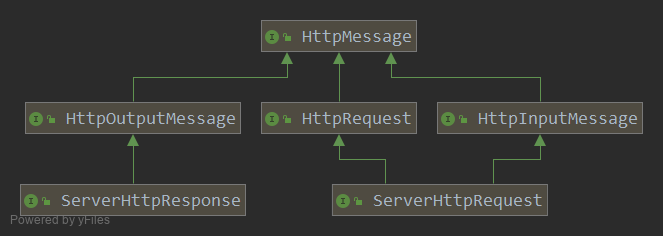
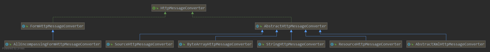

= HttpMessageConverter

策略接口, 指定可以在HTTP request 和 response 之间进行转换的转换器。

.HttpMessageConverter.java
[source,java]
----
public interface HttpMessageConverter<T> {

    // 指示转换器是否支持从特定(MediaType)媒体类型的 request 中读取信息成为指定Java类型对象
	boolean canRead(Class<?> clazz, @Nullable MediaType mediaType);

    // 指示转换器是否支持从特定(MediaType)媒体类型的 reponse 中读取信息成为指定Java类型对象
	boolean canWrite(Class<?> clazz, @Nullable MediaType mediaType);

	List<MediaType> getSupportedMediaTypes();

	// 从给定的输入消息中读取给定类型的对象, 并将其返回.
	T read(Class<? extends T> clazz, HttpInputMessage inputMessage)
			throws IOException, HttpMessageNotReadableException;

	void write(T t, @Nullable MediaType contentType, HttpOutputMessage outputMessage)
			throws IOException, HttpMessageNotWritableException;

}
----

在接口定义的方法中有``HttpInputMessage``和``HttpOutputMessage``, 用来代表需要转换的数据.

.HttpMessage.java
[source,java]
----
public interface HttpMessage {
	HttpHeaders getHeaders();
}

public interface HttpInputMessage extends HttpMessage {

	InputStream getBody() throws IOException;
}

public interface HttpOutputMessage extends HttpMessage {

	OutputStream getBody() throws IOException;
}
----

== AbstractHttpMessageConverter

为子类实现提供便利, 利用一个内部的List&lt;MediaType&gt;实现了接口中的 getSupportedMediaTypes() 方法.
并提供这个内部List的初始化逻辑和setter方法.

并且用一个 Charset 字段标记后面需要使用的默认编码集.

然后将接口中的 canRead(Class, MediaType) 和 canWrite(Class,MediaType) 拆分为两步

1. supports(Class)
2. canRead(mediaType)/canWrite(mediaType)

最后提供 read(), write() 模板方法, 主要是 write() 方法,
需要一些通用的额外处理比如: response header 的填充, 最后还需要主动调用OutputStream.flush()方法.

.AbstractHttpMessageConverter.java
[source,java]
----
public abstract class AbstractHttpMessageConverter<T> implements HttpMessageConverter<T> {

    private List<MediaType> supportedMediaTypes = Collections.emptyList();
    private Charset defaultCharset;

    // 实现HttpMessageConverter接口中的方法, 将逻辑分为, supports(Class) , canRead(mediaType)
    // supports() 方法是一个抽象方法, 由子类实现, 因为是否支持指定的Java类型是子类的事.
    // 为 canRead(MediaType)提供默认实现, 利用内部的 支持的媒体类型列表 判断是否支持.
	public boolean canRead(Class<?> clazz, @Nullable MediaType mediaType) {
		return supports(clazz) && canRead(mediaType);
	}

	protected boolean canRead(@Nullable MediaType mediaType) {
		if (mediaType == null) {
			return true;
		}
		for (MediaType supportedMediaType : getSupportedMediaTypes()) {
			if (supportedMediaType.includes(mediaType)) {
				return true;
			}
		}
		return false;
	}

    // HttpMessageConverter中的方法, 实现逻辑和上面的一样
	public boolean canWrite(Class<?> clazz, @Nullable MediaType mediaType) {
		return supports(clazz) && canWrite(mediaType);
	}

	protected boolean canWrite(@Nullable MediaType mediaType) {
		if (mediaType == null || MediaType.ALL.equalsTypeAndSubtype(mediaType)) {
			return true;
		}
		for (MediaType supportedMediaType : getSupportedMediaTypes()) {
			if (supportedMediaType.isCompatibleWith(mediaType)) {
				return true;
			}
		}
		return false;
	}

    // 实现接口中的read()方法, 直接委托给内部的 readInternal() 方法.
    // 由于读取请求的过程没有什么相识的步骤. 不同的requset的内容不一定相同, 所以没有额外的逻辑.
	public final T read(Class<? extends T> clazz, HttpInputMessage inputMessage)
			throws IOException, HttpMessageNotReadableException {

		return readInternal(clazz, inputMessage);
	}

    // 和read()方法不同, 虽然都是委托给内部的抽象方法 writeInternal().
    // 但是一个服务的生成的 responses 通常会具有一些共有的header.
    // 所以这个 write() 方法提供了一个模板方法, 
    // addDefaultHeaders()
	public final void write(final T t, @Nullable MediaType contentType, HttpOutputMessage outputMessage)
			throws IOException, HttpMessageNotWritableException {

		final HttpHeaders headers = outputMessage.getHeaders();
		addDefaultHeaders(headers, t, contentType);

		if (outputMessage instanceof StreamingHttpOutputMessage) {
			StreamingHttpOutputMessage streamingOutputMessage = (StreamingHttpOutputMessage) outputMessage;
			streamingOutputMessage.setBody(outputStream -> writeInternal(t, new HttpOutputMessage() {
				@Override
				public OutputStream getBody() {
					return outputStream;
				}
				@Override
				public HttpHeaders getHeaders() {
					return headers;
				}
			}));
		}
		else {
			writeInternal(t, outputMessage);
			outputMessage.getBody().flush();
		}
	}

}
----

== StringHttpMessageConverter

首先看一个比较简单具体实现 _StringHttpMessageConverter_
可以将 request 对读取成为 String, 将String对象写入到 response 中的消息转换器.

.StringHttpMessageConverter.jva
[source,java]
----
public class StringHttpMessageConverter extends AbstractHttpMessageConverter<String> {

	public static final Charset DEFAULT_CHARSET = StandardCharsets.ISO_8859_1;

	@Nullable
	private volatile List<Charset> availableCharsets;

	private boolean writeAcceptCharset = true;

    // 从构造器过程中可以看出, 这个消息转换器支持的媒体类型是 text-plain, all
	public StringHttpMessageConverter() {
		this(DEFAULT_CHARSET);
	}

	public StringHttpMessageConverter(Charset defaultCharset) {
		super(defaultCharset, MediaType.TEXT_PLAIN, MediaType.ALL);
	}

    // 实现 supports(Class<?> class), 只支持String类型
	public boolean supports(Class<?> clazz) {
		return String.class == clazz;
	}

    // 实现 readInternal, 首先是确定使用的 Charset, 然后通过 InputStream 读取byte,用确定好的编码集转换成对应的String
    // 1. 通过Content-type请求头确定,
    // 2. 如果这个content-type虽然不为空, 但是没有提供使用编码集的信息 content-type: text/plain
    //   就判断这个 contenty-type 是否和 application/json 兼容.(text/* 和 text/plain, text/html兼容)
    //   如果如果判断通过就使用 UTF-8 编码集.
    // 3. 最后使用设置的 defaultCharset.
    // 默认的无参构造器设置了 ISO-8859-1 为默认编码集,
    // 另一个构造器是由传入的值决定, 所以默认编码集可能是空的所以在 getContentTypeCharset() 方法中还进行了对应的不为null断言.
	protected String readInternal(Class<? extends String> clazz, HttpInputMessage inputMessage) throws IOException {
		Charset charset = getContentTypeCharset(inputMessage.getHeaders().getContentType());
		return StreamUtils.copyToString(inputMessage.getBody(), charset);
	}

}
----

== GenericHttpMessageConverter

接下来看一个特定的子接口``GenericHttpMessageConverter``

和父接口HttpMessageConverter很像. 是为了泛型类型的特化.
定义的方法和父接口的方法也就多了一个 Type, 代表泛型类型的具体类型.

比如说, 我们希望从 request 中读取一个 List<User> 类型.
此时List.class是我们的参数类型, 而User是我们具体的类型.

[source,java]
----
public interface GenericHttpMessageConverter<T> extends HttpMessageConverter<T> {

	boolean canRead(Type type, @Nullable Class<?> contextClass, @Nullable MediaType mediaType);

	T read(Type type, @Nullable Class<?> contextClass, HttpInputMessage inputMessage)
			throws IOException, HttpMessageNotReadableException;

	boolean canWrite(@Nullable Type type, Class<?> clazz, @Nullable MediaType mediaType);

	void write(T t, @Nullable Type type, @Nullable MediaType contentType, HttpOutputMessage outputMessage)
			throws IOException, HttpMessageNotWritableException;

}
----

=== AbstractGenericHttpMessageConverter

image::.GenericHttpMessageConverter.png[]

.AbstractGenericHttpMessageConverter.java
[source,java]
----
public abstract class AbstractGenericHttpMessageConverter<T> extends AbstractHttpMessageConverter<T>
		implements GenericHttpMessageConverter<T> {

    // 这个类也是一个基础类, 所以没有重写构造器.
	protected AbstractGenericHttpMessageConverter() {
	}
	protected AbstractGenericHttpMessageConverter(MediaType supportedMediaType) {
		super(supportedMediaType);
	}
	protected AbstractGenericHttpMessageConverter(MediaType... supportedMediaTypes) {
		super(supportedMediaTypes);
	}

	@Override
	protected boolean supports(Class<?> clazz) {
		return true;
	}

	@Override
	public boolean canRead(Type type, @Nullable Class<?> contextClass, @Nullable MediaType mediaType) {
		return (type instanceof Class ? canRead((Class<?>) type, mediaType) : canRead(mediaType));
	}

	@Override
	public boolean canWrite(@Nullable Type type, Class<?> clazz, @Nullable MediaType mediaType) {
		return canWrite(clazz, mediaType);
	}

	public final void write(final T t, @Nullable final Type type, @Nullable MediaType contentType,
			HttpOutputMessage outputMessage) throws IOException, HttpMessageNotWritableException {

		final HttpHeaders headers = outputMessage.getHeaders();
		addDefaultHeaders(headers, t, contentType);

		if (outputMessage instanceof StreamingHttpOutputMessage) {
			StreamingHttpOutputMessage streamingOutputMessage = (StreamingHttpOutputMessage) outputMessage;
			streamingOutputMessage.setBody(outputStream -> writeInternal(t, type, new HttpOutputMessage() {
				@Override
				public OutputStream getBody() {
					return outputStream;
				}
				@Override
				public HttpHeaders getHeaders() {
					return headers;
				}
			}));
		}
		else {
			writeInternal(t, type, outputMessage);
			outputMessage.getBody().flush();
		}
	}

	@Override
	protected void writeInternal(T t, HttpOutputMessage outputMessage)
			throws IOException, HttpMessageNotWritableException {

		writeInternal(t, null, outputMessage);
	}

	protected abstract void writeInternal(T t, @Nullable Type type, HttpOutputMessage outputMessage)
			throws IOException, HttpMessageNotWritableException;

}
----