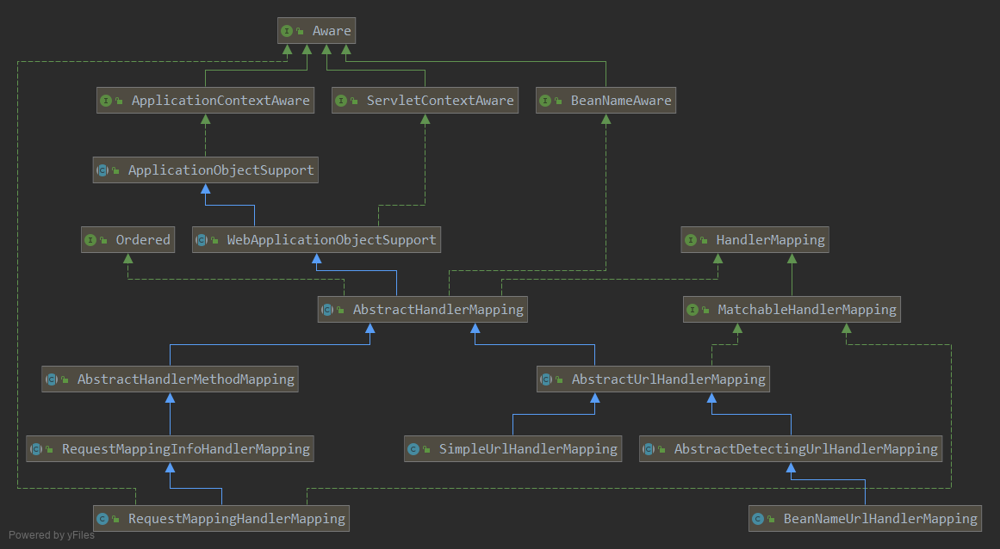
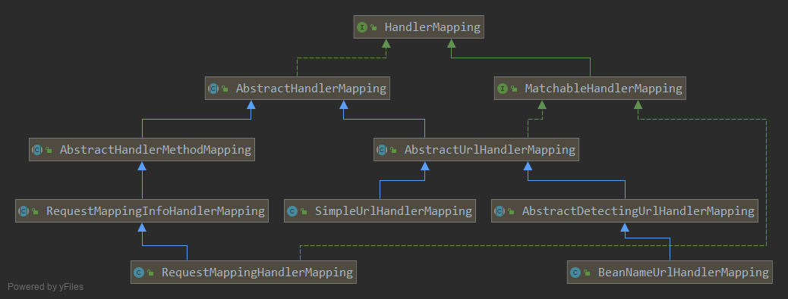
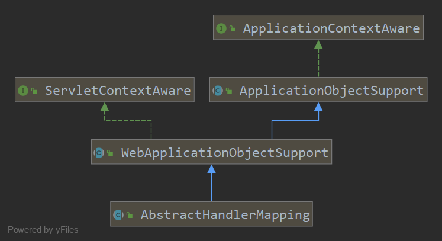

= HandlerMapping

HandlerMapping 组件负责路由请求到对应的handler上.

定义了5个需要暴露的 Request Attribute,
1. bestMatchingHandler
2. pathWithinHandlerMapping
3. bestMatchingPattern
4. introspectTypeLevelMapping

.HandlerMapping.java
[source,java]
----
public interface HandlerMapping {

    HandlerExecutionChain getHandler(HttpServletRequest request) throws Exception;
}
----

getHandler() 方法返回的不是一个Handler, 而是一个 HandlerExecutionChain,
这是典型的 Command 模式的使用.
这个 HandlerExecutionChain 不但持有 Handler, 还包括了处理这个请求相关的拦截器.

== HandlerExecutionChain

从这个类的字段和构造器来看, 它只是简单的持有对应的Handler和Interceptor.
它拥添加 Interceptor 方法和 getHandler()方法.

除了这些getter, setter方法外, 它还有些调用拦截器链的方法.

.HandlerExecutionChain.java
[source,java]
----
public class HandlerExecutionChain {

	private static final Log logger = LogFactory.getLog(HandlerExecutionChain.class);

	private final Object handler;

	private HandlerInterceptor[] interceptors;

	private List<HandlerInterceptor> interceptorList;

	private int interceptorIndex = -1;

	public HandlerExecutionChain(Object handler) {
		this(handler, (HandlerInterceptor[]) null);
	}

	public HandlerExecutionChain(Object handler, HandlerInterceptor... interceptors) {
		if (handler instanceof HandlerExecutionChain) {
			HandlerExecutionChain originalChain = (HandlerExecutionChain) handler;
			this.handler = originalChain.getHandler();
			this.interceptorList = new ArrayList<HandlerInterceptor>();
			CollectionUtils.mergeArrayIntoCollection(originalChain.getInterceptors(), this.interceptorList);
			CollectionUtils.mergeArrayIntoCollection(interceptors, this.interceptorList);
		}
		else {
			this.handler = handler;
			this.interceptors = interceptors;
		}
	}

    // 调用这个请求对应的拦截器链的 preHandler() 方法进行预处理.
    // 它会在 DispatcherServlet.doDisPatch()中调用, 在执行内部 Handler 对象之前.
	boolean applyPreHandle(HttpServletRequest request, HttpServletResponse response) throws Exception {
	}

    // 调用这个请求对应的拦截器链的 postHandler() 方法进行预处理.
    // 它会在 DispatcherServlet.doDisPatch()中调用, 在执行内部 Handler 对象之后.
	void applyPostHandle(HttpServletRequest request, HttpServletResponse response, ModelAndView mv) throws Exception {
	}

	void triggerAfterCompletion(HttpServletRequest request, HttpServletResponse response, Exception ex)
			throws Exception {

	}
	void applyAfterConcurrentHandlingStarted(HttpServletRequest request, HttpServletResponse response) {
	}
}
----

HandlerMapping可以根据Http请求创建HandlerExecutionChain.
所以HandlerExecutionChain中的 Handler,HandlerInterceptor
都应该配置在HandlerMapping中.

HandlerMapping中的信息是什么配置好的呢?
这里就会有一个注册过程, 这个注册过程在容器对 Bean 进行依赖注入时发生.
它实际上是通过一个Bean的postProcessor来完成的.

== Implement

*AbstractHandlerMapping* 对 HandlerMapping 进行了基本实现, 它实现了如下几个功能:

1. defaultHandler功能(如果没有映射的, 就使用默认handler, 可以为null)
2. 拦截器的注册
3. 以及HandlerExecutionChain应用到对应handler上的能力()
4. CORS设置和应用.
这样子类就可以专心实现如何根据请求获得handler的功能.

我们可以把``HandlerMapping``的实现分为两种,
一种是基于显式url配置的mapping. 由``AbstractUrlHandlerMapping``定义,
它的子类是定义了如何配置url声明的操作.
一种是支持注解式编程的``RequestMappingHandlerMapping``.

== AbstractHandlerMapping

HandlerMapping 实现的抽象基类实现基本功能, 如: 支持Order语义, 默认Handler, Cors配置,
HandlerInterceptor, 包括由路径模式映射的处理程序拦截器.
完成了拦截器的注册和组装, 占了很多行.

.AbstractHandlerMapping.java
[source,java]
----
public abstract class AbstractHandlerMapping extends WebApplicationObjectSupport
		implements HandlerMapping, Ordered, BeanNameAware {
    //用来实现默认handler的功能, 当子类实现的getHandlerInternal()方法返回null时就使用默认handler,如果有的话
    @Nuable
	private Object defaultHandler;

	private UrlPathHelper urlPathHelper = new UrlPathHelper();

	private PathMatcher pathMatcher = new AntPathMatcher();

	private final List<Object> interceptors = new ArrayList<>();

	private final List<HandlerInterceptor> adaptedInterceptors = new ArrayList<>();

	// CORS, 信息和处理CORS预检请求的处理器, 下面还有一个内部类是Handler类型的.
	private CorsConfigurationSource corsConfigurationSource = new UrlBasedCorsConfigurationSource();
	private CorsProcessor corsProcessor = new DefaultCorsProcessor();

	private int order = Ordered.LOWEST_PRECEDENCE;  // default: same as non-Ordered

	@Nullable
	private String beanName;

    // DefaultHandler, UrlPathHelper, PathMatcher, CorsProcessor, Order, beanName. 的getter setter方法.
    // interceptors, CorsConfigurationSource 的Setter方法.
    // 还有3个设置UrlPathHelper行为的开关方法.
}
----

实现HandlerMapping接口定义的方法, 将获取逻辑交给具体子类, 如果获取到的null就是用设置的默认 Handler.
实现了, 如果handler对象是String类型, 就会从ApplicationContext中获取对应name的Bean作为Handler.
最后添加一个 CORS Interceptor

.HandlerExecutionChain.java
[source,java]
----
public final HandlerExecutionChain getHandler(HttpServletRequest request) throws Exception {
    // 交给子类实现, 如果没有获取到handler就使用默认的handler.
    Object handler = getHandlerInternal(request);
    if (handler == null) {
        handler = getDefaultHandler();
    }
    if (handler == null) {
        return null;
    }
    // 如果获取到的handler是一个String, 就认为是一个BeanName, 从ApplicationContexxt中获取对应的Bean
    // Bean name or resolved handler?
    if (handler instanceof String) {
        String handlerName = (String) handler;
        handler = obtainApplicationContext().getBean(handlerName);
    }

    // 为获得的handler对象添加拦截器, 从而生成一个HandlerExecutionChain对象.
    // (当然获取到的handler可能已经是一个HandlerExecutionChain对象了)
    HandlerExecutionChain executionChain = getHandlerExecutionChain(handler, request);

    // 如果这个 request 是一个跨域请求, 就进行处理.
    // 根据规范CORS有简单请求和预检请求的区别.
    // 所以下面的 getCorsHandleExecutionChain() 方法有判断.
    if (CorsUtils.isCorsRequest(request)) {
        // this.corsConfigurationSource 代表全局的CORS配置, 只有通过其setter方法完成配置.
        // 所有的HandlerMapping都继承这个AbstractHandlerMapping, 并且在@EnableWebMvc中的配置过程中.
        // 为每一个HandlerMapping都调用了 setCorsConfigurations() 方法.
        // 保证每个传入的CORS配置是同一个, 所以被称为全局配置.
        CorsConfiguration globalConfig = this.corsConfigurationSource.getCorsConfiguration(request);
        // 除了全局配置外, 还有一个Handler级别的CORS配置.
        CorsConfiguration handlerConfig = getCorsConfiguration(handler, request);
        //合并这两个配置.
        CorsConfiguration config = (globalConfig != null ? globalConfig.combine(handlerConfig) : handlerConfig);
        executionChain = getCorsHandlerExecutionChain(request, executionChain, config);
    }

    return executionChain;
}

// 用handler对象和相应的拦截器组装成HandlerExecutionChain对象.
protected HandlerExecutionChain getHandlerExecutionChain(Object handler, HttpServletRequest request) {
    // 判断Handler是否已经是一个执行连了, 如果不是就new一个.
    HandlerExecutionChain chain = (handler instanceof HandlerExecutionChain ?
            (HandlerExecutionChain) handler : new HandlerExecutionChain(handler));

    // 获取这次request的lookup path, 根据请求路径判断是否需要给这个执行链添加对应的拦截器.
    String lookupPath = this.urlPathHelper.getLookupPathForRequest(request);
    for (HandlerInterceptor interceptor : this.adaptedInterceptors) {
        if (interceptor instanceof MappedInterceptor) {
            MappedInterceptor mappedInterceptor = (MappedInterceptor) interceptor;
            if (mappedInterceptor.matches(lookupPath, this.pathMatcher)) {
                chain.addInterceptor(mappedInterceptor.getInterceptor());
            }
        }
        else {
            chain.addInterceptor(interceptor);
        }
    }
    return chain;
}

/**
* 如果是一个预检请求, 意味着这一次不需要调用实际的Handler, 所以会用一个 PreFightHandler 替换真实的Handler
* 如果是一个简单请求, 为其添加一个 CorsInterceptor, 在handler调用前检查 CORS Header.
*
* PreFightHandler 和 CorsInterceptor 都是内部类. 实现都一样调用 corsProcessor.processRequest() 方法.
* 节约篇幅就不贴出来了
*
*/
protected HandlerExecutionChain getCorsHandlerExecutionChain(HttpServletRequest request,
        HandlerExecutionChain chain, @Nullable CorsConfiguration config) {

    if (CorsUtils.isPreFlightRequest(request)) {
        HandlerInterceptor[] interceptors = chain.getInterceptors();
        chain = new HandlerExecutionChain(new PreFlightHandler(config), interceptors);
    }
    else {
        chain.addInterceptor(new CorsInterceptor(config));
    }
    return chain;
}
----

== init

讲完了执行逻辑, 我们在看看它的初始化逻辑.
我们都知道 abstract 类是不能被实例化的, 然后它也没有定义构造器,
意味着它只有默认构造器.(它的子类好像也没有定义构造器呢)

当然这个对象一定是被 Spring IOC 容器管理的, 我们知道Spring IOC容器在创建对象时有许多步骤.
其中就有了给我们插入初始化逻辑的机会. 首先它的继承链长这样:

这两个ObjectSupport非常简单,
就是为了方便我们不用自己具体实现 ApplicationContextAware, ServletContextAware接口用的.

然后都提供了方法用于子类在注入 ApplicationContext,ServletContext 后执行自己的逻辑.
所以让我们关注 AbstractHandlerMapping 中的 initApplicationContext() 方法.

[source,java]
----
/*
 * 1. 调用 detectMappedInterceptors() 方法将当前 ApplicationContext 中的所有 MappedInterceptor 对象获取.
 * 2. 调用 initInterceptors() 方法将手动注册的拦截器, 
 *   从注册的位置List<Object> intercetors 中移动到 List<HandlerInterceptor> adaptedInterceptors中.
 * 
 * 也就是说最后 adaptedInterceptors 中是最终的保存所有拦截器的地方.
 */
protected void initApplicationContext() throws BeansException {
    // 空方法, 是给子类用的hook. 虽然暂时没有看到有子类用它
    extendInterceptors(this.interceptors);

    // 方法名: 直接映射的MappedInterceptor.
    // 从Context中获取所有的 MappedInterceptor 对象, 并添加到list中
    detectMappedInterceptors(this.adaptedInterceptors);

    // 将手动注册在 List<Object> 的 Interceptor, 放到 adaptedInterceptors 中.
    initInterceptors();
}

// 给子类扩展使用, 空实现
protected void extendInterceptors(List<Object> interceptors) {
}

// 从Context中获取所有的 MappedInterceptor 的实现, 并添加到 adaptedInterceptors 中
protected void detectMappedInterceptors(List<HandlerInterceptor> mappedInterceptors) {
    mappedInterceptors.addAll(
            BeanFactoryUtils.beansOfTypeIncludingAncestors(
                    obtainApplicationContext(), MappedInterceptor.class, true, false).values());
}

// 将 List<Object> interceptors 这个集合中的拦截器注册到 adaptedInterceptor.
protected void initInterceptors() {
    if (!this.interceptors.isEmpty()) {
        for (int i = 0; i < this.interceptors.size(); i++) {
            Object interceptor = this.interceptors.get(i);
            if (interceptor == null) {
                throw new IllegalArgumentException("Entry number " + i + " in interceptors array is null");
            }
            this.adaptedInterceptors.add(adaptInterceptor(interceptor));
        }
    }
}
----

后面的子类还有自己的初始化逻辑, 有的也会使用initApplicationContext()方法进行初始化逻辑.

== AbstractUrlHandlerMapping
讲完了所有`HandlerMapping`的公共父类`AbstractHandlerMapping`,
我们接下来看比较简单的基于`URL`路径匹配映射的`HandlerMapping`具体实现

AbstractHandlerMapping的子类, 实现了getHandlerInternal()方法.
定义的是 url String 映射一个 handler. 所以它用了 Map&lt;String, Object&gt;来存储所有的映射信息.
虽然它是一个 abstract 类, 但是它没有抽象方法, 它已经实现了如何匹配请求路径映射.
也提供了如何向它注册 url-handler 的注册方法.
但是它没有初始化的过程, 也就是说出了从父类AbstractHandlerMapping继承来的初始化逻辑以外,
它没有任何的初始化逻辑, 我们都知道父类只定义了如何初始化 Interceptor.
所以这个类无法自动的使用, 不能配置到ApplicationContext中, 就自己获取所有注册信息.

它的子类基本上是在定义如何在初始化的时候注册 url - handler.
第一个子类SimpleUrlHandlerMapping要求, 我们在配置文件中注册它时传入对应的映射信息.
它会在初始化时用我们填入的信息填充父类中的 handlerMap.

第二个子类BeanNameUrlHandlerMapping则会自动扫描IOC容器选择哪些BeanName为"/url"形式的Bean,
将BeanName 和 bean 作为一对进行注册.

.AbstractUrlHandlerMapping.java
[source,java]
----
public abstract class AbstractUrlHandlerMapping extends AbstractHandlerMapping implements MatchableHandlerMapping {

    // 一个映射到 "/" 这个路径的root handler. 可以为 null
    @Nullable
    private Object rootHandler;

    // 是否开启尾斜杠匹配, 即 "/test" 也会匹配 "/test/".
    private boolean useTrailingSlashMatch = false;

    private boolean lazyInitHandlers = false;

    // 注册表
    private final Map<String, Object> handlerMap = new LinkedHashMap<>();

    // 实现父类中的抽象方法
    @Override
    @Nullable
    protected Object getHandlerInternal(HttpServletRequest request) throws Exception {
        // 获取 request 的请求路径
        String lookupPath = getUrlPathHelper().getLookupPathForRequest(request);
        // 获得请求路径对应的 handler 对象.
        Object handler = lookupHandler(lookupPath, request);

        // 下面是处理rootHandler和defaultHandler, 可以不用看.
        if (handler == null) {
            // We need to care for the default handler directly, since we need to
            // expose the PATH_WITHIN_HANDLER_MAPPING_ATTRIBUTE for it as well.
            Object rawHandler = null;
            if ("/".equals(lookupPath)) {
                rawHandler = getRootHandler();
            }
            if (rawHandler == null) {
                rawHandler = getDefaultHandler();
            }
            if (rawHandler != null) {
                // Bean name or resolved handler?
                if (rawHandler instanceof String) {
                    String handlerName = (String) rawHandler;
                    rawHandler = obtainApplicationContext().getBean(handlerName);
                }
                validateHandler(rawHandler, request);
                handler = buildPathExposingHandler(rawHandler, lookupPath, lookupPath, null);
            }
        }
        return handler;
    }

    // 根据url获得 handler, 支持直接匹配, 和 ant 风格的路径
    protected Object lookupHandler(String urlPath, HttpServletRequest request) throws Exception {
        // 根据直接匹配(要求请求路径和注册表中url完全完全匹配)获得 handler.
        // 如果能直接从 map 中获得就说明是直接匹配成功.
        Object handler = this.handlerMap.get(urlPath);
        if (handler != null) {
            // Bean name or resolved handler?
            if (handler instanceof String) {
                String handlerName = (String) handler;
                handler = obtainApplicationContext().getBean(handlerName);
            }
            // 用于验证当前请求的handler, 默认实现为空方法, 可以在子类中扩展. 例如强制执行URL映射中表示的特定前提条件.
            validateHandler(handler, request);
            // 构建 HandlerExecutionChain 对象并返回.
            return buildPathExposingHandler(handler, urlPath, urlPath, null);
        }

        // 模式匹配. 将map中的key都认为是一个 pattern, 然后用 PathMatcher 对象去判断 url 是否匹配路径,
        /*
        * 1. 将注册表中的每个key String都视为一个 Pattern, 将使用PathMatcher.match()方法判断当前请求路径是否匹配
        * 2. 选出最佳匹配
        */
        List<String> matchingPatterns = new ArrayList<>();
        for (String registeredPattern : this.handlerMap.keySet()) {
            // 用PathMatcher进行判断(其实就是一个AntPathMatcher)
            if (getPathMatcher().match(registeredPattern, urlPath)) {
                matchingPatterns.add(registeredPattern);
            }
            // 如果支持尾斜线匹配, 并且当前请求路径是没有尾斜线的, 就拼接上/再试一次.
            else if (useTrailingSlashMatch()) {
                if (!registeredPattern.endsWith("/") && getPathMatcher().match(registeredPattern + "/", urlPath)) {
                    matchingPatterns.add(registeredPattern + "/");
                }
            }
        }

        String bestMatch = null;
        Comparator<String> patternComparator = getPathMatcher().getPatternComparator(urlPath);
        // 在有匹配的请求下, 对其进行排序, 这样第一个就是最佳匹配项
        if (!matchingPatterns.isEmpty()) {
            matchingPatterns.sort(patternComparator);
            if (logger.isTraceEnabled() && matchingPatterns.size() > 1) {
                logger.trace("Matching patterns " + matchingPatterns);
            }
            bestMatch = matchingPatterns.get(0);
        }
        // 根据匹配得到的key, 取到对应的handler
        if (bestMatch != null) {
            handler = this.handlerMap.get(bestMatch);
            if (handler == null) {
                if (bestMatch.endsWith("/")) {
                    handler = this.handlerMap.get(bestMatch.substring(0, bestMatch.length() - 1));
                }
                if (handler == null) {
                    throw new IllegalStateException(
                            "Could not find handler for best pattern match [" + bestMatch + "]");
                }
            }
            // Bean name or resolved handler?
            if (handler instanceof String) {
                String handlerName = (String) handler;
                handler = obtainApplicationContext().getBean(handlerName);
            }

            // 和上面一样的验证方法, 给子类扩展用的.
            validateHandler(handler, request);
            String pathWithinMapping = getPathMatcher().extractPathWithinPattern(bestMatch, urlPath);

            // There might be multiple 'best patterns', let's make sure we have the correct URI template variables
            // for all of them
            Map<String, String> uriTemplateVariables = new LinkedHashMap<>();
            for (String matchingPattern : matchingPatterns) {
                if (patternComparator.compare(bestMatch, matchingPattern) == 0) {
                    Map<String, String> vars = getPathMatcher().extractUriTemplateVariables(matchingPattern, urlPath);
                    Map<String, String> decodedVars = getUrlPathHelper().decodePathVariables(request, vars);
                    uriTemplateVariables.putAll(decodedVars);
                }
            }
            if (logger.isTraceEnabled() && uriTemplateVariables.size() > 0) {
                logger.trace("URI variables " + uriTemplateVariables);
            }

            // 暴露上面解析出来的 path 和 path variables(可选),
            // 会以 org.springframework....HandlerMapping.uriTemplateVariables 的名字放在Request Attribute 中
            return buildPathExposingHandler(handler, bestMatch, pathWithinMapping, uriTemplateVariables);
        }

        // No handler found...
        return null;
    }
}
----