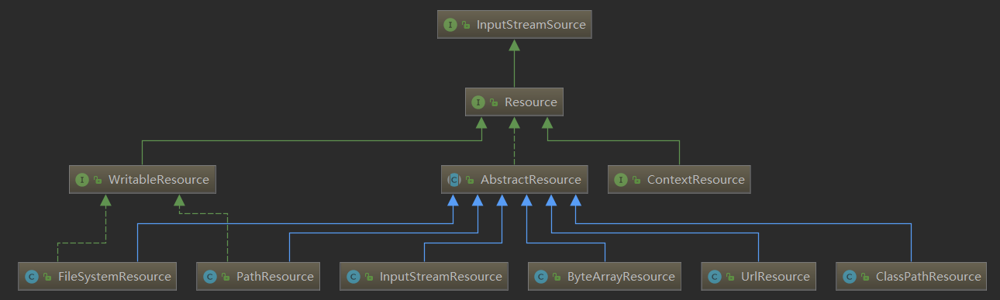
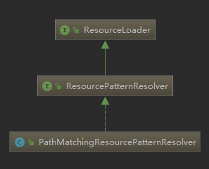

# Resource 接口

InputStreamSource 接口定义了一个从Resouce 中获取 java InputStream 类的方法
```java
public interface InputStreamSource {
    InputStream getInputStream() throws IOException;
}
```
它是资源的核心抽象, 拥有转换成具体资源的方法
```java
public interface Resouce extends InputStreamSource {
    URL getURL() throws IOException;
    URI getURI() throws IOException;
    File getFile() throws IOException;

    Resource createRelative(String relativePath) throws IOException;

    String getFilename();
    String getDecription();
```
# ResourceLoader 接口


Resouce接口的实现类很多, 直接使用的话要根据具体的 Resouce 来使用对应的子类
很麻烦, 所以 Spring 抽象出一个 ResourceLoader (资源加载器)
通过它来屏蔽不同的子类的构造. 由它负责自动的辨别路径使用对应资源的子类

它是一个策略接口(ps:ResourceLoader类上的注释讲的)
```java
public interface ResourceLoader {
    String CLASSPATH_URL_PREFIX = ResourceUtils.CLASSPATH_URL_PREFIX;
    Resource getResource(String location);
    ClassLoader getClassLoader();
```
ApplicationContext 必须提供这个功能, 扩展继承于**ResoucePatternResolver**

DefaultResoucLoader 是一个独立实现, 它通常在ApplicationContext外部使用
也经常被 **ResouceEditor** 使用

## ResoucePatternResolver
```java
public interface ResoucePatternResolver extends ResourceLoader {
    String CLASSPATH_ALL_URL_PREFIX="classpath*:";
    Resouce[] getResouces(String locationPattern) throws IOException;
}
```

## DefaultResourceLoader
DefaultResourceLoader 是 ResourceLoader 的默认实现, 几乎所有的 Application 的实现类都继承了它
通过它来提供 ResourceLoader 接口的功能
```java
public class DefautlResourceLoader implements ResourceLoader {
    private ClassLoader classLoader;
    private final Set<ProtocolResolver> protocolResolvers = new LinkedHashSet<>(4);
    public DefaultResourceLoader() {
        this.classLoader = ClassUtils.getDefaultClassLoader();
    }
    public DefaultResourceLoader(ClassLoader classLoader) {
        this.classLoader = classLoader;
    }
    public setClassLoader(ClassLoader classLoader){
        this.classLoader = classLoader;
    }
    public ClassLoader getClassLoader(){
        return (this.classLoader !=null ? this.classLoader : ClassUtils.getDefaultClassLoader());
    }
    public void addProtocolResolver(ProtocolResolver resolver) {
        Assert.notNull(resolver, "ProtocolResolver must not be null"):
        this.protocolResolvers.add(resolver);
    }
    public Colletion<ProtocolResolver> getProtocolResolvers() {
        return this.protocolResolvers;
    }

    //这是ResourceLoader 中方法的具体实现
    @Override
    public Resource getResource(String location) {
        // 首先判断指定的 location 是否为空
        Assert.notNull(location, "Location must not be null");
        // 然后遍历自己的 Set 集合 调用 protocolResolver (协议处理器) 处理
        for (ProtocolResolver protocolResolver : this.protocolResolvers) {
            Resource resource = protocolResolver.resolve(location, this);
            if (resource != null) {
                return resource;
            }
        }
        /*
         * 如果 location 以"/" 开始那边就解析为
         * 如果以 "classpath:" 开始就解析为 ClassPathResouce
         * 如果都不是就尝试解析为 URL
         */
        if (location.startsWith("/")) {
            return getResourceByPath(location);
        }
        else if (location.startsWith(CLASSPATH_URL_PREFIX)) {
            return new ClassPathResource(location.substring(CLASSPATH_URL_PREFIX.length()), getClassLoader());
        }
        else {
            try {
                // Try to parse the location as a URL...
                URL url = new URL(location);
                return new UrlResource(url);
            }
            catch (MalformedURLException ex) {
                // No URL -> resolve as resource path.
                return getResourceByPath(location);
            }
        }
    }

    protected Resource getResourceByPath(String path) {
        return new ClassPathContextResource(path, getClassLoader());
    }

}
```

