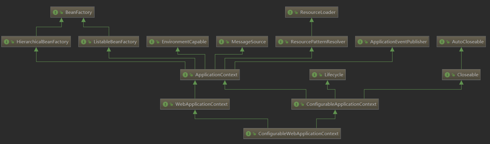

# Application

# AbstractApplicationContext
有三个 abstract (抽象)方法
```java
//这两个是自己提供的
protected abstract void refreshBeanFactory();
protected abstract void closeBeanFactory();
// 这个是从 ConfigurableApplication 中遗留的
public abstract ConfigurableListableBeanFactory getBeanFactory();
```
GenericApplicationContext(通用的applicationcontext) 和
AbstractRefreshableApplicationContext 继承并实现了 AbstractApplication

Spring 在这里搞了两套实现


中的三个抽象方法, 并且提供了一个加载配置的抽象方法
```java
protected abstract void loadBeanDefinitions(DefaultListableBeanFactory beanFactory);
```
