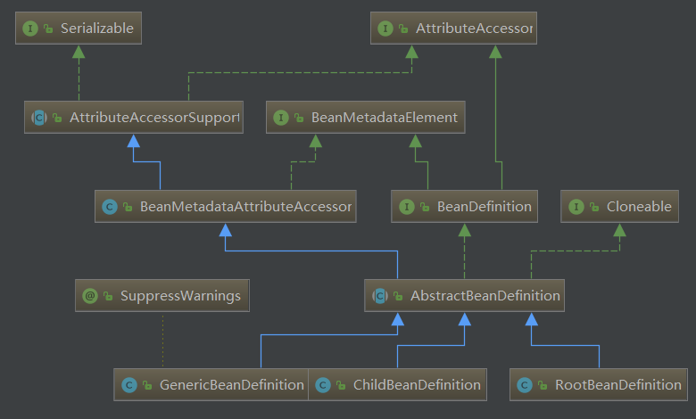

# BeanDefinition

这些是属性的 get/set 方法
ParentName
BeanClassName
Scope
LazyInit
DependsOn
FactoryBeanName
FactoryMethodName

这些是属性的 set/is方法
Primary
AutowireCandidate

这些是 get 方法
ConstructorArgumentValues
getPropertyValues
getRole
getDescription
getResourceDescription
getOriginatingBeanDefinition

# BeanDefinitionReader

Simple interface for bean definition readers.

```java
public interface BeanDefinitionReader {
    //
    BeanDefinitionRegistry getRegistry();
    ResourceLoader getResouceLoader();
    ClassLoader getBeanClassLoader();
    BeanNameGenerator getBeanNameGenerator();
    // 核心方法
    int loadBeanDefinitions(Resource resource);
    int loadBeanDefinitions(Resource... resources);
    int loadBeanDefinitions(String location);
    int loadBeanDefinitions(String... locations);
}
```

## AbstractBeanDefinitionReader
实现了 BeanDefinitionReader 接口. 有一个方法没有实现

```java
public loadBeanDefinitions(Resouce resourc);
```
其他load方法底层都依赖于它, 然后把它交给子类实现 (ps:模板方法设计模式)

其他方法的实现都很简单, 只是简单的持有一个相应的类对象
然后一些 setter/getter 方法

# BeanPostProcessor
Factory hook 允许自定义的修改新的 bean 实例
比如: 检测标记接口 或者 用代理包装它
```java
Object postProcessBeforeInitialization (Object bean, String beanName)
Object postProcessAfterInitialization (Object bean, String beanName)
```
