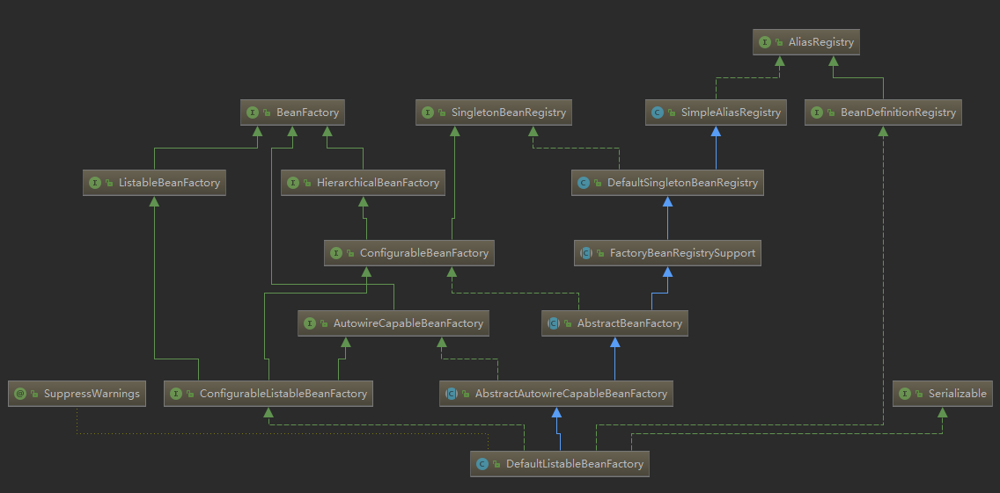

# BeanFactory

它是 Spring bean container 的 root interface 

它主要定义了一系列的 getBean() 方法
```java

//通过指定的beanName获取指定的 Bean
Object getBean(String name) throws BeansException;

//指定名字和类型来获取 Bean, requireType 可以是其父类或接口, 甚至可以是 null
<T> T getBean(String name Class<T> requireType) throws BeansException;

//用指定的参数来构建指定的 Bean, 这些参数可以是构造器参数/工厂方法参数,用来覆盖默认的参数
Object getBean(String name, Object... args) throws BeansException;

//返回唯一匹配的对象类型, 不可以为 null.
//这个方法在 ListableBeanFacroty 中通过类型查找
<T> T getBean(Class<T> requiredType) throws BeansException;

//和上面的一样,用新的参数去构造一个新的指定对象
<T> T getBean(Class<T> requiredType, Object... args) throws BeansException;

//返回给定的beanName 和 类型是否匹配
//ResolvableType 封装了 java.lang.reflect.Type 类
boolean isTypeMatch(String name, ResolvableType typeToMatch)
boolean isTypeMatch(String name, Class<?> typeToMatch)
```

# ListableBeanFactory
定义了访问容器中 Bean 基本信息的若干方法
```java
boolean containsBeanDefinition(String beanName);
int getBeanDefinitiionCount();
String[] getBeanDefinitionNames();
String[] getBeanNamesForType(ResolvableType type);
String[] getBeanNamesForType(Class<?> type);
String[] getBeanNamesForType(Class<?> type, boolean includeNonSingletions, boolean allowEagerInit);
<T> Map<String, T> getBeansOfType(Class<T> type) throws BeansException;
<T> Map<String, T> getBeansOfType(Class<T> type, boolean includeNonSingletions, boolean allowEagerInit);
String[] getBeanNamesForAnnotation(Class<? extends Annotation> annotationType);
Map<String, Object> getBeansWithAnnotation(Class<? extends Annotation> annotationType);
<A extends Annotation> A findAnnotationOnBean(String beanName, Class<A> annotationType);
```

# HierarchicalBeanFactory
定义了父子级联的 Ioc 容器接口
仅仅包含了两个方法
```java
public interface HierarchicalBeanFactory extends BeanFactory{
    //返回父容器, 如果没有返回 null
    BeanFactory getParentBeanFactory();
    // 判断当前 BeanFactory 中是否有指定名字的 Bean ,忽略父容器中的
    boolean containsLocalBean(String name);
}
```

# ConfigurableBeanFactroy
这是一个重量级的接口, 它增强了 IoC 容器的可定制性(ps:可配置的BeanFactroy嘛)

它定义了设置类装载器, 属性编辑器, 容器初始化后置处理器 等方法

1. ParentBeanFactory
2. BeanClassLoader
3. TempClassLoader
4. CacheBeanMetadata(ps:是否缓存元数据)
5. BeanExpressionResolver(ps:好像和 EL表达式有关)
6. ConversionService(类型转换服务)
7. 
8. TyepConverter(类型转换)
9. BeanPostProcessor

# AutowireCapableBeanFactory
自动装配的 BeanFacroty

```java
<T> T createBean(Class<T> beanClass)
void autowireBean(Object existingBean)
Object configureBean(Object existingBean, String beanName)
Object creaetBean(Class<?> beanClass, int autowireMode, boolean dependencyCheck)
Object autowire(Class<?> beanClass, int autowireMode, boolean dependencyCheck)
void autowireBeanProperties(Object existingBean, int autowireMode, boolean dependencyCheck)
void applyBeanPropertyValues(Object existingBean, String beanName)
Object initializeBean(Object existingBean, String beanName)
Object applyBeanPostProcessorsBeforeInitialization(Object existingBean, String beanName)
Object applyBeanPostProcessorsAfterInitialization(Object existingBean, String beanName)
void destroyBean(Object existingBean)
<T> NamedBeanHolder<T> resovleNamedBean(Class<T> requiredType)
Object resolveDependency(DependencyDescriptory descriptor, String requresingBeanName)
Object resolveDependency(DependencyDescriptory descriptor, String requresingBeanName,
                        Set<String> autowiredBeanNames, TypeConverter typeConverter)
```
