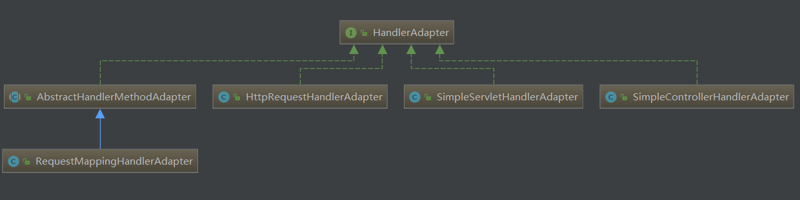

# HandlerMapping
Interface to be implemented by objects 
that define a mapping between requests and handler objects.

定义了请求与handler 之间的映射

```java
public interface HandlerMapping {
    HandlerExecutionChain getHandler(HttpServletRequest request) throws Exception;
}
```

# HandlerAdapter
MVC framework SPI, allowing parameterization of the core MVC workflow.
允许参数化

```java
public interface HandlerAdapter {
    //传入handler, 判断当前 adapter 是否支持该 handler
    //一般来说一种 adapter 支持一种 handler
    boolean supports(Object handler);
    //
    ModelAndView handle(HttpServletRequet request, HttpServletResponse response, Object handler) throws Exception;
    long getLastModified(HttpServletRequest request, Object handler);
}
```

使用了 Adapter 模式

RequestMappingHandlerAdapter 底层 HandlerMethod
SimpleControllerHandlerAdapter 底层 Controller
SimpleServletHandlerAdapter 底层 Servlet
HttpRequestHandlerAapter 底层 HttpRequestHandler

# HttpRequestHandler
Plain handler interface for components that process HTTP requests,
analogous to a Servlet. Only declares link javax.servlet.ServletException
and java.io.IOException, to allow for usage within any
javax.servlet.http.HttpServlet. This interface is essentially the
direct equivalent of an HttpServlet, reduced to a central handle method.

# HandlerMethod

# Controller
Base Controller interface, representing a component that receives
HttpServletRequest and HttpServletResponse
instances just like a HttpServlet but is able to
participate in an MVC workflow. Controllers are comparable to the
notion of a Struts Action.

```java
public interface Controller {
    ModelAndView HandleRequest(HttpServletRequest request, HttpServletResponse) throws Exceptoin;
}
```
