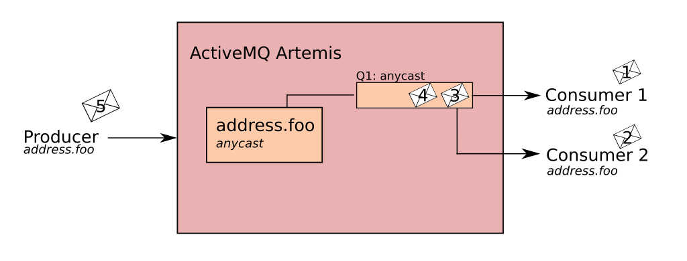

# Address

Address 表示消息传递的端点. 在配置中, 地址的名字通常是唯一的.
一个地址上可能会有0个或多个 queue 以及路由类型(路由类型也可以有多个).

# Queue

一个Queue和一个地址关联. 每个Address可以有多个队列.
一旦传入的消息与地址匹配, 消息被发送到其一个或多个队列.
具体取决于配置的路由类型.
可以将队列配置为自动创建和删除.

# Routing Type

路由类型确定如何将消息发送到与 Address 关联的队列.
可以使用两种路由类型配置 Address.

* Anycast : 匹配地址中的单个队列, 以point to point的方式.
* Multicast : 匹配地址中的每个队列, 采用 publish-subscribe 的方式.

> 注意: 可以为地址定义多个路由类型, 通常这会导致反模式. 因此不介意使用
> 如一个地址配置了两个路由类型, 并且客户端没有显式的指明使用哪种模式,
> 则通常使用 Anycast 路由消息.
> 唯一个例外是: 当Client端是 MQTT 时, 默认使用 MultiCast.

# Basic Configuration

## Point-to-Point Messaging

p2p消息传递时一种常见情况, 其中生产者发送的消息只有一个消费者.
例如, AMQP和JMS消息生成者和消费者可以使用p2p消息传递队列.
为地址定义 AnyCast 路由类型, 以便队列以点对点方式接收消息.

当使用 AnyCast 路由类型的 Address 收到消息时,
ActiveMQ 将找与该地址关联的队列, 并将消息路由到该地址.
(生产者生产消息, 发送到对应地址的指定 Queue)

当消费者请求从该地址消费时, 代理定位相关队列并将该队列与适当消费者相关联.
如果多个消费者连接到同一队列, 则消息在每个消费者之间平均分配.
(消费者消费消息, 从指定队列中获取消息)

这种情况是标准情况, 一个地址上只有一个Queue.

## Pubslish-Subscribe Messaging

在发布订阅模式中, 消息发送给订阅地址的每一个消费者.

当客户端连接到 MultiCast 路由类型的地址时, 将自动为客户端创建订阅队列.

## Point-to-Point Address multiple Queues

P2P中加入多个Queue
实际上, 可以在具有 AnyCast 类型的 Address 上定义多个队列.
当在这样的地址上接收消息时, 它们首先在地址定义的所有的队列中均匀分布.
使用完全限定的队列名称, 客户端可以选择它们想要订阅的队列.
如果多个消费者直接连接到单个队列. ActiveMQ 将负责在他们之间分发消息.

##

